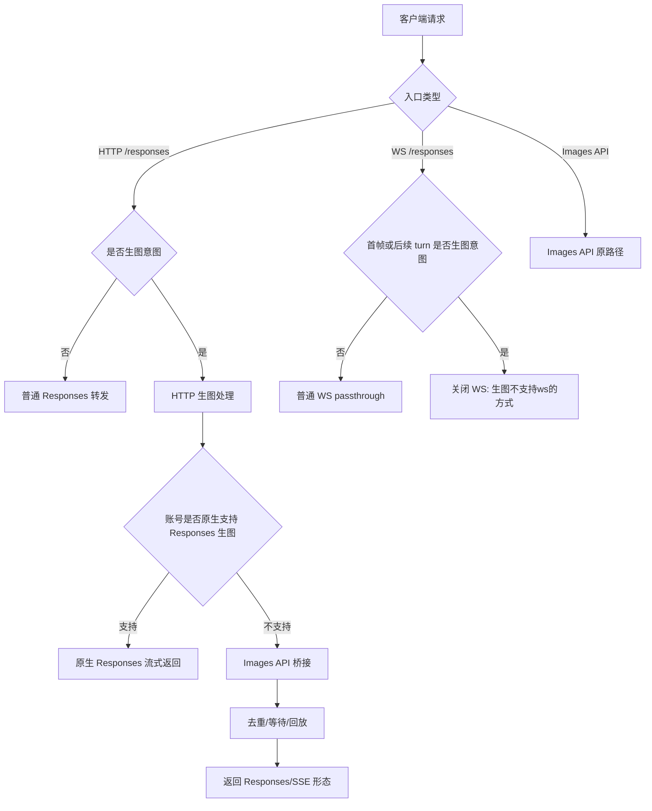

# Sub2API 生图链路恢复与 WS 不支持提示 PRD

## 1. 文档信息

| 项目 | 内容 |
|---|---|
| 文档版本 | v1.0 |
| 日期 | 2026-06-20 |
| 适用系统 | Sub2API OpenAI `/responses` 与图片生成链路 |
| 目标发布版本 | v0.2.48 |
| 需求状态 | 已确认 |
| 交付边界 | 只提交 GitHub 并生成 release，不手动更新线上版本 |

## 2. 文档目标

恢复 Codex Desktop 主流 HTTP 流式 `/responses` 生图体验，移除 WS 生图复杂兼容路径。客户端使用 WS 发起生图时，系统直接返回明确的不支持提示；客户端使用 HTTP 流式 `/responses` 或 Images API 时，系统继续支持生图，并保留重复生图防护。

## 3. 背景与问题

历史排查结果显示：

1. `0.08/张-生图专用-大西瓜` 账号有大量成功生图记录，成功方式为 Codex Desktop 发起 HTTP 流式 `/responses`，不是 WS passthrough。
2. 历史真正 WS passthrough 成功样本来自其他账号，不是大西瓜，也不是小慕。
3. 小慕账号支持 `/v1/images/generations` 非流式和流式生图，但不支持 `gpt-5.5 + image_generation tool` 的 `/v1/responses` 流式生图，也不支持当前系统的 `/v1/responses` WS 生图路径。
4. v0.2.39 引入“显式 image_generation 直接桥接 Images API”的策略后，WS 与 HTTP 流式链路混在一起，导致重复生图问题被放大。

## 4. 需求范围

### 4.1 本次包含

1. HTTP `/responses` 流式生图继续可用。
2. HTTP `/responses` 在账号无法原生处理生图时，允许转 Images API 流式/非流式路径。
3. WS `/responses` 生图不再做 Images API 桥接兼容，直接返回明确错误。
4. 保留桥接链路的重复生图保护。
5. 补充测试覆盖：HTTP 流式、WS 拒绝、重复请求、错误路径。
6. 产出 PRD、技术实施方案、测试用例文档。
7. 完成开发、Code review、测试、GitHub release。

### 4.2 本次不包含

1. 不手动更新线上版本。
2. 不做 WS 生图兼容适配。
3. 不新增复杂 Realtime WS 兼容。
4. 不修改线上账号配置。
5. 不改动第三方上游能力。

## 5. 用户角色

| 角色 | 诉求 |
|---|---|
| Codex Desktop 用户 | 使用 HTTP 流式 `/responses` 生成图片，结果稳定返回 |
| WS 客户端用户 | 如果使用 WS 发起生图，收到明确的不支持提示 |
| 管理员 | 能通过账号和日志区分 HTTP 流式、WS、Images API 路径 |
| 研发/测试 | 有明确规则判断哪些路径应该成功、哪些路径应该失败 |

## 6. 核心业务规则

### 6.1 HTTP 流式 `/responses` 生图规则

1. 客户端通过 HTTP `POST /responses` 或 `POST /v1/responses` 发起请求。
2. 请求包含生图意图时，系统优先按现有 OpenAI Responses 转发链路处理。
3. 若选中账号无法原生处理 Responses 生图，系统可转 Images API 生成图片。
4. 返回仍保持客户端可消费的 Responses/SSE 形态。
5. 同一请求或同一意图重复进入时，不允许重复打上游生成多张图。

### 6.2 WS `/responses` 生图规则

1. 客户端通过 WS `GET /responses` 或 `GET /openai/v1/responses` 发起请求。
2. 首帧或后续 turn 包含生图意图时，系统不再桥接到 Images API。
3. 系统直接关闭 WS，并返回明确原因：`生图不支持ws的方式`。
4. 该规则不影响普通非生图 WS 请求。

### 6.3 Images API 规则

1. `/v1/images/generations` 和 `/images/generations` 保持原有能力。
2. 支持非流式图片生成。
3. 支持上游兼容的流式图片生成。
4. 不引入 WS 兼容。

## 7. 功能总览

| 功能 | 说明 | 结果 |
|---|---|---|
| HTTP 流式生图 | Codex Desktop 主路径 | 保持可用 |
| WS 生图拒绝 | WS 首帧或后续 turn 生图意图 | 明确返回不支持 |
| Images API 生图 | 直接图片接口 | 保持可用 |
| 重复生图防护 | 桥接请求去重 | 保持可用 |
| 文档与测试 | PRD、方案、用例 | 本次补齐 |

## 8. 总体流程图



## 9. 详细功能需求

### 9.1 HTTP 流式 `/responses` 生图

#### 功能目标

保障 Codex Desktop 通过 HTTP 流式 `/responses` 发起生图时可正常完成。

#### 操作逻辑

1. 系统读取 HTTP 请求体。
2. 判断是否存在生图意图。
3. 按原有 Responses 转发或桥接逻辑处理。
4. 桥接时使用现有去重机制，避免重复生图。
5. 返回 SSE/Responses 兼容响应。

#### 验收要点

1. `POST /responses stream=true` 生图请求不被 WS 规则影响。
2. Images-only 账号可完成桥接生图。
3. 重复请求不重复打上游。

### 9.2 WS 生图不支持提示

#### 功能目标

避免继续兼容复杂 WS 生图路径，降低重复生成和状态错乱风险。

#### 操作逻辑

1. WS 建连后读取首帧，并在后续 turn 进入上游前重复检查。
2. 如果首帧或后续 turn 包含生图意图，系统写入明确错误事件或关闭原因。
3. 系统不调用 Images API。
4. 系统不记录生图用量。
5. 非生图 WS 请求继续走原有 passthrough。

#### 提示文案

```text
生图不支持ws的方式
```

#### 验收要点

1. WS 生图请求不会触发 `Responses image bridge direct to /images/generations` 日志。
2. WS 生图请求不会产生 `image_count > 0` 的 usage 记录。
3. 客户端能收到明确错误或关闭原因。
4. 普通 WS 文本请求不受影响。

### 9.3 Images API 生图

#### 功能目标

保留小慕等 Images API 账号的直接生图能力。

#### 操作逻辑

1. 直接调用 `/v1/images/generations` 或 `/images/generations`。
2. 按上游能力返回 JSON 或 SSE。
3. 不参与 WS 兼容。

#### 验收要点

1. 非流式 Images API 生图成功。
2. 流式 Images API 生图成功。
3. 原有计费字段正常记录。

## 10. 异常处理

| 场景 | 处理方式 |
|---|---|
| WS 生图请求 | 返回/关闭：`生图不支持ws的方式` |
| HTTP 桥接重复请求 | 等待并回放或返回已处理结果 |
| Images API 上游失败 | 保持现有上游错误透传/包装逻辑 |
| 客户端断开 | 不额外重试，不重复生成 |
| 非生图 WS | 保持原逻辑 |

## 11. 权限与配置

1. 不新增用户权限。
2. 不新增后台页面。
3. 不修改现有账号配置。
4. 保留现有账号级 `codex_image_generation_bridge` 配置，但 WS 不使用桥接。

## 12. 测试验收要点

1. WS 生图明确不支持。
2. HTTP 流式生图保持可用。
3. Images API 生图保持可用。
4. 桥接重复请求不重复生成。
5. 普通 WS 请求不受影响。
6. 无手动线上更新动作。

## 13. 待确认事项

无。
