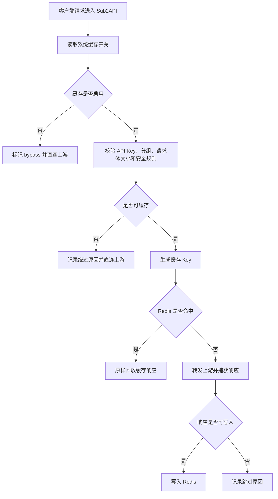

# Sub2API 本地响应缓存完整方案

## 1. 文档信息

| 项目 | 内容 |
|---|---|
| 文档名称 | Sub2API 本地响应缓存完整方案 |
| 所属系统 | Sub2API |
| 创建日期 | 2026-06-04 |
| 适用版本 | v0.2.6 起；v0.2.8 增加统计可观测 |
| 适用范围 | OpenAI 平台分组下的 Responses、Chat Completions、Messages 兼容请求 |

## 2. 目标

本地响应缓存用于在 Sub2API 网关层复用完全相同的 OpenAI 请求结果，减少重复上游调用，从而降低客户费用与上游账号消耗。

交付目标：

1. 管理员可在「系统设置 → 通用设置」打开或关闭缓存。
2. 同一 API Key、同一分组、同一模型、同一接口、同一请求体才允许命中缓存。
3. API Key 切换分组后，缓存天然隔离，不命中旧分组缓存。
4. 支持非流式 JSON 响应，也支持流式 SSE 响应的完整捕获与原样回放。
5. 不缓存工具调用、敏感内容、高随机性请求和不完整流式响应。
6. 后台提供缓存统计，显示当前缓存条目、占用、命中、未命中、绕过和写入跳过原因。

## 3. 非目标

| 非目标 | 说明 |
|---|---|
| 不做跨用户共享缓存 | 避免不同客户之间复用响应，降低隐私与账单归属风险 |
| 不缓存工具调用链路 | tools、function_call、tool_choice 等请求有上下文状态，错误复用风险高 |
| 不缓存图片生成/编辑 | 图片类请求体和输出成本、语义风险更高，本期不纳入 |
| 不缓存 WebSocket 实时会话 | 当前方案覆盖 HTTP/SSE 请求，不介入 OpenAI Responses WS 会话状态 |
| 不替代上游 Prompt Cache | 本地响应缓存是网关结果复用；上游 Prompt Cache 是模型侧上下文复用，两者不是同一层能力 |

## 4. 关键结论

### 4.1 API Key 切换分组后的缓存关系

缓存 Key 包含 `api_key_id` 与 `group_id`。同一个 API Key 从 A 分组切到 B 分组后，`group_id` 改变，缓存 Key 随之改变，因此不会命中 A 分组的旧缓存。

这条规则保证：

1. 不同分组的模型、价格、上游账号池、策略互不污染。
2. 管理员通过切组调整用户路由时，不会被旧分组缓存影响。
3. 缓存统计仍按全局累计展示，但实际响应复用按 Key 隔离。

### 4.2 开启缓存后增加的资源消耗

| 资源 | 增加原因 | 控制方式 |
|---|---|---|
| Redis 内存 | 保存响应体、响应头、状态码、创建时间和统计计数 | 默认响应体上限 512KB，TTL 10 分钟 |
| CPU | 请求体 JSON 规范化、SHA-256 计算、SSE 完整性判断 | 只处理请求体小于 256KB 的候选请求 |
| 网关内存 | 上游响应转发时同步捕获一份响应体 | 超过上限立即停止捕获，不影响转发 |
| Redis 操作 | 每次候选请求执行读缓存、写缓存或统计计数 | Redis 失败不阻断主请求 |
| 网络延迟 | 命中时少一次上游调用；未命中时多一次轻量 Redis 读写 | 对用户请求失败保持 fail-open，不因缓存失败中断 |

在当前默认参数下，缓存资源消耗主要来自 Redis 内存。命中率足够高时，上游费用和延迟下降会显著覆盖本地消耗。

## 5. 缓存数据流

### 5.1 请求进入



### 5.2 命中回放

命中后，网关直接返回缓存中的：

1. HTTP 状态码。
2. `Content-Type`。
3. 响应体原文。
4. 缓存响应头 `X-Sub2API-Cache: hit`。

流式 SSE 命中时，缓存的是完整 SSE 原文，回放时仍按 SSE 内容返回。客户端看到的是一次正常的流式响应结果。

## 6. 缓存 Key 设计

缓存 Key 的种子字段：

| 字段 | 作用 |
|---|---|
| 版本号 `v1` | 方便后续升级 Key 规则 |
| API Key ID | 隔离不同客户或不同密钥 |
| Group ID | 隔离不同分组、不同上游账号池和不同策略 |
| Endpoint | 区分 `/v1/responses`、`/v1/chat/completions`、`/v1/messages` |
| Platform | 当前限定 OpenAI 平台 |
| Model | 区分模型 |
| Canonical JSON Body | 对请求体做规范化，字段顺序不同但语义相同可命中同一 Key |

最终 Key 使用 SHA-256 生成，不在 Redis Key 中暴露请求正文。

Redis 缓存前缀：

```text
local_response_cache:v1:
```

统计计数 Key：

```text
local_response_cache:stats:v1:counters
```

## 7. 可缓存条件

请求同时满足以下条件才进入缓存读写链路：

1. 系统设置 `local_response_cache_enabled=true`。
2. 请求没有显式发送 `X-Sub2API-Cache-Control: bypass`。
3. API Key ID 有效。
4. API Key 已绑定有效分组。
5. 请求体大小不超过 256KB。
6. 请求体是合法 JSON。
7. 请求体不包含工具调用相关字段。
8. 请求体不包含敏感关键词。
9. `temperature` 不存在或不高于 0.3。

## 8. 绕过规则

| 绕过原因 | 含义 |
|---|---|
| `disabled` | 系统缓存开关关闭 |
| `explicit_bypass` | 客户端显式要求绕过缓存 |
| `no_api_key` | 请求上下文没有有效 API Key |
| `no_group` | API Key 没有有效分组 |
| `request_too_large` | 请求体超过上限 |
| `invalid_json` | 请求体不是合法 JSON |
| `tools_or_functions` | 请求包含工具调用相关字段 |
| `sensitive_content` | 请求体包含敏感关键词 |
| `temperature_too_high` | 随机性过高，不适合复用 |

绕过时请求继续正常转发上游，不因缓存不可用而失败。

## 9. 写入规则

只有满足以下条件才写入缓存：

1. 上游请求处理没有返回错误。
2. 下游客户端写入成功，没有短写或连接中断。
3. 响应状态码为 200。
4. 响应体非空。
5. 响应类型为 `application/json` 或 `text/event-stream`。
6. 响应体未超过 512KB 捕获上限。
7. 如果是 SSE，必须包含完整结束标记。

SSE 完整结束标记包括：

```text
data: [DONE]
event: response.completed
event: response.done
event: message_stop
"type":"response.completed"
"type":"response.done"
"type":"message_stop"
```

## 10. 写入跳过规则

| 跳过原因 | 含义 |
|---|---|
| `forward_error` | 上游转发链路返回错误 |
| `body_too_large` | 响应体超过缓存上限 |
| `write_error` | 下游客户端写入失败或短写 |
| `status_not_ok` | HTTP 状态码不是 200 |
| `empty_body` | 响应体为空 |
| `content_type` | 响应类型不是 JSON 或 SSE |
| `stream_incomplete` | 流式响应未观察到完整结束标记 |
| `store_failed` | Redis 写入失败 |

## 11. 后台可观测能力

后台「系统设置 → 通用设置」展示：

| 指标 | 说明 |
|---|---|
| 当前缓存条目 | Redis 中当前有效缓存条目数 |
| 当前占用 | 当前缓存条目的 Redis 内存占用估算 |
| 命中 | 成功从本地缓存回放的次数 |
| 未命中 | 候选请求未找到缓存的次数 |
| 绕过 | 请求没有进入缓存读写的次数 |
| 写入成功 | 上游响应成功写入本地缓存的次数 |
| 写入跳过 | 候选响应因规则未写入缓存的次数 |
| 最近原因 | 展示绕过与写入跳过原因，帮助判断为什么缓存没有增长 |

统计只记录计数和原因，不记录请求体、响应体、用户输入、API Key 或上游账号凭证。

## 12. 运维判断方法

### 12.1 缓存已开启但条目为 0

判断顺序：

1. 检查开关是否为启用状态。
2. 查看 `绕过` 是否增长。
3. 查看绕过原因是否集中在 `tools_or_functions`、`no_group`、`temperature_too_high`。
4. 查看 `未命中` 是否增长。
5. 查看 `写入跳过` 是否增长。
6. 如果 `store_skip:stream_incomplete` 增长，说明流式响应未完整结束或客户端提前断开。
7. 如果 `store_success` 增长但当前条目很少，说明 TTL 到期或请求分散导致缓存生命周期短。

### 12.2 缓存命中率低

常见原因：

1. 请求体每次都不同，例如包含时间戳、随机 ID、会话上下文。
2. 使用 tools/function calling。
3. temperature 高于阈值。
4. API Key 经常切分组。
5. TTL 过短，重复请求间隔超过 10 分钟。
6. 用户主要使用 WebSocket 实时会话，不走 HTTP/SSE 缓存链路。

## 13. 默认参数

| 参数 | 默认值 |
|---|---|
| 开关 | 关闭 |
| TTL | 10 分钟 |
| 请求体上限 | 256KB |
| 响应体上限 | 512KB |
| temperature 阈值 | 0.3 |
| 支持接口 | `/v1/responses`、`/v1/chat/completions`、`/v1/messages` |
| 支持响应 | JSON、SSE |

## 14. 安全边界

1. 缓存不跨 API Key。
2. 缓存不跨分组。
3. 缓存不跨平台。
4. 缓存不保存明显敏感请求。
5. 缓存不保存工具调用请求。
6. 缓存失败不影响主请求。
7. 流式响应必须完整才写入。
8. 客户端断开或写入失败时不写入。

## 15. 验收标准

1. 管理员可在「系统设置 → 通用设置」打开和关闭缓存。
2. 相同 API Key、分组、模型、接口和请求体的第二次请求返回 `X-Sub2API-Cache: hit`。
3. 同一个 API Key 切换分组后，不命中旧分组缓存。
4. 工具调用请求返回 `X-Sub2API-Cache: bypass`，统计中 `lookup_bypass:tools_or_functions` 增长。
5. 完整 SSE 响应可缓存并回放。
6. 不完整 SSE、客户端断开、响应过大不写入缓存。
7. 后台统计能展示当前条目、占用、命中、未命中、绕过、写入成功与跳过原因。
8. Redis 不可用时，请求仍按无缓存模式继续转发。
