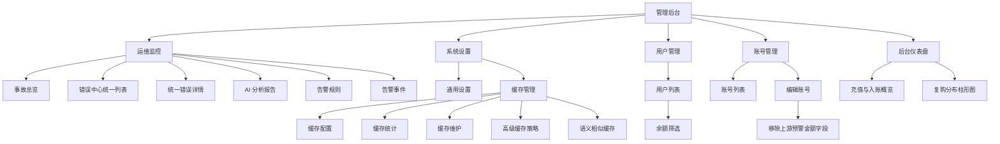
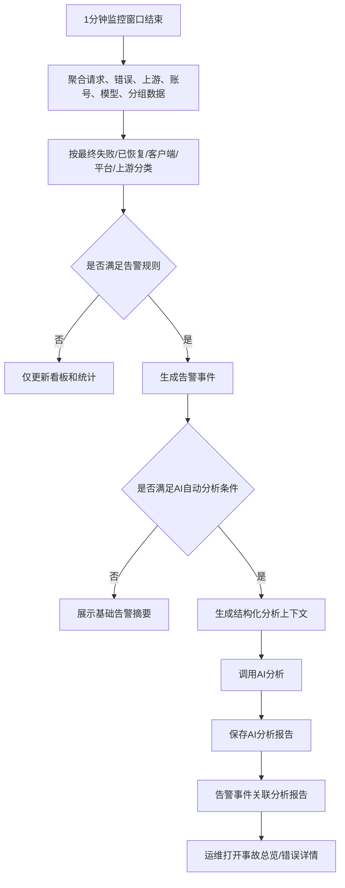
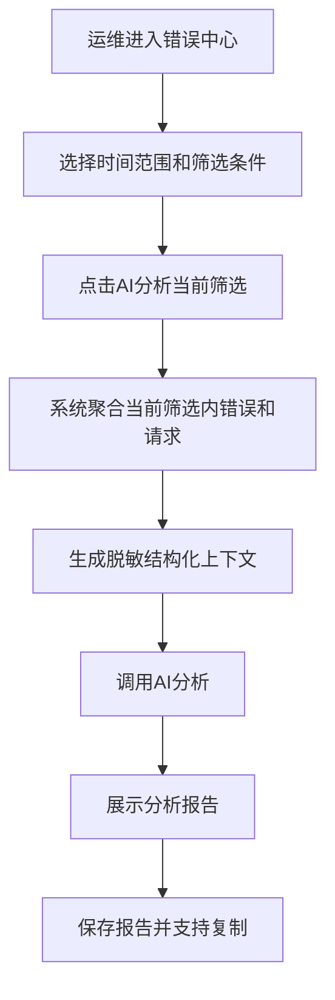
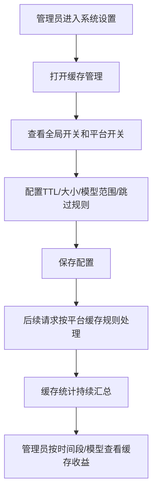
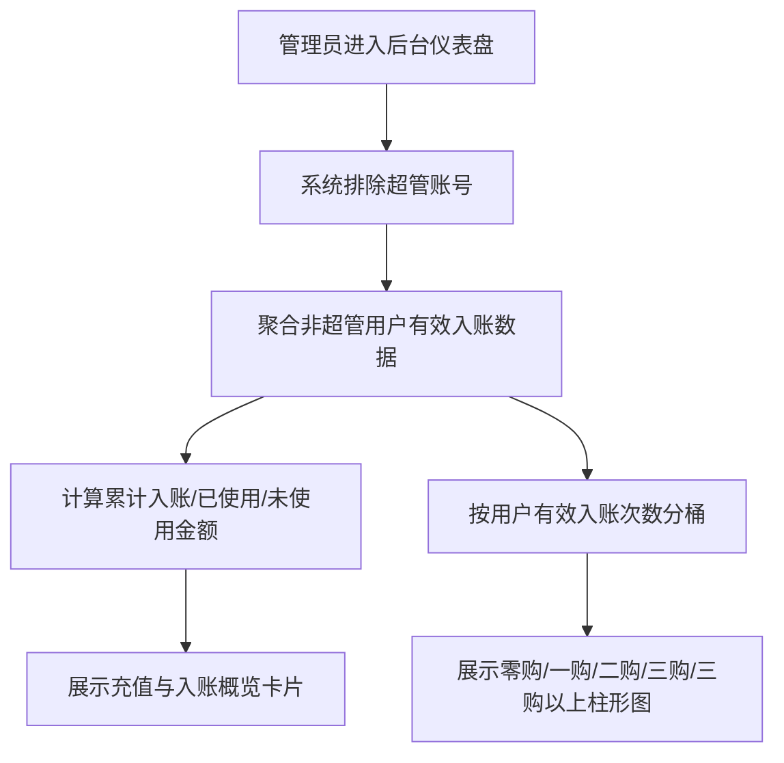
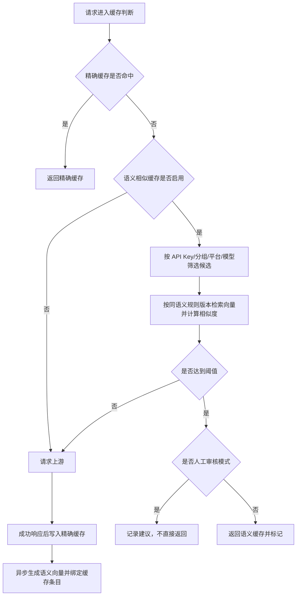

# Sub2API 运维监控、缓存管理与后台管理增强 PRD

## 1. 文档信息

| 项目 | 内容 |
|---|---|
| 文档名称 | Sub2API 运维监控、缓存管理与后台管理增强 PRD |
| 文档版本 | v2026.06.07-08 |
| 创建日期 | 2026-06-05 |
| 最后更新日期 | 2026-06-07 |
| 适用系统 | Sub2API 管理后台、网关缓存、运维监控、用户管理、账号管理 |
| 适用对象 | 产品、研发、测试、运维、运营、客服、平台所有者 |
| 文档性质 | 新一版需求 PRD |

## 2. 文档目标

本 PRD 定义 Sub2API 新一版后台能力改造，解决以下核心问题：

1. 运维告警容易被少量错误触发，告警噪音高，影响日常运营判断。
2. 运维监控已有多类列表和详情，但缺少统一错误入口、统一事故结论和快速根因分析。
3. 线上问题发生后，当前仍依赖人工或 Codex 再查日志才能完成归因，需要把 AI 分析能力植入运维监控。
4. 本地响应缓存第一版已上线，但缓存能力、缓存管理菜单、多平台覆盖、统计口径仍未完整产品化。
5. 系统设置、用户管理、账号管理中存在若干后台操作体验与业务策略调整需求。

本文输出业务可执行的产品需求，覆盖页面、字段、规则、流程、统计口径和验收标准。

## 3. 背景与问题

### 3.1 运维监控现状问题

当前运维监控已经具备请求错误、上游错误、客户端错误、请求详情、系统指标、告警规则和告警事件等能力。经过多次迭代，运维人员已能通过现有明细大致定位问题。

但当前仍存在两个关键痛点：

1. **告警误扰**：1 分钟窗口内出现 1～2 条错误时，错误率可能被放大，触发高优先级告警；运维打开后只看到少量错误，无法形成事故判断。
2. **结论缺失**：告警摘要只说明某个指标异常，没有直接告诉运维是哪个用户、API Key、分组、模型、上游账号或错误类型导致，也没有说明最终失败、已恢复、影响范围和处理动作。

### 3.2 缓存管理现状问题

本地响应缓存第一版已覆盖 OpenAI 平台的精确响应缓存和基础统计，但当前缓存开关与统计位于「系统设置 → 通用设置」中，入口不独立；缓存配置、缓存清理、按模型和时间统计、多平台缓存支持仍不完整。

### 3.3 后台管理现状问题

1. 用户管理列表缺少余额筛选，运营无法快速定位低余额、高余额或余额异常用户。
2. 账号管理编辑账号页面包含上游预警金额与相关邮件通知能力，该能力不再保留，需要从编辑账号中移除。

## 4. 版本目标

| 目标编号 | 目标 | 说明 |
|---|---|---|
| G01 | 降低无效告警 | 1 分钟内仍可快速告警，但必须结合影响数量、最终失败、错误类型和影响范围判断 |
| G02 | 提升问题定位速度 | 管理后台直接给出问题结论、影响范围、关联对象和处理动作 |
| G03 | 建立统一错误入口 | 将请求错误、上游错误、客户端错误等整合为统一列表和统一详情，通过错误分类区分 |
| G04 | 引入 AI 运维分析 | 支持自动触发 AI 分析和手动分析当前筛选时间段/错误集合 |
| G05 | 产品化缓存管理 | 将缓存从通用设置中拆出为「缓存管理」菜单，提供配置、统计、清理、原因分析 |
| G06 | 扩展缓存平台 | 缓存方案覆盖 OpenAI、Claude、Gemini 的 HTTP/SSE 请求链路 |
| G07 | 增强缓存统计 | 支持按时间段、平台、模型汇总 tokens、命中 tokens、命中率等指标 |
| G08 | 优化用户管理 | 用户管理列表新增余额筛选 |
| G09 | 精简账号管理 | 移除账号编辑中的上游预警金额和相关邮件通知能力 |

## 5. 需求范围

### 5.1 本期包含

| 模块 | 范围 |
|---|---|
| 运维告警 | 1 分钟实时告警规则重构、告警分级、告警降噪、告警解释字段 |
| 运维监控 UI | 统一错误列表、统一错误详情、事故总览、诊断摘要 |
| AI 运维分析 | 自动分析、手动分析、分析报告落库、报告复用 |
| 缓存管理 | 独立菜单、开关、参数、清理、统计、原因分布 |
| 多平台缓存 | OpenAI、Claude、Gemini 精确响应缓存规则 |
| 高级缓存策略 | 压缩存储、容量上限、淘汰策略、热点分析、成本节省模型、上游 Prompt Cache 联动展示 |
| 语义相似缓存 | 在同 API Key、同分组、同模型范围内提供默认关闭、可灰度的语义相似缓存能力 |
| 缓存统计 | 按时间段、平台、模型统计输入/输出/缓存命中 tokens 和命中率 |
| 用户管理 | 列表增加余额筛选 |
| 账号管理 | 移除上游预警金额与相关邮件通知入口 |
| 后台仪表盘 | 新增充值与入账概览和累计复购分布柱形图，排除超管账号 |

### 5.2 本期不包含

| 非范围 | 说明 |
|---|---|
| 不重做请求日志采集底座 | 继续复用现有请求日志、错误日志、上游错误、请求详情 |
| 不重做账号调度主流程 | 本期只增强监控和缓存，不改变账号选择算法 |
| 不跨用户共享缓存 | 缓存必须按 API Key、分组、平台、模型隔离；语义相似缓存也不得跨用户共享 |
| 不让 AI 自动执行修复 | AI 只输出分析和处理建议，不直接修改配置、禁用账号或重启服务 |

### 5.3 本 PRD 交付版本边界

本 PRD 包含运维监控、AI 分析、缓存 V2-V5、后台仪表盘、用户与账号管理需求。研发交付允许拆分为多个发布版本，但每个发布阶段必须满足对应验收标准后才能上线。

| 发布阶段 | 必须交付 | 是否阻塞主版本上线 | 启用方式 | 最小上线标准 |
|---|---|---|---|---|
| 阶段 1：运维与后台基础 | 运维告警重构、统一错误中心、AI 分析基础配置、缓存管理菜单、用户余额筛选、移除上游预警金额、后台充值与入账概览 | 是 | 默认启用，AI 分析未配置时置灰 | 不产生错误告警骚扰；旧入口可跳转；账号编辑不再出现上游预警金额 |
| 阶段 2：OpenAI 缓存产品化 | OpenAI 缓存产品化、缓存统计、缓存清理、命中率原因分析、缓存导出 | 是 | 默认关闭，由平台所有者开启 | OpenAI 重复请求命中率和 tokens 命中率达到验收目标 |
| 阶段 3：Claude/Gemini 精确缓存 | Claude/Gemini 文本类精确缓存、平台规则、流式完整结束判断 | 是 | 默认关闭，按平台开启 | 三平台重复请求命中率和 tokens 命中率达到验收目标 |
| 阶段 4：高级缓存策略 | 容量、压缩、淘汰、热点、成本节省、上游 Prompt Cache 展示 | 否，可灰度 | 默认关闭，灰度开启 | 不影响主请求；容量和淘汰策略可回退 |
| 阶段 5：语义相似缓存 | 观察、人工审核、灰度、正式启用、质量回滚 | 否，默认关闭，必须灰度验证后启用 | 默认关闭，仅灰度 API Key 生效 | 完成观察和人工审核，质量验收达标后才能进入灰度 |

发布规则：

1. 阶段 1～3 是主版本可用性的阻塞范围，未达到验收标准不得标记本 PRD 主版本完成。
2. 阶段 4～5 属于同一 PRD 内的高级能力，可以在阶段 1～3 后分小版本发布，但需求、字段、规则和验收均以本 PRD 为准。
3. 阶段 4 或阶段 5 上线失败时必须自动回退到已稳定的精确缓存能力，不影响阶段 1～3 已上线能力。
4. 每个阶段的技术方案、开发方案、测试验收文档、上线说明都必须带版本号、创建日期、最后更新日期和适用版本。

## 6. 角色定义

| 角色 | 权限/诉求 |
|---|---|
| 平台所有者 | 配置全局缓存、查看全部运维分析、管理告警规则 |
| 运维人员 | 查看事故总览、错误列表、AI 分析，处理账号池和上游异常 |
| 运营人员 | 查看用户余额筛选、缓存收益、用户影响范围、充值与入账概览和复购分布 |
| 客服人员 | 根据统一详情和 AI 分析解释用户失败原因 |
| 测试人员 | 验证告警、缓存、统计、筛选和账号编辑回归 |
| 普通用户 | 不直接使用后台能力，但受缓存命中、告警处理效率和问题定位改善影响 |

## 7. 功能总览

| 编号 | 功能名称 | 页面/入口 | 优先级 |
|---|---|---|---|
| F01 | 运维告警规则重构 | 运维监控 / 告警规则 | P0 |
| F02 | 运维事故总览 | 运维监控 / 总览 | P0 |
| F03 | 统一错误列表 | 运维监控 / 错误中心 | P0 |
| F04 | 统一错误详情 | 运维监控 / 错误中心 / 详情 | P0 |
| F05 | AI 运维分析 | 运维监控 / 错误中心 / AI 分析 | P0 |
| F06 | 缓存管理菜单 | 系统设置 / 缓存管理 | P0 |
| F07 | 缓存配置管理 | 系统设置 / 缓存管理 / 配置 | P0 |
| F08 | 多平台响应缓存 | OpenAI、Claude、Gemini 网关 | P0 |
| F09 | 缓存统计与模型汇总 | 系统设置 / 缓存管理 / 统计 | P0 |
| F10 | 缓存清理与原因分析 | 系统设置 / 缓存管理 / 维护 | P1 |
| F11 | 用户余额筛选 | 用户管理 / 用户列表 | P1 |
| F12 | 移除账号上游预警金额 | 账号管理 / 编辑账号 | P1 |
| F13 | 后台仪表盘充值与复购统计 | 后台仪表盘 | P1 |
| F14 | 高级缓存策略 | 系统设置 / 缓存管理 / 高级策略 | P1 |
| F15 | 语义相似缓存 | 系统设置 / 缓存管理 / 语义缓存 | P2 |

## 8. 总体信息架构



### 8.1 运维监控界面整改边界

本版本不是把运维监控全部推倒重做，而是在现有运维监控基础上完成一次结构重组。

| 原板块 | 本版本处理方式 | 说明 |
|---|---|---|
| 运维监控总览 | 保留并增强 | 总览继续作为进入运维监控后的默认页，新增事故总览、当前风险、最新 AI 分析结论、健康分数辅助展示 |
| 各类错误列表 | 合并为统一错误中心 | 原上游错误、客户端错误、请求错误等入口在本版本作为筛选入口保留，点击后进入统一错误中心并自动带入错误分类；下一个大版本从侧边栏移除旧入口，历史链接继续跳转 |
| 各类错误详情 | 合并为统一错误详情 | 详情页统一展示请求、用户、API Key、分组、模型、上游账号、错误分类、原始错误和处理建议 |
| 告警事件 | 保留并增强 | 告警事件继续存在，新增触发原因、影响范围、关联错误、AI 分析报告入口 |
| 告警规则编辑 | 保留并改造 | 原规则编辑入口保留，规则模型从单一指标阈值改为“1 分钟窗口 + 最终失败数 + 失败率 + 最小数量 + 影响范围 + 错误分类” |
| 运维监控设置 | 保留并拆分 | 数据采集、保留时间、自动刷新、全局邮件接收人等设置保留；告警阈值类配置迁移到告警规则编辑中 |
| 健康分数 | 保留但降级 | 健康分数即原页面健康风险分数，只作为总览辅助判断，不再单独生成告警事件，也不触发邮件、弹窗或 P0/P1 强提醒 |

## 9. 总体业务流程

### 9.1 运维告警与 AI 分析流程



### 9.2 手动 AI 分析流程



### 9.3 缓存管理流程



### 9.4 后台仪表盘充值与复购统计流程



## 10. 详细功能需求

### 10.1 F01 运维告警规则重构

#### 10.1.1 功能目标

告警必须保持 1 分钟内快速发现问题，同时避免 1～2 条错误在低流量窗口中触发高优先级告警。告警判断必须同时考虑最终失败数、失败率、样本量、错误类型、影响范围和是否自动恢复。

#### 10.1.2 告警判断原则

| 原则 | 规则 |
|---|---|
| 实时性 | 主告警窗口固定支持 1 分钟 |
| 数量保护 | 百分比告警必须同时满足最小错误数量 |
| 样本保护 | 小样本只进入观察或低优先级，不触发 P0 |
| 最终结果优先 | 最终失败强影响，已恢复波动弱影响 |
| 影响范围优先 | 影响多个用户、API Key、分组、模型或上游账号时提升等级 |
| 错误类型优先 | DB/Redis/服务不可用、账号池全不可用、关键上游失败优先级最高 |
| 可解释 | 每条告警必须说明触发原因、影响范围和推荐处理动作 |

#### 10.1.3 告警分级规则

#### P0 事故级告警

1 分钟内满足任一条件触发 P0：

| 条件 | 规则 |
|---|---|
| 服务不可用 | 健康检查失败、DB 不可用、Redis 关键依赖不可用导致主请求失败 |
| 最终失败数量高 | 最终失败请求数 ≥ 20 |
| 最终失败率高且有足够数量 | 最终失败率 ≥ 20%，且最终失败请求数 ≥ 5 |
| 关键分组不可用 | 任一启用中的核心分组可用账号数为 0 |
| 集中影响多用户 | 同一错误分类影响用户数 ≥ 3，且最终失败请求数 ≥ 5 |
| 集中影响 API Key | 同一错误分类影响 API Key 数 ≥ 3，且最终失败请求数 ≥ 5 |
| 同一模型大面积失败 | 同一模型最终失败请求数 ≥ 10，且失败率 ≥ 20% |

#### P1 高优先级告警

1 分钟内满足任一条件触发 P1：

| 条件 | 规则 |
|---|---|
| 最终失败数量中等 | 最终失败请求数 ≥ 5 |
| 最终失败率中等 | 最终失败率 ≥ 10%，且最终失败请求数 ≥ 3 |
| 同一上游账号集中失败 | 同一上游账号最终失败数 ≥ 3 |
| 上游权限/额度错误集中 | 同一上游账号或同一模型权限、额度、订阅类错误数 ≥ 3 |
| 同一用户严重受影响 | 同一用户最终失败数 ≥ 3 |

#### P2 观察告警

1 分钟内满足任一条件进入 P2 或观察，不发送 P0/P1 强提醒：

| 条件 | 规则 |
|---|---|
| 少量最终失败 | 最终失败请求数 1～2 |
| 已恢复上游波动 | 上游中途失败但最终请求成功 |
| 单一用户/Key 波动 | 仅影响 1 个用户或 1 个 API Key，且最终失败数 < 3 |
| 慢请求波动 | 低样本下 P99 延迟高，但无最终失败 |

#### 10.1.4 告警字段

| 字段 | 控件/类型 | 数据来源 | 说明 |
|---|---|---|---|
| 告警标题 | 文本 | 系统生成 | 包含等级和主要问题，例如“P1：GPT-VIP组 gpt-5.5 上游权限错误” |
| 告警等级 | 标签 | 告警规则 | P0/P1/P2/观察 |
| 当前状态 | 标签 | 告警事件 | 触发中、已恢复、已静默、已关闭 |
| 时间窗口 | 文本 | 告警规则 | 默认 1 分钟 |
| 最终失败数 | 数字 | 请求/错误聚合 | 用户最终失败的请求数量 |
| 已恢复波动数 | 数字 | 上游错误聚合 | 中途失败但最终成功的数量 |
| 失败率 | 百分比 | 公式 | 最终失败数 / 有效请求数 |
| 影响用户数 | 数字 | 聚合 | 去重用户数 |
| 影响 API Key 数 | 数字 | 聚合 | 去重 API Key 数 |
| 影响分组 | 标签列表 | 聚合 | 相关分组 |
| 影响模型 | 标签列表 | 聚合 | 相关模型 |
| 影响上游账号 | 标签列表 | 聚合 | 相关上游账号 |
| 主要错误分类 | 标签 | 分类规则 | 客户端、平台、上游、账号池、限流、权限、余额、配置、慢请求、未知 |
| 推荐动作 | 文本 | 系统规则/AI 分析 | 明确下一步处理动作 |
| AI 分析状态 | 标签 | AI 分析记录 | 未分析、分析中、已完成、失败 |

#### 10.1.5 与原告警规则编辑的融合

原告警规则编辑能力不删除，改造为“告警策略配置”。

| 原配置项 | 本版本处理方式 | 新规则中的位置 |
|---|---|---|
| 是否启用告警 | 保留 | 告警策略全局开关 |
| 告警接收邮箱 | 保留在运维监控设置 | 作为全局接收人，不在单条告警规则中重复维护 |
| 最低告警等级 | 保留在运维监控设置 | 作为全局通知过滤条件；单条规则只配置自身触发等级 |
| SLA 最低百分比 | 保留但不单独触发 P0/P1 | 作为服务质量参考指标，参与总览展示和观察级提示 |
| 请求错误率阈值 | 改造 | 必须同时配置最小最终失败数，不能只按百分比触发 |
| 上游错误率阈值 | 改造 | 必须区分最终失败与已恢复波动，已恢复波动只进入观察 |
| TTFT/P99 阈值 | 保留 | 慢请求类规则，低样本下只进入观察 |
| 健康分数阈值 | 保留展示，不作为告警规则 | 只用于总览颜色、辅助提示和趋势判断，不生成告警事件 |
| 错误过滤设置 | 保留 | 继续决定哪些错误进入日志和聚合统计 |

告警规则编辑页需要支持以下新字段：

| 字段 | 类型 | 说明 |
|---|---|---|
| 规则名称 | 文本 | 例如“上游账号集中失败” |
| 规则状态 | 开关 | 启用、停用 |
| 时间窗口 | 下拉 | 默认 1 分钟，本版本主告警固定支持 1 分钟 |
| 错误分类 | 多选 | 客户端、平台、上游、账号池、限流、权限、余额、配置、慢请求、未知 |
| 触发等级 | 下拉 | P0、P1、P2、观察 |
| 最小最终失败数 | 数字 | 百分比规则必须同时满足该数量 |
| 最小失败率 | 百分比 | 与最小最终失败数共同判断 |
| 最小样本量 | 数字 | 防止低流量窗口误报 |
| 影响范围条件 | 多选 | 用户数、API Key 数、分组数、模型数、上游账号数 |
| 已恢复波动处理 | 下拉 | 不告警、观察、计入趋势 |
| 是否自动 AI 分析 | 开关 | P0/P1 默认开启，P2 默认关闭 |
| 通知方式 | 多选 | 页面、邮件；使用运维监控设置中的全局接收人，不在规则内编辑邮箱 |
| 静默时间 | 数字 | 同类告警在静默期内不重复强提醒 |

10.1.3 中的 P0/P1/P2 是系统默认规则。管理员在告警规则编辑页修改后，以已启用的自定义规则为准；未配置自定义规则时使用系统默认规则。任何自定义规则都必须满足“百分比规则同时配置最小最终失败数和最小样本量”的底线，不能配置成单纯百分比强告警。

迁移后，原来只配置“错误率超过多少百分比就告警”的规则全部转换为“错误率 + 最小最终失败数 + 最小样本量”的复合规则。未满足最小数量时，页面展示为观察信息，不发送 P0/P1 强提醒。

#### 10.1.6 健康分数规则

健康分数保留。本文中的健康分数即原页面的健康风险分数，本版本不再把它作为告警事件或强提醒的触发条件。

| 项目 | 规则 |
|---|---|
| 展示位置 | 运维监控总览顶部保留健康分数/健康风险分数卡片 |
| 计算目的 | 用于快速判断整体趋势和系统状态 |
| 告警作用 | 健康分数单独降低时不生成告警事件、不发送邮件、不弹强提醒；只有真实错误规则触发时，作为辅助字段写入告警事件 |
| 颜色提示 | 可继续按高、中、低展示颜色，但颜色变化不等同于事故 |
| AI 分析 | AI 分析可引用健康分数作为背景信息，但结论必须基于最终失败、影响范围和错误分类 |
| 低分处理 | 健康分数低但最终失败数不足时，只在总览显示颜色和文字提示，不进入告警事件列表 |
| 事故判断 | P0/P1 必须由最终失败、依赖不可用、账号池不可用、集中影响等规则触发 |

健康分数的产品定位从“告警触发分数”调整为“总览辅助信号”。这样保留原有总览感知能力，同时解决少量错误把健康分数拉低后频繁强提醒的问题。

#### 10.1.7 验收标准

1. 1 分钟内 1～2 条最终失败不触发 P0。
2. 1 分钟内最终失败数达到 P0/P1 数量阈值时立即触发告警。
3. 已恢复上游波动不按最终失败计算。
4. 告警事件能展示影响用户、API Key、分组、模型、上游账号。
5. 告警摘要能说明“为什么触发”，不能只展示指标值。
6. 原告警规则编辑入口仍可进入，并能配置新复合规则。
7. 健康分数降低但未满足真实错误复合规则时，不生成告警事件，不发送邮件，不弹强提醒。

#### 10.1.8 告警事件生命周期

| 状态 | 进入条件 | 可操作人 | 后续动作 |
|---|---|---|---|
| 触发中 | 满足 P0/P1/P2 规则 | 系统 | 创建或更新告警事件 |
| 已确认 | 运维点击确认 | 平台所有者、运维 | 记录确认人、确认时间和确认说明 |
| 处理中 | 运维标记处理中 | 平台所有者、运维 | 记录处理人、处理说明和预计处理动作 |
| 已恢复 | 连续 3 个 1 分钟窗口不再满足触发条件 | 系统 | 标记恢复时间，停止强提醒 |
| 已关闭 | 人工关闭或系统恢复后 10 分钟自动关闭 | 平台所有者、运维 | 进入历史记录 |
| 已静默 | 命中静默规则 | 系统 | 不重复发送强提醒，只更新次数和影响范围 |

告警去重 Key：

```text
错误大类 + 错误子类 + 分组 + 模型 + 上游账号 + 触发等级
```

生命周期规则：

1. 同一去重 Key 在静默期内只更新原告警事件，不新建重复告警。
2. 同一窗口同时命中 P0、P1、P2 时，以最高等级为准。
3. 同一窗口命中多条同等级规则时，合并为一条告警事件，并在触发原因中列出全部命中规则。
4. P0/P1 首次触发发送强提醒；静默期内不重复发送邮件。
5. P2 默认只在页面展示，不发送邮件；管理员自定义规则明确开启邮件时除外。
6. 人工关闭后，如果同一去重 Key 再次满足 P0/P1 且超过静默期，需要重新创建告警。

#### 10.1.9 健康风险分数新计算口径

健康风险分数保留展示，但必须调整为抗小样本误报的辅助分数。

| 分数区间 | 状态 | 展示规则 | 告警关系 |
|---|---|---|---|
| 90～100 | 正常 | 绿色 | 不触发告警 |
| 70～89 | 观察 | 蓝/灰 | 可展示观察提示，不生成强提醒 |
| 50～69 | 风险 | 黄色 | 必须同时满足真实错误规则才进入风险告警 |
| 0～49 | 事故 | 红色 | 必须同时满足 P0 事故规则才进入事故告警 |

计算原则：

1. 低样本窗口不允许大幅拉低分数。
2. 1 分钟内最终失败数 ≤ 2 时，健康风险分数最低不得低于 70。
3. 已恢复波动只影响趋势，不直接拉低到风险或事故区间。
4. 健康风险分数进入风险或事故区间必须同时满足最终失败数、失败率、影响范围或依赖不可用规则。
5. 页面必须展示“分数原因”，至少包含最终失败数、失败率、有效请求数、影响范围、依赖状态。
6. 健康风险分数单独降低不生成告警事件、不发送邮件、不弹强提醒。

#### 10.1.10 补充验收标准

1. 同一去重 Key 在静默期内不会重复创建告警。
2. 连续 3 个 1 分钟窗口恢复后，告警自动进入已恢复。
3. 1 分钟内最终失败数 ≤ 2 时，健康风险分数不低于 70。
4. 健康风险分数页面展示分数原因。

### 10.2 F02 运维事故总览

#### 10.2.1 功能目标

事故总览用于让运维进入运维监控后第一眼知道当前是否有真实事故、主要问题是什么、影响范围多大、是否需要处理。

#### 10.2.2 页面区域

| 区域 | 内容 |
|---|---|
| 当前状态卡 | 正常、观察中、风险、事故中 |
| 主要问题摘要 | 当前最高优先级问题的结论 |
| 影响范围 | 用户、API Key、分组、模型、上游账号 |
| 最终失败与恢复 | 最终失败数、已恢复波动数、总错误数 |
| 推荐处理动作 | 账号处理、配置检查、上游检查、无需处理等 |
| 最近 AI 分析 | 最新一条自动/手动 AI 分析报告入口 |
| 快捷筛选 | 进入统一错误列表并带入当前事故筛选条件 |

#### 10.2.3 状态定义

| 状态 | 定义 | 页面颜色 |
|---|---|---|
| 正常 | 无 P0/P1/P2 事件，或仅有已恢复低级波动 | 绿色 |
| 观察中 | 存在 P2 或低样本异常 | 蓝/灰 |
| 风险 | 存在 P1 或多个观察事件聚集 | 黄色 |
| 事故中 | 存在 P0 或基础设施不可用 | 红色 |

#### 10.2.4 验收标准

1. 运维打开页面即可看到当前最高优先级问题。
2. 页面能区分“最终失败”和“已恢复波动”。
3. 页面能直接跳转统一错误列表并自动带入筛选条件。
4. 页面显示的摘要必须包含影响范围和处理动作。

### 10.3 F03 统一错误列表

#### 10.3.1 功能目标

将请求错误、上游错误、客户端错误、平台错误、已恢复波动统一到一个错误中心列表，使用分类标签、结果标签和筛选条件进行区分，降低页面切换成本。

#### 10.3.2 页面入口

| 入口 | 说明 |
|---|---|
| 运维监控 / 错误中心 | 主入口 |
| 事故总览 / 查看详情 | 带入事故关联筛选 |
| 告警事件 / 查看关联错误 | 带入告警关联筛选 |
| AI 分析报告 / 查看样本 | 带入分析样本筛选 |

#### 10.3.3 筛选字段

| 字段 | 控件类型 | 必填 | 数据来源 | 默认值 | 说明 |
|---|---|---|---|---|---|
| 时间范围 | 快捷选择 + 日期时间 | 是 | 系统枚举 | 最近 30 分钟 | 支持 1m、5m、30m、1h、6h、24h、自定义 |
| 错误结果 | 多选 | 否 | 固定枚举 | 全部 | 最终失败、已恢复、客户端中断、未知 |
| 错误大类 | 多选 | 否 | 固定枚举 | 全部 | 客户端、平台、上游、账号池、限流、权限、余额、配置、慢请求、未知 |
| 严重度 | 多选 | 否 | 固定枚举 | 全部 | P0、P1、P2、观察、普通 |
| 状态码 | 多选/输入 | 否 | 日志状态码 | 全部 | 支持 400、401、403、429、500、529 等 |
| 用户 | 远程搜索 | 否 | 用户表 | 空 | 支持邮箱/ID 搜索 |
| API Key | 远程搜索 | 否 | API Key | 空 | 支持名称/ID 搜索 |
| 分组 | 下拉/搜索 | 否 | 分组列表 | 全部 | 支持多选 |
| 模型 | 输入/多选 | 否 | 请求日志模型 | 全部 | 支持模糊搜索 |
| 上游账号 | 远程搜索 | 否 | 账号列表 | 全部 | 支持账号名/ID 搜索 |
| 请求 ID | 输入 | 否 | 人工输入 | 空 | request_id/client_request_id |
| 关键词 | 输入 | 否 | 错误消息 | 空 | 搜索错误摘要、上游错误消息 |
| 是否已分析 | 单选 | 否 | 分析记录 | 全部 | 全部、已分析、未分析 |

#### 10.3.4 列表字段

| 字段 | 类型 | 数据来源 | 说明 |
|---|---|---|---|
| 发生时间 | 时间 | 错误日志 | 错误发生时间 |
| 结果 | 标签 | 分类规则 | 最终失败、已恢复、客户端中断 |
| 错误大类 | 标签 | 分类规则 | 客户端、平台、上游、账号池等 |
| 错误子类 | 标签 | 分类规则 | 权限、限流、余额、模型不支持、账号不可用等 |
| 严重度 | 标签 | 告警/分类规则 | P0/P1/P2/观察/普通 |
| 状态码 | 文本 | 错误日志 | 客户端状态码 + 上游状态码 |
| 用户 | 文本 | 请求归因 | 用户邮箱/ID，脱敏展示 |
| API Key | 文本 | 请求归因 | Key 名称/ID |
| 分组 | 文本 | 请求归因 | 分组名称 |
| 模型 | 文本 | 请求模型 | 请求模型/上游模型 |
| 上游账号 | 文本 | 上游归因 | 账号名称/ID |
| 摘要 | 文本 | 分类规则/错误消息 | 一句话说明 |
| 同类数量 | 数字 | 当前筛选聚合 | 同类错误数量 |
| AI 分析 | 状态 | 分析记录 | 未分析、分析中、已完成 |
| 操作 | 按钮 | 页面操作 | 查看详情、AI 分析、复制摘要 |

#### 10.3.5 兼容关系

1. 原请求错误列表、上游错误列表、客户端错误列表保留为筛选视图，不再作为完全割裂的页面。
2. 原详情入口跳转至统一错误详情，并自动定位到对应错误分类 Tab。
3. 原有接口能复用的继续复用；新列表对用户只体现为统一入口。

#### 10.3.6 验收标准

1. 可以通过统一列表查到最终失败、上游错误、客户端错误和已恢复波动。
2. 按错误分类筛选后结果与原分类列表一致或更完整。
3. 列表能快速区分最终失败和已恢复。
4. 列表支持按用户、API Key、分组、模型、上游账号筛选。

### 10.4 F04 统一错误详情

#### 10.4.1 功能目标

统一错误详情用于展示单个错误或一组关联错误的完整请求链路、错误分类、影响范围、原始日志、同类问题和处理建议。

#### 10.4.2 详情结构

| 区域 | 内容 |
|---|---|
| 结论区 | 错误结论、最终结果、是否影响用户、处理建议 |
| 请求链路 | 用户、API Key、分组、模型、入口、上游账号、上游端点 |
| 错误分类 | 大类、子类、状态码、错误来源、错误归属 |
| 影响范围 | 同类错误数量、影响用户/API Key/分组/模型/账号 |
| 恢复情况 | 是否重试、是否切换账号、是否最终成功 |
| AI 分析 | 自动或手动分析报告 |
| 原始记录 | 请求错误、上游错误、请求详情、系统日志 |
| 同类问题 | 同账号、同模型、同用户、同分组近期错误 |

#### 10.4.3 关键字段

| 字段 | 类型 | 说明 |
|---|---|---|
| 错误结论 | 文本 | 例如“上游账号 95 不支持 image_generation，但请求已切换成功” |
| 是否最终失败 | 布尔/标签 | 是/否 |
| 是否已恢复 | 布尔/标签 | 是/否 |
| 恢复方式 | 文本 | 重试、账号切换、客户端重连、无 |
| 用户影响 | 文本 | 影响用户数量和具体用户 |
| 账号影响 | 文本 | 影响上游账号及账号状态 |
| 推荐动作 | 文本 | 检查账号权限、移除模型路由、忽略波动等 |
| 关联分析报告 | 链接 | AI 分析记录 |

#### 10.4.4 验收标准

1. 任意错误从统一列表进入后都能看到统一详情。
2. 详情中必须明确最终失败/已恢复。
3. 详情中必须显示请求用户与上游账号，不再混淆“请求账号”和“上游账号”。
4. 详情可以查看原始日志，但默认先展示可读结论。

### 10.5 F05 AI 运维分析

#### 10.5.1 功能目标

AI 运维分析用于替代“运维看到摘要后再让 Codex 查日志分析”的人工流程。系统在满足条件时自动分析，也支持运维对当前筛选结果手动分析。

#### 10.5.2 自动触发条件

| 条件 | 是否触发 AI 分析 |
|---|---|
| P0 告警生成 | 是 |
| P1 告警生成 | 是 |
| 同一错误分类 1 分钟内最终失败数 ≥ 5 | 是 |
| 同一上游账号 1 分钟内最终失败数 ≥ 3 | 是 |
| 同一模型 1 分钟内最终失败数 ≥ 5 | 是 |
| 仅 1～2 条 P2 观察错误 | 否，除非人工点击 |
| 已恢复上游波动少量出现 | 否，除非人工点击 |

#### 10.5.3 手动触发入口

| 入口 | 说明 |
|---|---|
| 错误中心列表顶部 | 分析当前筛选结果 |
| 错误详情页 | 分析当前错误及关联请求 |
| 告警事件详情 | 分析当前告警关联窗口 |
| 事故总览 | 分析当前主要问题 |

#### 10.5.4 AI 分析配置

AI 分析必须提供独立配置。未完成配置时，自动分析不触发，手动分析按钮置灰并提示“请先配置 AI 分析服务”，不影响告警、错误列表和详情页使用。

| 字段 | 控件类型 | 必填 | 默认值 | 校验规则 | 说明 |
|---|---|---|---|---|---|
| AI 分析开关 | 开关 | 是 | 关闭 | 布尔值 | 总开关，关闭后自动和手动分析均不可用 |
| 服务地址 | 输入框 | 是 | 空 | 必须为 http/https URL | AI 分析模型服务 Base URL |
| API 秘钥 | 密码输入 | 是 | 空 | 保存时加密/脱敏展示 | 调用 AI 分析模型使用的秘钥 |
| 模型名称 | 输入框/下拉 | 是 | 空 | 不允许为空 | 例如 gpt-5.5、claude、gemini 或平台自定义模型名 |
| 接口类型 | 下拉 | 是 | OpenAI 兼容 | 固定枚举 | OpenAI 兼容、Responses、Anthropic 兼容、Gemini 兼容 |
| 自动分析等级 | 多选 | 是 | P0、P1 | P0/P1/P2/观察 | 控制哪些告警自动触发 AI 分析 |
| 手动分析开关 | 开关 | 是 | 开启 | 布尔值 | 控制错误中心和详情页手动分析按钮 |
| 单次分析最大样本数 | 数字输入 | 是 | 50 | 1～500 | 控制送入 AI 的错误样本数量 |
| 单次分析超时 | 数字输入 | 是 | 60 秒 | 5～300 秒 | 超时后标记分析失败 |
| 自动分析同类去重间隔 | 数字输入 | 是 | 10 分钟 | 1～1440 分钟 | 同一问题在去重间隔内只自动分析 1 次 |
| 全局 AI 调用频率限制 | 数字输入 | 是 | 10 次/分钟 | 1～1000 次/分钟 | 控制全局 AI 分析调用上限，防止错误风暴导致分析风暴 |

配置保存后必须支持一次“测试连接”。测试连接只验证服务地址、秘钥和模型可用性，不写入分析报告。

#### 10.5.5 AI 分析输入范围

AI 不直接读取未处理原始日志全文。系统先生成结构化上下文，再交给 AI。

| 上下文字段 | 说明 |
|---|---|
| 时间范围 | 分析窗口 |
| 总请求数 | 当前筛选范围内请求数 |
| 最终失败数 | 用户最终失败请求数 |
| 已恢复波动数 | 中途失败但最终成功数量 |
| 错误分类分布 | 按大类/子类统计 |
| 状态码分布 | 客户端和上游状态码 |
| 请求路径和方法 | 例如 /v1/responses、/v1/chat/completions、/v1/messages、Gemini 接口路径 |
| 客户端错误字段 | 客户端请求错误的错误码、参数名、校验失败原因、断连/超时标记 |
| 用户分布 | 影响用户 Top N，脱敏展示 |
| API Key 分布 | 影响 API Key Top N |
| 分组分布 | 影响分组 |
| 模型分布 | 请求模型/上游模型 |
| 上游账号分布 | 影响账号 |
| 典型错误样本 | 每类错误抽样，脱敏 |
| 近期变化 | 与上一窗口相比的增长/下降 |
| 已有恢复动作 | 重试、切换、自动恢复情况 |

#### 10.5.6 AI 分析颗粒度

AI 分析分为两种颗粒度：

| 颗粒度 | 触发入口 | 分析目标 | 输出要求 |
|---|---|---|---|
| 单条错误分析 | 错误详情页 | 解释当前这一条错误具体是什么 | 必须输出错误子类、证据字段、是否用户侧问题、是否平台侧问题、是否上游侧问题 |
| 聚合窗口分析 | 告警事件、事故总览、错误中心筛选结果 | 判断一段时间内主要问题和影响范围 | 必须输出主因排序、影响用户/API Key/分组/模型/上游账号、处理动作 |

客户端请求错误必须继续细分，不能只停留在“客户端请求错误”摘要。可分析出的子类包括：

| 子类 | 判断依据 | 示例结论 |
|---|---|---|
| 鉴权错误 | 缺少 API Key、API Key 无效、Key 被禁用 | 客户端使用了无效 Key 或已禁用 Key |
| 用户/Key 限流 | 用户 RPM、Key RPM、并发限制命中 | 用户侧请求频率超过当前限制 |
| 余额/额度不足 | 用户余额不足、Key 配额耗尽 | 用户余额或 Key 配额不足 |
| 参数格式错误 | JSON 非法、字段类型不正确、必填字段缺失 | 客户端请求体格式不符合接口要求 |
| 模型不可用 | 请求模型不存在、无权限、未映射到可用渠道 | 客户端请求了当前不可用模型 |
| 路径/方法错误 | 请求路径不存在、HTTP 方法不支持 | 客户端请求入口错误 |
| 上下文超限 | 输入 tokens 或上下文超过模型限制 | 请求内容超过模型上下文窗口 |
| 客户端断开 | context canceled、broken pipe、请求中途取消 | 客户端主动断开或网络中断 |
| 证据不足 | 日志缺少错误码、请求体摘要或关键字段 | 只能输出“无法进一步确认”，并列出缺失字段 |

如果现有日志字段不足以判断具体子类，AI 分析必须明确写出“证据不足”和缺失字段，不能编造原因。

#### 10.5.7 AI 分析输出字段

| 字段 | 说明 |
|---|---|
| 分析结论 | 一句话说明主要问题 |
| 事故等级判断 | 正常、观察、风险、事故 |
| 主要原因 | 最可能原因 |
| 证据 | 关键日志字段和统计依据 |
| 影响范围 | 用户、API Key、分组、模型、上游账号 |
| 是否需要人工处理 | 是/否 |
| 处理动作 | 明确下一步动作 |
| 可忽略原因 | 若无需处理，说明为什么 |
| 后续观察点 | 继续观察的指标 |
| 置信度 | 高、中、低 |

#### 10.5.8 分析报告状态

| 状态 | 说明 |
|---|---|
| 待分析 | 已创建任务但未开始 |
| 分析中 | AI 正在生成结果 |
| 已完成 | 可查看报告 |
| 分析失败 | 调用失败或上下文不足 |
| 已过期 | 报告对应数据窗口已超过保留期 |

#### 10.5.9 权限与安全

1. AI 分析上下文必须脱敏 API Key、Token、完整邮箱、代理地址、请求正文敏感内容。
2. AI 不允许自动修改系统配置。
3. 自动分析必须有频率限制，避免错误风暴导致分析风暴。
4. 手动分析结果必须记录操作人和时间。

#### 10.5.10 验收标准

1. P0/P1 告警生成后自动创建 AI 分析任务。
2. 错误中心支持对当前筛选范围手动分析。
3. 分析报告能说明原因、影响范围、证据和处理动作。
4. 分析输入不包含完整密钥和敏感正文。
5. 分析失败时页面展示失败原因，不影响错误列表使用。
6. 未配置服务地址、API 秘钥或模型时，自动分析不触发，手动分析按钮置灰。
7. 客户端请求错误分析必须输出具体子类；证据不足时必须列出缺失字段。

#### 10.5.11 客户端请求错误分类规则

客户端请求错误必须优先通过系统规则分类，AI 分析只做解释、归因和补充，不作为唯一分类来源。

| 子类 | 必需字段 | 判断规则 |
|---|---|---|
| 鉴权错误 | status_code、error_code、api_key_status | 401/403，或 Key 无效、Key 禁用、Key 缺失 |
| 用户限流 | status_code、rate_limit_type、user_id、api_key_id | 429 且 rate_limit_type 为 user/key/group 中的用户侧或 Key 侧限制 |
| 余额不足 | error_code、user_balance、quota_status | 余额不足、Key 配额耗尽、用户额度不足 |
| 参数错误 | status_code、validation_error、param_name | 400 且存在参数校验失败或请求体格式错误 |
| 模型不可用 | requested_model、mapped_model、channel_status | 模型不存在、无映射、无可用渠道、无模型权限 |
| 上下文超限 | input_tokens、model_context_window、error_code | 输入超过模型上下文或输出上限配置不合法 |
| 路径/方法错误 | request_path、http_method、status_code | 路径不存在或 HTTP 方法不支持 |
| 客户端断开 | request_canceled、broken_pipe、context_canceled | 请求中断、客户端主动取消、网络断开 |
| 证据不足 | 缺少上述必需字段 | 无法判断具体子类，必须列出缺失字段 |

如果缺少必需字段，错误子类显示“证据不足”，AI 分析报告必须列出缺失字段。AI 不得在证据不足时编造具体原因。

#### 10.5.12 AI 分析任务控制规则

| 项目 | 规则 |
|---|---|
| 最大并发分析任务 | 默认 3 个 |
| 自动分析频率 | 同一告警去重 Key 10 分钟内最多 1 次 |
| 重试次数 | 失败后最多重试 1 次 |
| 超时处理 | 超过配置超时时间标记失败 |
| 报告保留时间 | 默认 30 天 |
| 成本归属 | 默认计入平台运营成本 |
| 失败展示 | 展示失败原因，不影响告警和错误列表 |
| 手动分析覆盖 | 手动分析不受自动分析去重限制，但受并发限制 |
| 队列满处理 | 新自动分析任务丢弃并记录原因；手动分析提示稍后重试 |

#### 10.5.13 AI 分析人工反馈

AI 分析报告支持人工反馈，用于后续优化分析规则，不自动改变历史报告。

| 反馈项 | 说明 |
|---|---|
| 有用 | 分析结论、证据和处理动作基本正确 |
| 无用 | 分析没有帮助 |
| 原因不准确 | 主因判断错误 |
| 影响范围不准确 | 用户、Key、模型、上游账号范围判断错误 |
| 处理建议不准确 | 推荐动作不可执行或方向错误 |
| 证据不足 | 报告未列出足够证据 |

反馈记录必须包含反馈人、反馈时间、报告 ID 和反馈项。

#### 10.5.14 补充验收标准

1. 客户端请求错误先由系统规则给出子类，再由 AI 解释。
2. AI 自动分析同一去重 Key 10 分钟内不重复触发。
3. AI 分析失败后最多重试 1 次。
4. 报告超过保留时间后不可再查看正文，但保留报告摘要和统计数量。
5. 管理员可对 AI 报告提交人工反馈。

### 10.6 F06 缓存管理菜单

#### 10.6.1 功能目标

将当前位于「系统设置 → 通用设置」中的缓存开关和统计拆出，独立为「系统设置 → 缓存管理」菜单。

#### 10.6.2 菜单位置

| 菜单层级 | 名称 |
|---|---|
| 一级菜单 | 系统设置 |
| 二级菜单 | 缓存管理 |

#### 10.6.3 迁移规则

1. 通用设置中不再展示本地响应缓存开关和缓存统计卡片。
2. 原缓存开关配置值保留，不因菜单迁移丢失。
3. 原有缓存统计指标迁移至缓存管理页面，并保留原统计项。
4. 用户从通用设置进入时不再看到缓存配置，避免通用设置过长。

#### 10.6.4 验收标准

1. 系统设置中出现「缓存管理」菜单。
2. 通用设置不再展示缓存开关和统计。
3. 缓存管理页面能展示原有开关和统计。
4. 迁移后原开关状态保持不变。

#### 10.6.5 缓存能力分版本边界

早期缓存方案采用分版本落地。本 PRD 收录完整缓存路线需求，开发和上线可以继续按版本拆分，但 V2、V3、V4、V5 的需求都属于本 PRD 范围，不能再遗漏到 PRD 外。

| 版本 | 状态 | 能力边界 | 交付要求 |
|---|---|---|---|
| 缓存 V1：OpenAI 保守版 | 已上线/现有基线 | OpenAI 平台 API Key + 分组 + 模型 + 接口 + 请求体精确响应缓存；支持 JSON 与完整 SSE 回放；默认关闭；TTL 10 分钟；请求体 256KB；响应体 512KB；Redis 失败不影响主请求；基础命中/未命中/绕过/写入统计 | 作为当前基线保留，不允许回退 |
| 缓存 V2：后台产品化版 | 本 PRD 范围内必做 | 缓存管理独立菜单；通用设置移除缓存区；全局/平台开关；TTL、大小、temperature、模型白名单/黑名单、绕过 Header；按时间段、平台、模型、API Key 查看命中率和 tokens 命中率；缓存清理；命中率目标和低命中原因分析 | 作为后台可用性的最低交付边界 |
| 缓存 V3：多平台扩展版 | 本 PRD 范围内必做 | 在 V2 管理能力基础上扩展 Claude、Gemini 文本类 HTTP/SSE 精确响应缓存；补齐平台标准化字段、平台绕过规则、Gemini 流式完整结束规则；三平台重复请求命中率和 tokens 命中率按目标验收 | 技术方案可拆分 OpenAI、Claude、Gemini 发布，但最终验收必须覆盖三平台 |
| 缓存 V4：高级缓存策略版 | 本 PRD 范围内需求 | 压缩存储、容量上限、淘汰策略、热点分析、成本节省模型、上游 Prompt Cache 联动展示 | 可以在 V2/V3 后发布，但需求和验收必须写入本 PRD |
| 缓存 V5：语义相似缓存版 | 本 PRD 范围内需求 | 在同 API Key、同分组、同平台、同模型内，对语义相似请求进行可控复用；默认关闭；独立开关；严格阈值；可灰度；可回滚 | 不允许跨用户共享；不替代精确缓存；必须有质量与安全验收 |

版本关系说明：

1. V1 是当前已完成的保守基线，不能在 V2/V3/V4/V5 中回退。
2. V2 是当前后台产品化的最低交付边界。
3. V3 是本 PRD 的多平台缓存目标，技术方案和发布计划可以按 OpenAI、Claude、Gemini 拆分，但最终验收必须覆盖三平台。
4. V4、V5 不再作为 PRD 外的“后续方向”，而是本 PRD 的高级缓存需求；研发可以按版本排期，但产品需求、字段、规则和验收必须在本 PRD 内定义。
5. V5 语义相似缓存默认关闭，未通过质量验收前不得对正式用户默认启用。

### 10.7 F07 缓存配置管理

#### 10.7.1 功能目标

缓存管理页面提供完整缓存配置能力，支持全局开关、平台开关、缓存范围、TTL、大小限制、模型策略和跳过规则。

#### 10.7.2 配置字段

| 字段 | 控件类型 | 必填 | 默认值 | 数据来源 | 校验规则 | 说明 |
|---|---|---|---|---|---|---|
| 全局缓存开关 | 开关 | 是 | 关闭 | 系统设置 | 布尔值 | 关闭后所有平台不读写本地响应缓存 |
| OpenAI 缓存开关 | 开关 | 是 | 继承全局 | 系统设置 | 布尔值 | 控制 OpenAI 平台缓存 |
| Claude 缓存开关 | 开关 | 是 | 关闭 | 系统设置 | 布尔值 | 控制 Claude/Anthropic 平台缓存 |
| Gemini 缓存开关 | 开关 | 是 | 关闭 | 系统设置 | 布尔值 | 控制 Gemini 平台缓存 |
| 默认 TTL | 数字输入 | 是 | 10 分钟 | 系统设置 | 1～1440 分钟 | 缓存有效期 |
| 请求体上限 | 数字输入 | 是 | 256KB | 系统设置 | 1KB～5MB | 超过后绕过缓存 |
| 响应体上限 | 数字输入 | 是 | 512KB | 系统设置 | 1KB～10MB | 超过后不写入缓存 |
| temperature 阈值 | 数字输入 | 否 | 0.3 | 系统设置 | 0～2 | 高于阈值绕过缓存 |
| 模型白名单 | 多行输入/标签 | 否 | 空 | 人工配置 | 支持精确和通配 | 为空表示不限制模型 |
| 模型黑名单 | 多行输入/标签 | 否 | 空 | 人工配置 | 支持精确和通配 | 命中黑名单强制绕过 |
| 客户端绕过 Header | 只读说明 | 否 | X-Sub2API-Cache-Control:bypass | 系统固定 | 不可编辑 | 给客户端显式绕过使用 |
| 缓存范围 | 只读说明 | 是 | API Key + Group + Platform + Model + Endpoint + Body | 系统固定 | 不可编辑 | 本期不允许跨用户共享 |
| 请求命中率目标 | 数字输入 | 是 | 90% | 系统设置 | 0～100 | 用于缓存验收和页面目标提示 |
| tokens 命中率目标 | 数字输入 | 是 | 90% | 系统设置 | 0～100 | 用于衡量缓存节省比例 |

#### 10.7.3 操作按钮

| 操作 | 权限 | 行为 |
|---|---|---|
| 保存配置 | 平台所有者 | 保存缓存配置，立即影响后续请求 |
| 重置默认值 | 平台所有者 | 恢复安全默认参数，不清空缓存数据 |
| 查看绕过原因 | 运维/平台所有者 | 跳转统计中的绕过原因分布 |
| 清理缓存 | 平台所有者 | 进入缓存维护区域 |

#### 10.7.4 验收标准

1. 可单独打开/关闭 OpenAI、Claude、Gemini 缓存。
2. 配置保存后立即影响后续请求。
3. 非法 TTL、大小、temperature 阈值不能保存。
4. 模型白名单/黑名单支持精确和通配匹配。
5. 缓存范围说明清晰展示，不允许跨用户共享。

### 10.8 F08 多平台响应缓存

#### 10.8.1 功能目标

在现有 OpenAI 精确响应缓存基础上，补充 Claude、Gemini 缓存能力。F08/V3 阶段只定义三类平台的精确请求缓存；语义相似缓存属于 F15/V5，规则和验收单独定义。

#### 10.8.2 平台支持范围

| 平台 | 支持接口/请求形态 | 支持响应 | 本期规则 |
|---|---|---|---|
| OpenAI | Responses、Chat Completions、Messages 兼容请求 | JSON、SSE | 保留现有能力并扩展配置和统计 |
| Claude | Messages 请求、Anthropic 兼容请求 | JSON、SSE | 支持非工具调用、非高随机性请求 |
| Gemini | GenerateContent、StreamGenerateContent 兼容请求 | JSON、SSE/流式响应 | 支持文本类请求，图片/文件复杂输入默认绕过 |

#### 10.8.3 通用缓存 Key 规则

缓存 Key 必须包含：

1. API Key ID。
2. Group ID。
3. Platform。
4. Endpoint。
5. Model。
6. 标准化请求体 Hash。
7. 缓存规则版本。

同一 API Key 切换分组后不得命中旧分组缓存。

请求体标准化规则：

1. 只对 JSON 请求进行标准化，字段顺序、空白字符不影响 Hash。
2. 必须保留所有影响输出的字段，包括 system/instructions/messages/input/contents、model、temperature、top_p、max_tokens/max_output_tokens、response_format、stop、safety_settings、generation_config 等。
3. 不影响输出的追踪字段可以剔除，但剔除清单必须固定，不能按模型临时变化。
4. 流式和非流式响应形态必须纳入 Key，避免用非流式缓存错误返回流式客户端。
5. Header 中影响响应格式或协议的字段必须纳入 Key；鉴权密钥原文不得进入 Key，只能使用内部 API Key ID。
6. 命中缓存时必须按原接口形态返回：JSON 请求返回 JSON，SSE 请求回放 SSE。

#### 10.8.4 平台细化缓存规则

| 平台 | 可缓存条件 | 必须纳入标准化请求的字段 | 默认绕过条件 |
|---|---|---|---|
| OpenAI | Responses、Chat Completions、Messages 兼容文本请求；无工具调用；随机性不高；响应完整成功 | model、input/messages、instructions/system、temperature、top_p、max_output_tokens/max_tokens、response_format、stop、stream、reasoning effort 等影响输出字段 | tools/function_call、parallel_tool_calls、文件/图片输入、高 temperature、响应未完整结束 |
| Claude | Messages 文本请求；无 tool_use；响应完整成功 | model、system、messages、temperature、top_p/top_k、max_tokens、stop_sequences、stream | tools/tool_choice/tool_use、多模态文件、thinking/tool 流程不完整、高随机性 |
| Gemini | GenerateContent 文本请求；无函数调用；响应完整成功 | model、contents、system_instruction、generation_config、safety_settings、stream | function_call、文件/图片输入、无法确认流式完整结束、高随机性 |

#### 10.8.5 平台绕过规则

| 绕过场景 | OpenAI | Claude | Gemini | 说明 |
|---|---|---|---|---|
| 缓存关闭 | 绕过 | 绕过 | 绕过 | 平台开关关闭 |
| 请求体过大 | 绕过 | 绕过 | 绕过 | 超过请求体上限 |
| 非法 JSON | 绕过 | 绕过 | 绕过 | 无法规范化 |
| 工具调用 | 绕过 | 绕过 | 绕过 | tools/function/tool_use 等 |
| 高随机性 | 绕过 | 绕过 | 绕过 | temperature 超阈值 |
| 文件/图片/多模态复杂输入 | 绕过 | 绕过 | 绕过 | 本期文本优先 |
| 敏感字段 | 绕过 | 绕过 | 绕过 | 命中敏感关键词 |
| 客户端显式绕过 | 绕过 | 绕过 | 绕过 | Header 指定 bypass |

#### 10.8.6 写入规则

1. 最终响应状态为成功。
2. 响应体非空。
3. 响应体大小不超过上限。
4. 流式响应必须完整结束。
5. 客户端连接中断或写入失败时不写入。
6. Redis 写入失败不影响用户请求。

#### 10.8.7 Gemini 流式缓存最低执行规则

1. Gemini 流式响应只有在系统能够识别“完整结束”时才允许写入缓存。
2. 若当前实现无法识别 Gemini 流式结束标记，或结束标记不在已支持清单内，本次响应必须按 `stream_incomplete` 处理并跳过写入。
3. 跳过写入不影响用户请求转发，也不影响后续非流式缓存能力。
4. 技术方案可继续细化 Gemini 结束标记清单，但 PRD 层面要求“无法确认完整结束即不写入”。
5. 测试验收时，必须覆盖 Gemini 流式完整结束可写入、无法识别结束标记不写入两类场景。

#### 10.8.8 命中率验收口径

缓存验收不只验证“能命中”，必须验证命中百分比。命中率只在候选请求中计算，绕过请求不进入分母。

| 验收场景 | 请求构造 | 合格标准 |
|---|---|---|
| 单平台单模型连续重复 | 同一 API Key、分组、平台、模型、请求体连续请求 10 次，TTL 未过期 | 第 1 次允许未命中并写入，第 2～10 次必须命中；请求命中率 ≥ 90%，tokens 命中率 ≥ 90% |
| 预热后重复请求 | 先请求 1 次完成预热，再用同一请求体连续请求 10 次 | 请求命中率 = 100%，tokens 命中率 = 100% |
| 多模型独立缓存 | 同一 API Key 下 gpt-5.5 与另一个模型使用相同输入分别请求 | 不得串模型命中；各模型内重复请求命中率达到目标 |
| 跨 API Key/分组隔离 | 不同 API Key 或不同分组使用相同请求体 | 不得跨 API Key 或跨分组命中 |
| 绕过请求样本 | tools、多模态、高 temperature、非法 JSON、客户端显式 bypass | 绕过率记录正确，不计入候选请求命中率分母 |
| 三平台覆盖 | OpenAI、Claude、Gemini 各执行 10 次相同可缓存文本请求 | 每个平台请求命中率 ≥ 90%，tokens 命中率 ≥ 90% |

后台缓存统计页面必须展示目标命中率和实际命中率。实际命中率低于目标时，页面必须展示主要原因分布，例如绕过过多、请求体不重复、TTL 过短、模型在黑名单、流式未完整结束、Redis 写入失败。

#### 10.8.9 验收标准

1. OpenAI 现有缓存能力不回退；相同 API Key、分组、模型、请求体连续 10 次请求，请求命中率 ≥ 90%，tokens 命中率 ≥ 90%。
2. Claude 相同 API Key、分组、模型、请求体连续 10 次请求，请求命中率 ≥ 90%，tokens 命中率 ≥ 90%。
3. Gemini 相同 API Key、分组、模型、请求体连续 10 次请求，请求命中率 ≥ 90%，tokens 命中率 ≥ 90%。
4. 三个平台 tools/tool_use/function 调用均绕过缓存。
5. 三个平台流式响应只有完整结束才写入缓存。
6. Redis 不可用时三个平台都继续请求上游。

#### 10.8.10 缓存统计分母规则

| 指标 | 分母 | 是否包含绕过请求 |
|---|---|---|
| 请求命中率 | 候选请求数 = 命中 + 未命中 | 不包含 |
| tokens 命中率 | 候选请求对应 tokens | 不包含绕过请求 |
| 缓存覆盖率 | 总请求数 | 包含绕过请求 |
| 绕过率 | 总请求数 | 包含 |
| 写入成功率 | 未命中候选请求数 | 不包含绕过请求 |

缓存目标分为两类：

1. 可缓存重复请求命中率目标：≥ 90%，作为验收强制目标。
2. 整体缓存覆盖率目标：页面展示，用于运营观察，不作为强制验收。

#### 10.8.11 Header 与缓存 Key 规则

| Header | 是否参与 Key | 说明 |
|---|---|---|
| Authorization | 否 | 不使用原文，使用内部 API Key ID |
| Content-Type | 是 | 影响请求解析和响应格式 |
| Accept | 是 | 影响响应格式时参与 Key |
| X-Sub2API-Cache-Control | 否 | bypass 只控制绕过，不参与命中 Key |
| OpenAI-Beta / Anthropic-Version / Gemini API 版本类 Header | 是 | 影响上游协议和响应结构 |
| 透传追踪 Header | 否 | request id、trace id 等不影响模型输出 |

#### 10.8.12 绕过原因枚举

| 原因 | 含义 |
|---|---|
| disabled | 缓存关闭 |
| explicit_bypass | 客户端显式绕过 |
| no_api_key | 无有效 API Key |
| no_group | 无有效分组 |
| request_too_large | 请求体超过上限 |
| invalid_json | 请求体不是合法 JSON |
| tools_or_functions | 包含工具调用、函数调用或 tool_use |
| multimodal | 包含图片、文件、音频、视频等复杂输入 |
| sensitive_content | 命中敏感关键词 |
| temperature_too_high | 随机性超过阈值 |
| model_blacklist | 命中模型黑名单 |
| model_not_whitelist | 未命中模型白名单 |
| platform_disabled | 平台缓存关闭 |

#### 10.8.13 写入跳过原因枚举

| 原因 | 含义 |
|---|---|
| forward_error | 上游转发失败 |
| body_too_large | 响应体超过上限 |
| write_error | 下游写入失败或客户端断开 |
| status_not_ok | HTTP 状态码不是成功状态 |
| empty_body | 响应体为空 |
| content_type | 响应类型不支持 |
| stream_incomplete | 流式响应未完整结束 |
| store_failed | Redis 写入失败 |
| rule_version_changed | 规则版本变化导致不写入旧结构 |

#### 10.8.14 缓存配置变更规则

1. TTL 调整只影响新写入缓存。
2. 请求体上限、响应体上限、temperature 阈值调整立即影响后续候选判断。
3. 模型白名单、黑名单调整立即影响后续读取和写入。
4. 缓存规则版本变更后，旧缓存不得被新规则命中。
5. 清理缓存不清理历史统计。
6. 关闭全局缓存后不读取、不写入，但保留已有缓存数据。
7. 重新开启后，未过期且规则版本一致的缓存可以继续命中。
8. 平台开关关闭时，仅关闭对应平台读写，不影响其他平台缓存。

### 10.9 F09 缓存统计与模型汇总

#### 10.9.1 功能目标

缓存统计在保留原有统计项基础上，新增按时间段、平台、模型汇总，帮助站长判断不同模型的缓存收益。

#### 10.9.2 原有统计保留

| 指标 | 说明 |
|---|---|
| 当前缓存条目 | Redis 当前有效缓存条目数 |
| 当前占用 | 当前缓存条目占用估算 |
| 命中 | 成功从本地缓存返回次数 |
| 未命中 | 候选请求未找到缓存次数 |
| 绕过 | 请求未进入缓存读写次数 |
| 写入成功 | 成功写入缓存次数 |
| 写入跳过 | 候选响应未写入次数 |
| 命中率 | 命中 / 候选请求 |
| 绕过原因 | 按原因统计 |
| 写入跳过原因 | 按原因统计 |

#### 10.9.3 新增筛选字段

| 字段 | 控件类型 | 必填 | 默认值 | 数据来源 | 说明 |
|---|---|---|---|---|---|
| 时间范围 | 快捷选择 + 自定义 | 是 | 今日 | 系统时间 | 今日、昨日、近 7 天、近 30 天、自定义 |
| 平台 | 下拉 | 否 | 全部 | 平台枚举 | OpenAI、Claude、Gemini |
| 模型 | 下拉/搜索 | 否 | 全部 | 统计中出现过的模型 | 例如 gpt-5.5 |
| 分组 | 下拉/搜索 | 否 | 全部 | 分组列表 | 用于查看分组维度收益 |
| API Key | 远程搜索 | 否 | 全部 | API Key 列表 | 用于排查单 Key 命中情况 |

#### 10.9.4 新增模型汇总指标

| 指标 | 公式/来源 | 说明 |
|---|---|---|
| 请求次数 | 统计时间内候选请求 + 绕过请求 | 展示该模型整体请求规模 |
| 候选请求数 | 命中 + 未命中 | 进入缓存读写判断的请求数 |
| 命中次数 | 本地缓存命中次数 | 直接由本地缓存返回 |
| 未命中次数 | 候选但未命中次数 | 首次或缓存过期 |
| 绕过次数 | 绕过缓存次数 | 因规则不缓存 |
| 写入成功次数 | 成功写入缓存次数 | 后续可命中 |
| 输入 tokens | 统计时间内该模型请求输入 tokens | 来源用量记录 |
| 输出 tokens | 统计时间内该模型请求输出 tokens | 来源用量记录 |
| 缓存命中输入 tokens | 命中缓存返回时对应输入 tokens | 用于估算节省输入 tokens |
| 缓存命中输出 tokens | 命中缓存返回时对应输出 tokens | 用于估算节省输出 tokens |
| 缓存命中总 tokens | 命中输入 + 命中输出 | 缓存复用规模 |
| tokens 命中率 | 缓存命中总 tokens / 候选请求 tokens | 按可缓存候选流量衡量缓存收益，不包含主动绕过和不可缓存请求 |
| 请求命中率 | 命中次数 / 候选请求数 | 按请求次数衡量收益 |
| 预估节省 | 命中缓存对应上游成本估算 | 若价格数据可用则展示 |

#### 10.9.5 汇总表字段

| 字段 | 类型 | 说明 |
|---|---|---|
| 平台 | 标签 | OpenAI/Claude/Gemini |
| 模型 | 文本 | 模型名称 |
| 请求次数 | 数字 | 时间范围内请求总量 |
| 输入 tokens | 数字 | 总输入 tokens |
| 输出 tokens | 数字 | 总输出 tokens |
| 命中次数 | 数字 | 缓存命中请求数 |
| 命中输入 tokens | 数字 | 命中的输入 tokens |
| 命中输出 tokens | 数字 | 命中的输出 tokens |
| tokens 命中率 | 百分比 | 命中 tokens / 候选请求 tokens |
| 请求命中率 | 百分比 | 命中次数 / 候选请求数 |
| 绕过次数 | 数字 | 不进入缓存的次数 |
| 主要绕过原因 | 文本 | Top 1 绕过原因 |

#### 10.9.6 示例场景

管理员选择：

```text
时间范围：今日
平台：OpenAI
模型：gpt-5.5
```

页面展示：

```text
输入 tokens：xxx
输出 tokens：xxx
缓存命中输入 tokens：xxx
缓存命中输出 tokens：xxx
缓存命中总 tokens：xxx
tokens 命中率：xx%
请求命中率：xx%
```

#### 10.9.7 验收标准

1. 原有统计项全部保留。
2. 支持选择今日、昨日、近 7 天、近 30 天和自定义时间段。
3. 支持按模型筛选，例如 gpt-5.5。
4. 支持展示输入 tokens、输出 tokens、缓存命中 tokens、命中百分比。
5. 没有 tokens 数据时显示 0 或 “暂无数据”，不能报错。
6. 多平台缓存命中均进入统一统计。

#### 10.9.8 缓存统计导出规则

缓存统计支持导出当前筛选结果，导出字段与页面汇总表一致。

| 项目 | 规则 |
|---|---|
| 导出权限 | 平台所有者、运营人员 |
| 导出范围 | 当前筛选的时间范围、平台、模型、分组、API Key |
| 导出字段 | 平台、模型、请求次数、候选请求数、命中次数、未命中次数、绕过次数、输入 tokens、输出 tokens、命中 tokens、请求命中率、tokens 命中率、主要绕过原因 |
| 脱敏规则 | API Key 只显示名称、ID、尾号，不导出完整 Key |
| 异常处理 | 导出失败时提示失败原因，不影响页面查询 |

### 10.10 F10 缓存清理与原因分析

#### 10.10.1 功能目标

缓存管理提供维护能力，支持按范围清理缓存、查看绕过原因和写入跳过原因，辅助判断缓存为何不生效。

#### 10.10.2 清理能力

| 操作 | 权限 | 说明 |
|---|---|---|
| 清理全部缓存 | 平台所有者 | 清空本地响应缓存，不清空统计 |
| 按平台清理 | 平台所有者 | 清理指定平台缓存 |
| 按模型清理 | 平台所有者 | 清理指定模型缓存 |
| 按分组清理 | 平台所有者 | 清理指定分组缓存 |
| 按 API Key 清理 | 平台所有者 | 清理指定 API Key 缓存 |

#### 10.10.3 原因分析展示

| 指标 | 说明 |
|---|---|
| 绕过原因 Top N | disabled、tools_or_functions、temperature_too_high 等 |
| 写入跳过原因 Top N | body_too_large、stream_incomplete、status_not_ok 等 |
| 平台分布 | 不同平台原因分布 |
| 模型分布 | 不同模型原因分布 |
| 趋势 | 原因随时间变化 |

#### 10.10.4 验收标准

1. 清理缓存前必须二次确认。
2. 清理操作记录操作人、时间、范围。
3. 清理失败时展示失败原因。
4. 原因分析可按时间范围筛选。

### 10.11 F11 用户余额筛选

#### 10.11.1 功能目标

用户管理列表增加余额筛选，帮助运营快速查找低余额、高余额、余额为零或余额异常用户。

#### 10.11.2 页面入口

| 入口 | 说明 |
|---|---|
| 用户管理 / 用户列表 / 筛选区 | 新增余额筛选条件 |

#### 10.11.3 筛选字段

| 字段 | 控件类型 | 必填 | 默认值 | 校验规则 | 说明 |
|---|---|---|---|---|---|
| 余额筛选方式 | 下拉 | 否 | 不筛选 | 固定枚举 | 不筛选、等于、大于、大于等于、小于、小于等于、介于、等于 0、余额不足 |
| 最小余额 | 数字输入 | 条件必填 | 空 | 最多 4 位小数 | 大于等于/介于时使用 |
| 最大余额 | 数字输入 | 条件必填 | 空 | 最多 4 位小数，需 ≥ 最小余额 | 小于等于/介于时使用 |
| 余额不足阈值 | 数字输入 | 条件必填 | 系统默认低余额阈值 | ≥ 0 | 选择“余额不足”时使用 |

#### 10.11.4 业务规则

1. 余额筛选与状态、角色、分组、搜索、用户属性筛选可组合使用。
2. “等于 0”包含余额为 0 的用户，不包含负数。
3. “余额不足”表示余额小于等于阈值。
4. 筛选结果分页、排序保持现有规则。
5. 导出或批量操作如使用当前筛选条件，必须包含余额筛选。

#### 10.11.5 验收标准

1. 可筛选余额为 0 的用户。
2. 可筛选余额小于指定金额的用户。
3. 可筛选余额区间内用户。
4. 余额筛选与其他筛选条件组合正确。
5. 非法金额输入不能发起查询。

### 10.12 F12 移除账号上游预警金额

#### 10.12.1 功能目标

账号管理编辑账号页面移除上游预警金额功能及其相关邮件通知能力，避免账号编辑页继续维护该业务逻辑。

#### 10.12.2 移除范围

| 页面/能力 | 处理方式 |
|---|---|
| 编辑账号页面上游预付金额字段 | 保留上游预付金额字段，仅用于余额/成本记录时可展示；若业务确认不再需要可后续移除 |
| 编辑账号页面上游预警金额字段 | 移除 |
| 上游预警金额校验 | 移除 |
| 上游预警金额保存 | 移除 |
| 上游预警金额邮件通知开关/说明 | 移除 |
| 上游预警邮件发送逻辑 | 不再由账号编辑页配置触发 |
| 相关文案 | 移除或替换 |

#### 10.12.3 数据保留与通知停用规则

1. 历史账号 extra 中已存在的 `upstream_warning_amount` 不在本需求中强制清库。
2. 编辑账号保存时不再新增或更新 `upstream_warning_amount`。
3. 如果账号原有 `upstream_warning_amount`，页面不展示该字段。
4. 上游预警金额相关邮件通知能力整体停用；历史 `upstream_warning_amount` 仅作为历史数据保留，不再参与任何邮件通知判断。
5. 后台扫描任务、扣费链路、余额通知服务或其他旧逻辑不得再读取 `upstream_warning_amount` 触发上游预警邮件。
6. 本需求不影响用户余额低额通知、用户个人余额通知等非账号上游预警类邮件。

#### 10.12.4 验收标准

1. 编辑账号页面不再出现上游预警金额输入框。
2. 保存账号时不再提交上游预警金额。
3. 上游预警金额相关校验不再出现。
4. 上游预警金额相关邮件通知入口不再出现。
5. 历史 `upstream_warning_amount` 不再触发任何上游预警邮件。
6. 移除后账号其他字段保存不受影响。

### 10.13 F13 后台仪表盘充值与复购统计

#### 10.13.1 功能目标

后台仪表盘新增充值与入账经营数据板块，让平台所有者和运营人员进入后台首页后可以直接看到非超管用户的累计有效入账、余额消耗情况和复购人群分布。

#### 10.13.2 页面入口

| 入口 | 展示位置 | 说明 |
|---|---|---|
| 后台仪表盘 | 仪表盘统计区新增板块 | 与现有核心指标同屏展示，命名为“充值与入账概览” |
| 后台仪表盘 | 仪表盘图表区新增图表 | 命名为“复购分布”，使用柱形图展示累计用户数 |

#### 10.13.3 统计范围

| 范围项 | 规则 |
|---|---|
| 用户范围 | 只统计非超管账号用户 |
| 超管账号定义 | 本 PRD 中超管账号指后台管理员账号，即系统角色为 admin 的账号 |
| 排除规则 | 只排除超管自己作为余额接收方的入账、订单和余额；超管给非超管客户代充、人工加款、赠送余额必须计入 |
| 统计对象 | 非超管用户的有效余额入账行为 |
| 有效入账行为 | 包括线上支付成功并入账、超管给客户手动加款、超管给客户赠送余额、后台代客户充值，以及其他任何实际增加非超管用户余额的方式 |
| 未支付订单 | 不计入累计金额和有效入账次数 |
| 已取消订单 | 不计入累计金额和有效入账次数 |
| 退款或回滚订单 | 按最终有效入账金额统计，已回滚部分不计入；全额回滚后该次行为不计入有效入账次数 |
| 人工加款 | 计入累计金额和有效入账次数，前提是接收方为非超管用户 |
| 赠送余额 | 计入累计金额和有效入账次数，前提是接收方为非超管用户 |
| 时间范围 | 本板块展示累计数据，不受仪表盘临时时间筛选影响 |

#### 10.13.4 充值与入账概览字段

| 字段 | 控件/展示 | 数据来源 | 统计口径 | 说明 |
|---|---|---|---|---|
| 累计入账金额 | 金额卡片 | 支付订单与余额入账记录 | 非超管用户所有有效余额入账金额累计 | 包括客户自助充值、超管手动加款、赠送余额、后台代充等；只排除超管自己账号的钱、未支付、取消、已回滚金额 |
| 已使用金额 | 金额卡片 | 余额消费流水/历史估算 | 优先按非超管用户消费类余额流水累计；历史流水不足时按累计入账金额 - 当前有效未使用余额估算 | 小于 0 时显示 0；估算时必须标记“历史数据估算” |
| 未使用金额 | 金额卡片 | 用户当前余额/余额流水 | 非超管用户当前仍未消耗的有效入账余额 | 只排除超管自己账号余额；客户通过任何方式获得且未使用的余额都计入 |
| 统计用户数 | 数字 | 用户与充值记录 | 非超管注册用户总数 | 用于解释复购分布分母 |
| 有入账用户数 | 数字 | 支付订单与余额入账记录 | 有效入账次数 ≥ 1 的非超管用户数 | 可作为辅助指标展示 |

#### 10.13.5 复购分布柱形图

| 分组 | 统计口径 | 说明 |
|---|---|---|
| 零购 | 已注册但有效入账次数 = 0 的非超管用户数 | 包含从未支付成功、也未收到人工加款/赠送余额/后台代充的用户 |
| 一购 | 有效入账次数 = 1 的非超管用户数 | 有效入账行为与充值与入账概览口径一致 |
| 二购 | 有效入账次数 = 2 的非超管用户数 | 有效入账行为与充值与入账概览口径一致 |
| 三购 | 有效入账次数 = 3 的非超管用户数 | 有效入账行为与充值与入账概览口径一致 |
| 三购以上 | 有效入账次数 > 3 的非超管用户数 | 四次及以上合并展示 |

图表规则：

1. 图表类型为柱形图。
2. 横轴固定为零购、一购、二购、三购、三购以上。
3. 纵轴为人数。
4. 数据为累计数据，不按日、周、月切换。
5. 柱形图上方展示总注册用户数、有入账用户数、复购用户数。
6. 复购用户数 = 有效入账次数 ≥ 2 的非超管用户数。
7. 图表为空时展示“暂无非超管用户数据”，不能显示错误。
8. 复购分布的“入账行为”与充值与入账概览的有效入账行为完全一致，人工加款、赠送余额、后台代充均计入次数。

#### 10.13.6 数据一致性规则

1. 零购、一购、二购、三购、三购以上五个分组人数之和必须等于非超管注册用户总数。
2. 一购、二购、三购、三购以上人数之和必须等于有入账用户数。
3. 已使用金额优先以消费类余额流水为准，不强制要求与未使用金额相加等于累计入账金额；只有历史流水不足、采用估算口径时，才使用“已使用金额 = 累计有效入账金额 - 当前有效未使用余额”，页面必须标记“历史数据估算”，并仍然排除超管账号。
4. 金额统一按系统当前余额单位展示，保留两位小数。
5. 统计结果刷新失败时保留上一次成功数据，并显示刷新失败提示。

#### 10.13.7 验收标准

1. 后台仪表盘出现充值与入账概览板块。
2. 累计入账金额、已使用金额、未使用金额均排除超管账号。
3. 超管自己账号的充值订单和余额不影响充值与入账概览；超管给非超管客户的代充、人工加款、赠送余额必须计入。
4. 复购柱形图展示零购、一购、二购、三购、三购以上五个柱。
5. 五个柱形图分组人数之和等于非超管注册用户总数。
6. 用户有效入账次数变化后，复购分布进入对应分组。
7. 无有效入账用户时，零购人数正确显示，一购及以上为 0。


#### 10.13.8 指标命名规则

本板块展示名称为“充值与入账概览”。如果页面继续使用“充值”字样，必须在说明中明确：充值包含客户自助支付、后台代充、人工加款、赠送余额。

| 展示名称 | 实际口径 |
|---|---|
| 累计入账金额 | 非超管用户所有有效余额增加金额 |
| 已使用金额 | 有效入账金额中已被消费的金额 |
| 未使用金额 | 非超管用户当前未消费余额 |
| 复购分布 | 按有效入账次数统计的用户分布 |

#### 10.13.9 已使用金额计算优先级

已使用金额优先按余额流水中的消费类流水累计计算。

如果历史数据无法按流水准确区分，则使用：

```text
已使用金额 = 累计有效入账金额 - 当前有效未使用余额
```

计算规则：

1. 退款、回滚、手动扣减必须按最终有效金额扣除。
2. 赠送余额过期不计入已使用金额，单独作为过期/失效金额统计。
3. 负数场景按 0 展示，并记录异常数据数量。
4. 使用估算公式时，页面必须标记“历史数据估算”。
5. 数据源不足时展示“暂无准确流水”，不能展示误导性金额。

#### 10.13.10 补充验收标准

1. 页面板块名称为“充值与入账概览”。
2. 已使用金额优先按消费类流水累计。
3. 历史估算场景必须展示“历史数据估算”。
4. 负数金额按 0 展示，并记录异常数量。

### 10.14 F14 高级缓存策略

#### 10.14.1 功能目标

高级缓存策略用于解决缓存上线后的资源控制、热点识别、成本收益量化和上游 Prompt Cache 可见性问题。该能力属于本 PRD 范围，允许在 V2/V3 后分阶段上线，但不能作为 PRD 外需求遗漏。

#### 10.14.2 配置字段

| 字段 | 控件类型 | 必填 | 默认值 | 校验规则 | 说明 |
|---|---|---|---|---|---|
| Redis 缓存容量上限 | 数字输入 | 是 | 512MB | 64MB～系统可用内存安全上限 | 控制本地响应缓存最大容量 |
| 单条缓存压缩 | 开关 | 是 | 开启 | 布尔值 | 对超过阈值的响应体使用压缩存储 |
| 压缩触发阈值 | 数字输入 | 是 | 64KB | 1KB～响应体上限 | 响应体超过该值时压缩 |
| 淘汰策略 | 下拉 | 是 | LRU | 固定枚举 | LRU、LFU、W-TinyLFU |
| 热点识别窗口 | 下拉 | 是 | 1 小时 | 固定枚举 | 15 分钟、1 小时、6 小时、24 小时 |
| 热点阈值 | 数字输入 | 是 | 5 次命中 | ≥ 1 | 达到阈值后标记为热点缓存 |
| 成本节省展示 | 开关 | 是 | 开启 | 布尔值 | 根据模型价格展示预估节省 |
| 上游 Prompt Cache 展示 | 开关 | 是 | 开启 | 布尔值 | 展示上游 cache read/write tokens，与本地响应缓存区分 |

#### 10.14.3 高级统计字段

| 指标 | 说明 |
|---|---|
| 当前容量使用率 | 当前缓存占用 / 容量上限 |
| 压缩前大小 | 原始缓存响应体总大小 |
| 压缩后大小 | 实际写入 Redis 的总大小 |
| 压缩节省率 | 1 - 压缩后大小 / 压缩前大小 |
| 淘汰次数 | 因容量上限触发的缓存删除次数 |
| 热点缓存 Top N | 命中次数最高的缓存条目，脱敏展示模型、分组、API Key 名称 |
| 本地响应缓存节省 tokens | 本地命中避免上游调用对应的 tokens |
| 上游 Prompt Cache read tokens | 上游返回的 cache read tokens |
| 上游 Prompt Cache write tokens | 上游返回的 cache creation/write tokens |
| 总预估节省 | 本地响应缓存节省 + 上游 Prompt Cache 节省估算 |

#### 10.14.4 业务规则

1. 容量上限达到后必须按配置的淘汰策略删除旧缓存，不能影响主请求。
2. 压缩和解压失败时，该条缓存按写入失败或读取失败处理，请求继续走上游。
3. 热点缓存列表不得展示完整请求体、完整响应体、完整 API Key 或敏感内容。
4. 本地响应缓存节省和上游 Prompt Cache 节省必须分开展示，不能混成一个数字。
5. 成本节省依赖模型价格；价格缺失时展示 tokens 节省，不展示金额节省。
6. W-TinyLFU 上线前必须保留 LRU/LFU 可选回退。

#### 10.14.5 验收标准

1. 可配置 Redis 缓存容量上限。
2. 达到容量上限后缓存自动淘汰，不影响正常请求。
3. 开启压缩后，压缩前大小、压缩后大小、压缩节省率展示正确。
4. 可查看热点缓存 Top N，且敏感信息已脱敏。
5. 本地响应缓存节省与上游 Prompt Cache 节省分开展示。
6. 模型价格缺失时不展示错误金额。

#### 10.14.6 高级缓存策略页面展示

高级策略页面分为四个区域：

| 区域 | 字段 | 说明 |
|---|---|---|
| 容量控制区 | 当前容量、容量上限、容量使用率、淘汰策略、最近淘汰次数 | 判断 Redis 缓存是否接近上限 |
| 压缩收益区 | 压缩前大小、压缩后大小、压缩节省率 | 判断压缩是否有效 |
| 热点缓存区 | 热点模型、热点分组、热点 API Key、命中次数、最近命中时间 | 找出最有缓存收益的请求来源 |
| 成本节省区 | 本地响应缓存节省 tokens、上游 Prompt Cache tokens、预估节省金额、价格缺失提示 | 区分本地缓存和上游 Prompt Cache 收益 |

#### 10.14.7 补充验收标准

1. 高级策略页面展示容量控制、压缩收益、热点缓存、成本节省四个区域。
2. 热点缓存区不展示完整请求体和完整 API Key。
3. 价格缺失时展示价格缺失提示，不展示错误金额。

### 10.15 F15 语义相似缓存

#### 10.15.1 功能目标

语义相似缓存用于在精确请求缓存之外，对同一用户、同一分组、同一平台、同一模型下语义高度相似的请求进行可控复用，提高缓存覆盖率。该能力属于本 PRD 范围，但默认关闭，必须独立开关、灰度上线、可回滚。

#### 10.15.2 配置字段

| 字段 | 控件类型 | 必填 | 默认值 | 校验规则 | 说明 |
|---|---|---|---|---|---|
| 语义相似缓存开关 | 开关 | 是 | 关闭 | 布尔值 | 总开关，关闭后不做语义匹配 |
| 适用平台 | 多选 | 是 | 空 | OpenAI/Claude/Gemini | 控制哪些平台允许语义相似缓存 |
| 适用模型白名单 | 多行输入/标签 | 是 | 空 | 支持精确和通配 | 为空时不启用任何模型 |
| 相似度阈值 | 数字输入 | 是 | 0.98 | 0.90～1.00 | 只有达到阈值才可复用 |
| 最大复用时间 | 数字输入 | 是 | 10 分钟 | 1～1440 分钟 | 语义缓存 TTL，不得超过精确缓存 TTL 上限 |
| 最大候选数量 | 数字输入 | 是 | 20 | 1～200 | 每次语义检索最多比较的候选缓存数 |
| 灰度 API Key | 多选/搜索 | 否 | 空 | API Key 列表 | 为空表示不对正式流量启用 |
| 人工审核模式 | 开关 | 是 | 开启 | 布尔值 | 开启后只记录可复用建议，不直接返回缓存 |
| 质量回滚阈值 | 数字输入 | 是 | 1% 投诉/错误 | ≥ 0 | 达到阈值自动关闭语义相似缓存 |

#### 10.15.3 语义模型与向量生成规则

语义相似缓存必须先完成语义模型配置和向量生成规则定义。未完成配置时，该能力显示为“未配置”，即使总开关打开也不得参与匹配。

| 配置/规则项 | 控件/来源 | 必填 | 默认值 | 规则 |
|---|---|---|---|---|
| 语义模型服务地址 | 输入框 | 是 | 空 | 用于生成请求语义向量；为空时语义相似缓存不可启用 |
| 语义模型 API Key | 密钥输入 | 是 | 空 | 仅平台所有者可配置和查看脱敏值；不得在列表、日志、分析报告中明文展示 |
| 语义模型名称 | 输入框/下拉 | 是 | 空 | 由平台配置决定，变更后生成新的语义规则版本 |
| 向量维度 | 只读 | 是 | 由语义模型返回 | 与已建索引维度不一致时不得混用旧向量 |
| 语义规则版本 | 系统生成 | 是 | 自动生成 | 语义模型、向量维度、相似度计算方式、归一化规则任一变化都必须生成新版本 |
| 向量生成超时 | 数字输入 | 是 | 3 秒 | 超时后本次语义匹配跳过，不影响主请求和精确缓存 |
| 向量批量重建 | 操作按钮 | 否 | 关闭 | 仅用于规则版本切换后的后台重建，不得阻塞线上请求 |

向量来源规则：

1. 向量只从标准化后的用户语义内容生成，不包含 API Key 原文、请求 ID、链路 ID、IP、时间戳、随机种子等跟踪字段。
2. system、instructions、system_instruction 不进入相似度向量混算，但必须作为精确隔离条件；不同 system 边界直接阻断语义复用。
3. tools、function call、tool_use、多模态输入、文件、图片、音频、视频请求不生成语义向量。
4. 向量记录必须绑定 API Key ID、用户 ID、分组、平台、模型、system 指纹、语义规则版本、缓存条目 ID 和过期时间。
5. 精确缓存写入成功后，系统异步生成语义向量；向量生成失败只记录失败原因，不影响原请求返回、不影响精确缓存写入。
6. 删除缓存、缓存过期、清理缓存时，必须同步删除或失效对应向量索引。
7. 语义模型、向量维度或归一化规则变更后，旧语义规则版本的向量不得与新版本互相匹配；需要继续使用时必须后台重建。
8. 语义相似度计算只在同 API Key ID、同用户、同分组、同平台、同模型、同 system 指纹、同语义规则版本范围内进行。
9. 语义模型服务异常、超时、返回维度不一致或返回空向量时，本次请求按语义缓存未命中处理，并记录跳过原因。
10. 语义向量不得作为跨用户推荐、跨客户分析或训练数据使用。

#### 10.15.4 命中边界

| 边界 | 规则 |
|---|---|
| 用户隔离 | 只允许同一 API Key 内复用，不允许跨 API Key |
| 分组隔离 | 只允许同一分组内复用，不允许跨分组 |
| 平台隔离 | OpenAI、Claude、Gemini 不得互相复用 |
| 模型隔离 | 不同模型不得互相复用 |
| 系统提示隔离 | system/instructions/system_instruction 不同不得复用 |
| 工具调用 | tools/function/tool_use 请求不得进入语义相似缓存 |
| 多模态 | 图片、文件、音频、视频请求默认不得进入语义相似缓存 |
| 高随机性 | temperature 超阈值不得进入语义相似缓存 |
| 敏感内容 | 命中敏感关键词不得进入语义相似缓存 |

#### 10.15.5 语义相似缓存流程



#### 10.15.6 展示与审计

| 字段 | 说明 |
|---|---|
| 语义候选数 | 本次参与匹配的候选缓存数 |
| 最高相似度 | 命中候选的相似度 |
| 命中来源 | 精确缓存、语义相似缓存、未命中 |
| 复用原因 | 达到相似度阈值、同 Key、同分组、同模型 |
| 风险标记 | system 不同、模型不同、工具调用、多模态等必须阻断的原因 |
| 回滚记录 | 自动或人工关闭语义相似缓存的操作记录 |

#### 10.15.7 验收标准

1. 默认关闭语义相似缓存。
2. 未配置模型白名单时，语义相似缓存不对任何请求生效。
3. 同一 API Key、同一分组、同一平台、同一模型、相似度达到阈值时，审核模式下只记录建议，不直接返回缓存。
4. 关闭审核模式且灰度 API Key 命中时，达到阈值才允许返回语义相似缓存。
5. 不同 API Key、不同分组、不同模型、不同 system 提示不得语义复用。
6. tools、多模态、高随机性、敏感内容请求不得语义复用。
7. 语义相似缓存命中必须有独立统计，不得混入精确缓存命中率。
8. 达到质量回滚阈值后自动关闭语义相似缓存。
9. 未配置语义模型服务地址、API Key 或语义模型名称时，语义相似缓存不得启用。
10. 语义模型、向量维度或语义规则版本变化后，旧向量不得与新向量互相匹配。
11. 语义向量必须按 API Key ID、用户、分组、平台、模型、system 指纹和语义规则版本隔离。

#### 10.15.8 语义相似缓存上线阶段

语义相似缓存必须按以下阶段上线：

| 阶段 | 行为 | 是否返回缓存 | 进入下一阶段条件 |
|---|---|---|---|
| 观察阶段 | 只记录相似候选和相似度 | 否 | 连续 7 天无阻断问题，候选样本充足 |
| 人工审核阶段 | 后台展示建议，由管理员抽检 | 否 | 抽检准确率达到质量验收标准 |
| 灰度阶段 | 仅对灰度 API Key 生效 | 是 | 投诉率和错误率低于回滚阈值 |
| 正式阶段 | 仅模型白名单内启用 | 是 | 灰度稳定后由平台所有者手动开启 |

未完成观察阶段和人工审核阶段前，不允许直接进入灰度阶段。

#### 10.15.9 语义相似缓存质量验收

1. 抽样 100 条语义相似候选，人工判定可复用准确率 ≥ 98%。
2. 任意涉及金额、账号、密钥、配置、实时数据、用户身份的问题不得语义复用。
3. 投诉率或错误反馈率 ≥ 1% 时自动关闭。
4. 所有语义命中必须记录原请求、命中目标、相似度、返回来源和操作审计。
5. 审核模式下不得直接向用户返回语义缓存。

#### 10.15.10 投诉与错误率来源

| 来源 | 说明 |
|---|---|
| 用户反馈按钮 | 用户反馈缓存结果不准确 |
| 后台人工标记 | 管理员在语义命中记录中标记错误 |
| 客服登记 | 客服根据用户工单登记错误反馈 |
| API Key 主动上报 | 客户端通过反馈接口上报错误命中 |
| 自动异常检测 | 语义命中后短时间内同用户重试相同问题且绕过缓存 |

#### 10.15.11 补充验收标准

1. 语义相似缓存必须先进入观察阶段，不返回缓存。
2. 人工审核准确率未达到 98% 时不得进入灰度阶段。
3. 投诉率或错误反馈率达到 1% 后自动关闭语义相似缓存。
4. 语义命中审计记录可追溯原请求、命中目标和相似度。
5. 语义模型配置缺失时页面显示“未配置”，线上请求不进入语义匹配。
6. 缓存清理或过期后，对应语义向量必须同步失效。

## 11. 指标口径

### 11.1 运维告警指标

| 指标 | 公式 | 说明 |
|---|---|---|
| 有效请求数 | 成功请求数 + 最终失败请求数 | 不包含已恢复波动 |
| 最终失败数 | 最终返回失败给用户的请求数 | status_code ≥ 400 且未恢复 |
| 已恢复波动数 | 上游中途失败但最终请求成功数 | 用于观察，不强告警 |
| 最终失败率 | 最终失败数 / 有效请求数 | 告警主指标 |
| 影响用户数 | 最终失败或波动涉及的去重用户数 | 用于判断影响范围 |
| 影响 API Key 数 | 去重 API Key 数 | 用于判断影响范围 |
| 影响模型数 | 去重模型数 | 用于判断是否模型级故障 |
| 影响上游账号数 | 去重上游账号数 | 用于判断账号池问题 |
| 健康风险分数 | 按 10.1.9 新口径计算 | 具备抗小样本保护；1 分钟最终失败数 ≤ 2 时最低不低于 70；展示分数原因；不作为告警事件或强提醒触发条件 |

### 11.2 缓存统计指标

| 指标 | 公式 | 说明 |
|---|---|---|
| 请求命中率 | 命中次数 / 候选请求数 | 候选请求数 = 命中 + 未命中 |
| tokens 命中率 | 缓存命中 tokens / 候选请求 tokens | 候选请求 tokens = 可缓存候选请求的输入 tokens + 输出 tokens，不包含绕过请求 |
| 整体 tokens 覆盖率 | 缓存命中 tokens / 全部请求 tokens | 全部请求 tokens 包含绕过请求，仅用于观察缓存覆盖面，不作为命中率目标 |
| 缓存命中 tokens | 命中输入 tokens + 命中输出 tokens | 命中时按原请求/响应 tokens 统计 |
| 绕过率 | 绕过次数 / 总请求次数 | 反映多少请求不适合缓存 |
| 写入成功率 | 写入成功 / 未命中候选请求 | 反映未命中后可缓存比例 |
| 预估节省 | 命中 tokens 按模型价格估算 | 价格数据可用时展示 |
| 语义相似缓存命中率 | 语义相似缓存命中次数 / 语义候选请求数 | 与精确缓存命中率分开展示 |
| 压缩节省率 | 1 - 压缩后大小 / 压缩前大小 | 高级缓存策略指标 |
| 容量使用率 | 当前缓存占用 / 容量上限 | 达到阈值后触发淘汰 |

### 11.3 后台仪表盘充值指标

| 指标 | 公式 | 说明 |
|---|---|---|
| 非超管注册用户数 | 全部注册用户数 - 超管账号数 | 复购分布的总分母 |
| 累计入账金额 | 非超管用户所有有效余额入账金额求和 | 包括自助充值、人工加款、赠送余额、后台代充等；不含超管自己账号的钱、未支付、取消、已回滚金额 |
| 未使用金额 | 非超管用户当前未消耗的有效入账余额求和 | 客户通过任何方式获得且未使用的余额都计入，排除超管自己账号余额 |
| 已使用金额 | 优先按非超管用户消费类余额流水求和；历史流水不足时按累计入账金额 - 未使用金额估算 | 小于 0 时按 0 展示；估算时标记“历史数据估算” |
| 有入账用户数 | 有效入账次数 ≥ 1 的非超管用户数 | 一购、二购、三购、三购以上之和 |
| 复购用户数 | 有效入账次数 ≥ 2 的非超管用户数 | 二购、三购、三购以上之和 |
| 复购率 | 复购用户数 / 有入账用户数 | 有入账用户数为 0 时显示 0 |

## 12. 权限要求

| 功能 | 平台所有者 | 运维 | 运营 | 客服 |
|---|---|---|---|---|
| 查看事故总览 | 是 | 是 | 是 | 是 |
| 查看统一错误列表 | 是 | 是 | 是 | 是，需脱敏 |
| 查看统一错误详情 | 是 | 是 | 是 | 是，需脱敏 |
| 手动 AI 分析 | 是 | 是 | 否 | 否 |
| 查看 AI 分析 | 是 | 是 | 是 | 是，需脱敏 |
| 查看 AI 配置 | 是 | 是，只读 | 否 | 否 |
| 编辑 AI 配置 | 是 | 否 | 否 | 否 |
| 测试 AI 连接 | 是 | 否 | 否 | 否 |
| 查看 AI 秘钥脱敏值 | 是 | 否 | 否 | 否 |
| 提交 AI 报告反馈 | 是 | 是 | 是 | 是 |
| 管理告警规则 | 是 | 是 | 否 | 否 |
| 缓存配置 | 是 | 否 | 否 | 否 |
| 缓存统计 | 是 | 是 | 是 | 否 |
| 清理缓存 | 是 | 否 | 否 | 否 |
| 高级缓存策略 | 是 | 否 | 否 | 否 |
| 语义相似缓存配置 | 是 | 否 | 否 | 否 |
| 查看高级缓存统计 | 是 | 是 | 是 | 否 |
| 导出缓存统计 | 是 | 否 | 是 | 否 |
| 关闭语义相似缓存 | 是 | 否 | 否 | 否 |
| 查看充值与入账概览 | 是 | 否 | 是 | 否 |
| 查看复购分布 | 是 | 否 | 是 | 否 |
| 导出错误列表 | 是 | 是 | 否 | 否 |
| 用户余额筛选 | 是 | 是 | 是 | 客服只读 |
| 编辑账号 | 是 | 是 | 否 | 否 |

## 13. 数据脱敏规则

| 数据 | 展示规则 |
|---|---|
| API Key | 只显示名称、ID、尾号，不显示完整 Key |
| 用户邮箱 | 后台管理员可完整显示；客服视角脱敏 |
| 上游账号凭证 | 永不展示完整 token/key |
| 请求正文 | 默认不展示完整正文，AI 分析仅使用脱敏摘要 |
| 响应正文 | 默认不展示完整正文，只展示错误摘要 |
| 代理地址 | 脱敏展示 |
| 充值金额 | 后台管理员和运营可查看汇总金额，不展示单个用户支付流水细节 |
| AI 分析秘钥 | 只允许平台所有者保存和重置，页面仅展示脱敏状态 |
| 语义缓存审计 | 不展示完整原请求和完整命中响应，只展示脱敏摘要与相似度 |

## 14. 异常处理

| 场景 | 处理规则 |
|---|---|
| AI 分析服务不可用 | 不影响告警和错误列表，展示“分析失败” |
| 缓存 Redis 不可用 | 请求继续走上游，缓存统计记录失败或降级 |
| 缓存配置保存失败 | 保留旧配置并提示失败原因 |
| 统一错误列表查询超时 | 返回降级结果或提示缩小时间范围 |
| 告警聚合失败 | 记录系统日志，不重复触发同类告警 |
| 充值统计刷新失败 | 保留上一次成功数据，展示刷新失败提示，不影响仪表盘其他板块 |
| 余额筛选参数非法 | 前端阻止查询，后端返回参数错误 |
| 清理缓存失败 | 展示失败原因并记录操作审计 |
| AI 分析队列满 | 自动分析丢弃并记录原因，手动分析提示稍后重试 |
| 语义缓存质量回滚 | 自动关闭语义相似缓存，保留精确缓存能力 |
| 缓存容量达到上限 | 按淘汰策略清理缓存，不影响主请求 |

## 15. 测试验收清单

### 15.1 运维告警

| 编号 | 验收项 |
|---|---|
| A01 | 1 分钟内 1 条最终失败不触发 P0 |
| A02 | 1 分钟内 2 条最终失败不触发 P0，进入观察或 P2 |
| A03 | 1 分钟内最终失败数 ≥ 20 触发 P0 |
| A04 | 1 分钟内最终失败率 ≥ 20% 且失败数 ≥ 5 触发 P0 |
| A05 | 已恢复上游波动不计入最终失败数 |
| A06 | 告警事件展示影响用户/API Key/分组/模型/上游账号 |
| A07 | 同一去重 Key 静默期内不重复创建告警 |
| A08 | 连续 3 个 1 分钟窗口恢复后告警自动进入已恢复 |
| A09 | 1 分钟最终失败数 ≤ 2 时健康风险分数不低于 70 |
| A10 | 健康风险分数展示分数原因 |

### 15.2 统一错误中心

| 编号 | 验收项 |
|---|---|
| E01 | 统一列表可查看全部错误分类 |
| E02 | 筛选“最终失败”只展示用户最终失败请求 |
| E03 | 筛选“已恢复”展示中途错误但最终成功记录 |
| E04 | 详情页显示请求用户和上游账号 |
| E05 | 详情页可查看 AI 分析报告 |

### 15.3 AI 分析

| 编号 | 验收项 |
|---|---|
| AI01 | P0/P1 告警自动触发 AI 分析 |
| AI02 | 错误中心可手动分析当前筛选结果 |
| AI03 | AI 分析报告包含结论、证据、影响范围、处理动作 |
| AI04 | AI 输入上下文已脱敏 |
| AI05 | AI 分析失败不影响告警和列表展示 |
| AI06 | 未配置服务地址、API 秘钥或模型时，自动分析不触发，手动分析按钮置灰 |
| AI07 | 客户端请求错误可细分为鉴权、限流、余额、参数、模型、路径、上下文、断开等子类 |
| AI08 | 证据不足时，AI 分析报告列出缺失字段，不编造原因 |
| AI09 | 同一去重 Key 10 分钟内不重复自动分析 |
| AI10 | AI 报告支持人工反馈 |

### 15.4 缓存管理

| 编号 | 验收项 |
|---|---|
| C01 | 系统设置出现缓存管理菜单 |
| C02 | 通用设置不再显示缓存开关和统计 |
| C03 | 缓存管理保留原有统计项 |
| C04 | 可配置 OpenAI、Claude、Gemini 平台缓存开关 |
| C05 | 可按时间段、平台、模型查看缓存统计 |
| C06 | 可查看 gpt-5.5 今日输入/输出/命中 tokens 和命中率 |
| C07 | 可清理指定范围缓存 |
| C08 | Redis 不可用时请求继续正常转发 |
| C09 | OpenAI、Claude、Gemini 可缓存重复请求样本的请求命中率均 ≥ 90% |
| C10 | OpenAI、Claude、Gemini 可缓存重复请求样本的 tokens 命中率均 ≥ 90% |
| C11 | 预热后同一请求体重复请求命中率 = 100% |
| C12 | 低于命中率目标时展示原因分布 |
| C13 | 可配置容量上限、压缩、淘汰策略和热点识别 |
| C14 | 容量达到上限后自动淘汰且不影响主请求 |
| C15 | 本地响应缓存节省与上游 Prompt Cache 节省分开展示 |
| C16 | 语义相似缓存默认关闭，未配置模型白名单不生效 |
| C17 | 语义相似缓存不得跨 API Key、用户、分组、平台、模型、system 指纹、语义规则版本复用 |
| C18 | 语义相似缓存命中率与精确缓存命中率分开展示 |
| C19 | 缓存统计支持按当前筛选导出 |
| C20 | 语义相似缓存观察阶段不返回缓存 |
| C21 | 语义相似缓存人工审核准确率未达到 98% 不得进入灰度 |
| C22 | 语义相似缓存投诉率或错误反馈率达到 1% 自动关闭 |
| C23 | 语义模型配置缺失时语义相似缓存不启用 |
| C24 | 语义规则版本变化后旧向量不参与新版本匹配 |
| C25 | 缓存清理或过期后对应语义向量同步失效 |

### 15.5 用户与账号管理

| 编号 | 验收项 |
|---|---|
| U01 | 用户列表支持余额等于 0 筛选 |
| U02 | 用户列表支持余额小于/大于指定金额筛选 |
| U03 | 用户列表支持余额区间筛选 |
| U04 | 余额筛选可与其他条件组合 |
| AC01 | 编辑账号页面不展示上游预警金额 |
| AC02 | 编辑账号保存不提交上游预警金额 |
| AC03 | 上游预警金额相关邮件通知入口被移除 |

### 15.6 后台仪表盘充值与复购

| 编号 | 验收项 |
|---|---|
| D01 | 后台仪表盘展示累计入账金额、已使用金额、未使用金额 |
| D02 | 充值与入账概览排除超管账号 |
| D03 | 人工加款、赠送余额、后台代充计入累计入账金额和复购分布次数 |
| D03-1 | 未支付订单、已取消订单、已回滚金额不计入累计入账金额和复购分布次数 |
| D04 | 复购柱形图展示零购、一购、二购、三购、三购以上 |
| D05 | 五个复购分组人数之和等于非超管注册用户总数 |
| D06 | 无有效入账用户时零购人数正确，一购及以上为 0 |
| D07 | 页面板块名称为“充值与入账概览” |
| D08 | 已使用金额优先按消费类流水累计 |
| D09 | 历史估算场景展示“历史数据估算” |

## 16. 上线与迁移要求

1. 菜单迁移不改变原缓存开关配置值。
2. 通用设置迁移至缓存管理后，旧页面不再展示缓存区域。
3. 原错误列表入口可以保留一段时间，但跳转到统一错误中心并带入筛选。
4. 原告警规则需要进行一次默认规则迁移：废弃单纯百分比 P0 规则，替换为“百分比 + 最小失败数 + 影响范围”。
5. 原告警规则编辑入口保留，页面名称统一为“告警规则”；如果旧文案仍显示“预警规则”，本版本统一替换为“告警规则”。内部配置项按新复合规则展示。
6. 原运维监控设置保留数据采集、保留时间、自动刷新、全局邮件接收人等配置；单条告警规则不重复维护邮箱，只选择通知方式和触发等级。阈值类告警配置迁移到告警规则编辑。
7. 健康分数/健康风险分数继续展示，但从强告警触发依据调整为总览辅助指标；健康分数单独降低不生成告警事件。
8. 历史 `upstream_warning_amount` 数据不强制删除，但不再由编辑账号页面维护。
9. AI 分析上线初期默认只对 P0/P1 自动触发，P2 仅支持手动触发。
10. 本 PRD 后续配套的技术方案、开发方案、测试验收文档、上线说明均必须在文档信息区写明版本号、创建日期、最后更新日期和适用版本。
11. 交付必须按 5.3 的阶段边界验收；阶段 4、阶段 5 可灰度发布，但不得影响阶段 1～3 稳定能力。
12. 语义相似缓存未完成观察阶段和人工审核阶段前，不得进入灰度阶段。

## 17. 后续技术细化事项

| 编号 | 事项 | 当前处理 |
|---|---|---|
| T01 | AI 分析费用统计 | 服务地址、秘钥、模型已在 PRD 确定为必配；费用归属默认计入平台运营成本，后续技术方案细化成本统计 |
| T02 | 客服是否允许查看 AI 分析全文 | 默认允许查看脱敏版 |
| T03 | 上游预付金额字段是否也一并移除 | 本 PRD 仅确定移除上游预警金额；预付金额保留展示/编辑，后续可单独确认 |
| T04 | 缓存预估节省是否按实际计费价格展示 | 价格数据可用时展示；不可用时隐藏预估节省 |
| T05 | Gemini 流式响应结束标记清单的技术细化 | PRD 已确定最低规则：无法确认完整结束即不写入；具体标记清单在技术方案中细化 |
| T06 | Claude/Gemini 多模态请求是否纳入缓存 | 本 PRD 默认绕过，多模态缓存不进入 V2/V3/V4/V5 验收；后续如需支持必须新增独立规则和验收 |


## 18. 字段级规格补充

本章节用于补齐字段级测试用例所需的信息。除各功能章节已有规则外，字段级测试以本章节为直接依据。本章节未覆盖的通用格式、权限、脱敏、空态、异常提示按 18.12～18.14 执行。

### 18.1 通用页面字段规则

| 规则项 | 统一要求 |
|---|---|
| 时间格式 | 页面展示为 `YYYY-MM-DD HH:mm:ss`，按系统时区展示；导出保留同一格式 |
| 金额格式 | 默认保留 2 位小数，单位跟随系统余额单位；无数据显示 `--` |
| 百分比格式 | 默认保留 2 位小数；分母为 0 时显示 `0.00%` 并提示“暂无可计算数据” |
| 数字格式 | 整数不保留小数；大数字使用千分位；无数据显示 `0` 或 `--`，按字段说明执行 |
| 表格分页 | 默认每页 20 条，可选 20/50/100；翻页保留筛选条件 |
| 表格排序 | 默认按发生时间或更新时间倒序；支持排序字段在字段表中标明 |
| 远程搜索 | 输入少于 2 个字符不发起搜索，提示“请输入至少 2 个字符” |
| 多选上限 | 未单独说明时最多选择 50 项，超过提示“最多选择 50 项” |
| 导出 | 导出默认按当前筛选条件；导出内容必须执行页面同等脱敏规则 |
| 加载中 | 卡片、表格、图表展示骨架屏或加载态，不显示旧错误文案 |
| 加载失败 | 保留上一次成功数据时标记“数据刷新失败，展示上次成功数据”；无历史数据时展示失败空态 |
| 无数据 | 展示“暂无数据”，不得展示 `null`、`undefined`、空白异常 |
| 无权限 | 可见但不可操作的按钮置灰；完全不可见的数据字段隐藏；点击无权限入口提示“当前账号无权限执行此操作” |
| 重复提交 | 异步任务提交后按钮进入处理中状态，处理完成或失败前不得重复提交 |
| 操作审计 | 涉及配置、清理、关闭、导出的操作必须记录操作人、时间、操作对象、结果和失败原因 |

### 18.1.1 统一错误分类字典

告警规则、统一错误列表、错误详情、AI 分析和导出必须共用同一套错误分类字典。页面可按“大类 + 子类 + 客户端细分子类”展示，不得在不同页面使用互相冲突的分类名称。

| 层级 | 枚举 | 说明 |
|---|---|---|
| 错误大类 | 客户端 | 客户端断开、请求格式、工具调用、协议兼容等由调用端或客户端链路引起的问题 |
| 错误大类 | 平台 | Sub2API 平台自身处理、依赖服务、内部异常引起的问题 |
| 错误大类 | 上游 | 上游模型服务返回错误、不可用、超时、返回格式异常 |
| 错误大类 | 账号池 | 上游账号不可用、账号池为空、账号调度失败 |
| 错误大类 | 限流 | 用户、Key、分组、上游、模型维度的 RPM/TPM/并发限制 |
| 错误大类 | 权限 | API Key 权限、上游账号权限、模型权限、订阅权限不足 |
| 错误大类 | 余额 | 用户余额不足、上游额度不足、订阅额度耗尽 |
| 错误大类 | 配置 | 模型映射、渠道配置、分组配置、缓存配置、AI 配置错误 |
| 错误大类 | 慢请求 | TTFT、P99、总耗时异常但未必最终失败 |
| 错误大类 | 未知 | 无法归入以上分类的问题 |
| 客户端细分子类 | 按 10.5.11 执行 | 客户端请求错误在大类为“客户端”时继续展示细分子类 |

### 18.2 F01 告警规则编辑字段级规格

#### 18.2.1 告警规则字段表

告警规则分为三类：系统内置默认规则、管理员自定义规则、历史迁移规则。系统内置默认规则按 10.1.3 生效；管理员新建自定义规则时，下表默认值按触发等级带入；从系统内置规则复制创建时，以被复制规则的当前阈值带入；历史迁移规则只读展示旧口径并按新复合规则迁移后生效。

| 字段 | 控件类型 | 必填 | 默认值 | 数据来源 | 校验/边界 | 联动规则 | 错误提示/空态 | 可编辑角色 |
|---|---|---|---|---|---|---|---|---|
| 规则名称 | 文本输入 | 是 | 空 | 用户输入 | 2～50 字；同一租户内不可重名 | 无 | 为空提示“请输入规则名称”；重名提示“规则名称已存在” | 平台所有者、运维 |
| 规则状态 | 开关 | 是 | 启用 | 用户选择 | 启用/停用 | 停用后不参与触发，不删除历史事件 | 保存失败提示“规则状态保存失败” | 平台所有者、运维 |
| 时间窗口 | 单选 | 是 | 1 分钟 | 固定枚举 | 本版本固定 1 分钟；历史规则展示原值但保存时转为 1 分钟 | 与本 PRD 1 分钟实时告警一致 | 不可编辑时展示“本版本固定 1 分钟窗口” | 平台所有者、运维 |
| 错误分类 | 多选 | 是 | 全部错误大类 | 统一错误分类字典 | 固定枚举：客户端/平台/上游/账号池/限流/权限/余额/配置/慢请求/未知；最多 20 项；不得为空 | 选择客户端时可启用 10.5.11 客户端细分条件 | 为空提示“请选择错误分类” | 平台所有者、运维 |
| 触发等级 | 单选 | 是 | P2 | 固定枚举：P0/P1/P2/观察 | 自定义百分比规则必须配置最小失败数和最小样本量；数量型 P0/P1 不强制影响范围 | P0/P1 默认允许自动 AI 分析；观察级不发送通知 | 不满足联动提示“百分比规则必须配置最小失败数和最小样本量” | 平台所有者、运维 |
| 最小最终失败数 | 数字输入 | 是 | P0=20，P1=5，P2=1，观察=1 | 用户输入/等级默认值 | 1～100000，整数 | 百分比规则下不得大于最小样本量；数量型规则可单独生效 | “最小最终失败数不能大于最小样本量” | 平台所有者、运维 |
| 最小失败率 | 百分比输入 | 是 | P0=20%，P1=10%，P2=0%，观察=0% | 用户输入/等级默认值 | 0～100%，最多 2 位小数 | 分母为有效请求数；值为 0 表示不启用失败率条件 | “请输入 0～100 的百分比” | 平台所有者、运维 |
| 最小样本量 | 数字输入 | 是 | 50 | 用户输入 | 1～1000000，整数 | 最终失败率计算分母低于最小样本量时不触发强告警 | “请输入大于 0 的整数” | 平台所有者、运维 |
| 影响范围条件 | 条件组 | 否 | 空 | 用户输入/系统默认 | 可选影响用户数、API Key 数、分组数、模型数、上游账号数；每项 1～100000 | 仅选择影响范围型触发条件时必填；系统内置集中影响规则按 10.1.3 执行 | “请配置影响范围条件” | 平台所有者、运维 |
| 已恢复波动处理 | 单选 | 是 | 只记录不告警 | 固定枚举：只记录/参与观察/参与告警 | 默认不得参与 P0/P1 强告警 | 选择参与告警时必须配置最小波动数 | “已恢复波动参与告警需配置最小波动数” | 平台所有者、运维 |
| 最小已恢复波动数 | 数字输入 | 否 | 10 | 用户输入 | 1～100000，整数 | 仅当已恢复波动处理为参与观察或参与告警时可编辑 | 未启用时置灰 | 平台所有者、运维 |
| 是否自动 AI 分析 | 开关 | 是 | P0/P1 开启，P2/观察关闭 | 等级默认/用户选择 | AI 配置缺失时只可关闭 | 开启后需满足 10.5 自动触发条件 | AI 未配置时提示“请先完成 AI 分析配置” | 平台所有者、运维 |
| 通知方式 | 多选 | 否 | 站内通知 | 固定枚举：站内/邮件/无 | 选择邮件时全局邮件接收人不能为空 | 观察级默认不发邮件 | 邮件未配置提示“请先配置邮件接收人” | 平台所有者、运维 |
| 静默时间 | 数字输入 | 是 | 10 分钟 | 用户输入 | 0～1440 分钟，整数；0 表示不静默 | 同一去重 Key 在静默期内合并，不重复通知 | “请输入 0～1440 的整数分钟” | 平台所有者、运维 |
| 规则说明 | 多行文本 | 否 | 空 | 用户输入 | 最多 500 字 | 无 | 超长提示“最多 500 字” | 平台所有者、运维 |

#### 18.2.2 告警规则保存与冲突处理

| 场景 | 系统行为 | 页面提示 |
|---|---|---|
| 旧单一百分比规则迁移后与新规则并存 | 新复合规则优先生效；旧规则只读展示并标记“已迁移” | “该规则已按新告警模型迁移” |
| 保存时规则名称重名 | 阻止保存 | “规则名称已存在” |
| 影响范围型触发条件未配置影响范围 | 阻止保存 | “请配置影响范围条件” |
| 最小失败数大于最小样本量 | 阻止保存 | “最小最终失败数不能大于最小样本量” |
| AI 自动分析开启但 AI 配置缺失 | 允许保存规则，但自动 AI 分析开关回退关闭 | “AI 未配置，已关闭自动分析” |
| 邮件通知开启但邮件接收人为空 | 阻止保存 | “请先配置邮件接收人” |
| 保存接口失败 | 保留用户输入，不关闭弹窗 | “保存失败，请稍后重试” |

### 18.3 F02 运维事故总览字段级规格

| 区域/字段 | 控件/展示类型 | 数据来源 | 默认值/空态 | 刷新频率 | 权限/脱敏 | 点击行为 | 异常提示 |
|---|---|---|---|---|---|---|---|
| 当前状态卡 | 状态卡片 | 最近 1 分钟告警聚合结果 | 无事件显示“当前稳定” | 30 秒自动刷新 | 全角色可见 | 点击进入告警事件列表 | 聚合失败显示“状态刷新失败” |
| 健康风险分数 | 数字卡片+颜色 | 10.1.9 新口径 | 无数据显示 `--` | 30 秒 | 全角色可见 | 点击展示分数原因 | 计算失败显示“暂不可用” |
| 分数原因 | 文本列表 | 健康分数计算明细 | 无原因显示“暂无异常原因” | 跟随分数刷新 | 全角色可见 | 无 | 无 |
| 主要问题摘要 | 文本摘要 | 当前最高优先级告警/AI 最新结论 | 无事件显示“暂无需要处理的问题” | 30 秒 | 客服查看脱敏版 | 点击进入关联详情 | AI 失败时显示基础摘要 |
| 最终失败数 | 数字卡片 | 1 分钟最终失败聚合 | 0 | 30 秒 | 全角色可见 | 点击进入统一错误列表，带入最终失败筛选 | 聚合失败显示 `--` |
| 已恢复波动数 | 数字卡片 | 1 分钟已恢复波动聚合 | 0 | 30 秒 | 全角色可见 | 点击进入统一错误列表，带入已恢复筛选 | 聚合失败显示 `--` |
| 影响用户数 | 数字卡片 | 去重用户数 | 0 | 30 秒 | 客服不可见用户明细 | 点击进入统一错误列表 | 聚合失败显示 `--` |
| 影响 API Key 数 | 数字卡片 | 去重 API Key 数 | 0 | 30 秒 | 客服只看脱敏 API Key | 点击进入统一错误列表 | 聚合失败显示 `--` |
| 影响模型 | 标签组 | 影响模型去重列表 | 空显示“无” | 30 秒 | 全角色可见 | 点击筛选对应模型 | 数据缺失显示“未知模型” |
| 影响上游账号 | 标签组 | 去重上游账号 | 空显示“无” | 30 秒 | 客服不可见；运营看脱敏名称 | 点击筛选对应上游账号 | 数据缺失显示“未知上游账号” |
| 最近 AI 分析入口 | 链接/按钮 | 最近一条已完成 AI 报告 | 无报告显示“暂无 AI 分析” | 30 秒 | 客服看脱敏版 | 点击打开 AI 报告 | 报告过期显示“分析已过期” |
| 查看详情按钮 | 按钮 | 当前最高优先级告警事件 | 无告警时置灰 | 30 秒 | 全角色可见 | 跳转统一错误详情/告警事件详情 | 无数据提示“暂无可查看详情” |
| 手动 AI 分析按钮 | 按钮 | 当前筛选时间段与错误集合 | AI 未配置、无错误、任务进行中时置灰 | 实时 | 平台所有者/运维可操作 | 提交手动分析任务 | 置灰原因需明确展示 |
| 快捷筛选 | 标签按钮 | 错误分类、模型、上游账号、用户影响范围 | 无数据隐藏 | 30 秒 | 按字段脱敏 | 点击进入统一错误列表并带筛选条件 | 跳转失败提示“筛选打开失败” |

### 18.4 F03 统一错误列表字段级规格

#### 18.4.1 筛选项规则

| 筛选项 | 控件类型 | 默认值 | 数据来源 | 校验/边界 | 空态/提示 | 权限/脱敏 |
|---|---|---|---|---|---|---|
| 时间范围 | 时间范围选择器 | 最近 30 分钟 | 用户选择 | 最大跨度 7 天；开始时间不得晚于结束时间；不得选择未来时间 | 超限提示“时间范围最长支持 7 天” | 全角色可用 |
| 快捷时间 | 单选按钮 | 最近 30 分钟 | 固定枚举：近 5 分钟/30 分钟/1 小时/今日/自定义 | 自定义时必须填写开始和结束时间 | 时间为空提示“请选择时间范围” | 全角色可用 |
| 错误大类 | 多选下拉 | 全部 | 统一错误分类字典 | 最多 20 项 | 无分类显示“暂无错误分类” | 全角色可用 |
| 错误结果 | 多选下拉 | 全部 | 固定枚举：最终失败/已恢复/客户端中断/未知 | 最多 10 项 | 无 | 全角色可用 |
| 状态码 | 文本输入 | 空 | 用户输入 | 支持单个数字、逗号分隔、区间；HTTP 状态码 100～599 | 格式错误提示“请输入合法状态码” | 全角色可用 |
| 用户 | 远程搜索 | 空 | 用户列表 | 至少 2 字符搜索；最多选 20 个 | 无结果提示“未找到用户” | 客服不可用；运营可用 |
| API Key | 远程搜索 | 空 | API Key 列表 | 至少 2 字符；最多选 20 个 | 无结果提示“未找到 API Key” | 客服不可用；显示脱敏 |
| 分组 | 多选下拉 | 全部 | 分组配置 | 最多 50 项 | 无分组显示“暂无分组” | 全角色可用 |
| 平台 | 多选 | 全部 | OpenAI/Claude/Gemini/其他 | 最多 10 项 | 无 | 全角色可用 |
| 模型 | 远程搜索/多选 | 全部 | 请求日志模型字段 | 至少 2 字符搜索；最多 50 个 | 无结果显示“未找到模型” | 全角色可用 |
| 上游账号 | 远程搜索 | 全部 | 上游账号列表 | 至少 2 字符；最多 20 个 | 无结果显示“未找到上游账号” | 客服不可用；运营看脱敏名称 |
| 请求 ID | 文本输入 | 空 | 用户输入 | 最多 128 字符 | 超长提示“请求 ID 过长” | 全角色可用 |
| 关键词 | 文本输入 | 空 | 用户输入 | 最多 100 字符；支持模糊匹配错误摘要、上游错误消息、客户端错误摘要；不搜索完整请求/响应正文 | 无结果提示“未找到匹配错误” | 全角色可用，匹配内容按脱敏摘要展示 |
| 是否已分析 | 单选 | 全部 | 固定枚举：全部/已分析/未分析 | 无 | 无 | 全角色可用 |

#### 18.4.2 列表字段规则

| 列表字段 | 数据来源 | 默认展示 | 可排序 | 空值展示 | 脱敏/权限 | 点击行为 |
|---|---|---|---|---|---|---|
| 发生时间 | 请求日志/错误日志 | 是 | 是 | `--` | 全角色可见 | 无 |
| 错误分类 | 系统分类结果 | 是 | 是 | 未分类 | 全角色可见 | 点击筛选同类错误 |
| 错误摘要 | 错误归一化摘要 | 是 | 否 | 暂无摘要 | 请求/响应正文脱敏 | 点击进入详情 |
| 状态 | 错误状态 | 是 | 是 | 未知 | 全角色可见 | 点击筛选状态 |
| 状态码 | 响应状态码 | 是 | 是 | `--` | 全角色可见 | 点击筛选状态码 |
| 用户 | 用户表/请求日志 | 是 | 是 | 未知用户 | 客服脱敏，显示 `k***@domain.com` | 点击筛选用户，客服无点击 |
| API Key | API Key 记录 | 是 | 否 | 未知 Key | 显示名称、ID、后 4 位 | 点击筛选 API Key，客服无点击 |
| 分组 | 分组配置 | 是 | 是 | 未分组 | 全角色可见 | 点击筛选分组 |
| 平台 | 请求平台 | 是 | 是 | 未知平台 | 全角色可见 | 点击筛选平台 |
| 模型 | 请求模型 | 是 | 是 | 未知模型 | 全角色可见 | 点击筛选模型 |
| 上游账号 | 调度/上游日志 | 是 | 是 | 未命中上游 | 客服隐藏；运营脱敏 | 点击筛选上游账号 |
| 同类数量 | 同去重 Key 统计 | 是 | 是 | 1 | 全角色可见 | 点击查看同类错误 |
| AI 分析状态 | AI 报告状态 | 是 | 是 | 未分析 | 全角色可见 | 点击打开报告；无报告时打开手动分析 |
| 操作 | 系统生成 | 是 | 否 | 无 | 按权限展示 | 查看详情/手动分析/导出 |

#### 18.4.3 列表操作、分页、排序、导出

| 项目 | 规则 |
|---|---|
| 默认排序 | 按发生时间倒序 |
| 分页 | 默认 20 条/页，可选 20、50、100 |
| 无结果 | 显示“暂无符合条件的错误记录”，保留筛选区 |
| 查看详情 | 全角色可点击；客服进入脱敏详情 |
| 手动 AI 分析 | 仅平台所有者、运维可点击；AI 未配置、无错误、任务进行中、时间范围超过 24 小时时置灰 |
| 导出 | 仅平台所有者、运维可导出；导出字段与当前列表字段一致并执行脱敏 |
| 导出最大范围 | 最长 7 天，最多 100000 行；超出提示缩小范围 |
| 导出空结果 | 不生成文件，提示“当前筛选条件下暂无可导出数据” |

### 18.5 F04 统一错误详情字段级规格

| 区域 | 字段 | 控件/展示 | 数据来源 | 空值/默认 | 只读 | 脱敏/权限 | 操作行为/提示 |
|---|---|---|---|---|---|---|---|
| 结论区 | 问题结论 | 文本摘要 | AI 报告优先，系统分类兜底 | 暂无结论 | 是 | 客服看脱敏版 | AI 未完成显示基础摘要 |
| 结论区 | 处理建议 | 文本列表 | AI 报告/规则模板 | 暂无建议 | 是 | 全角色可见 | 无 |
| 结论区 | 当前状态 | 状态标签 | 告警/错误状态 | 未知 | 是 | 全角色可见 | 可跳转同状态列表 |
| 请求链路 | 请求 ID | 文本+复制按钮 | 请求日志 | `--` | 是 | 全角色可见 | 复制成功提示“已复制” |
| 请求链路 | 用户 | 文本/链接 | 用户表 | 未知用户 | 是 | 客服脱敏 | 有权限点击用户详情 |
| 请求链路 | API Key | 文本 | API Key 记录 | 未知 Key | 是 | 显示名称、ID、后 4 位 | 无 |
| 请求链路 | 分组 | 文本 | 分组配置 | 未分组 | 是 | 全角色可见 | 无 |
| 请求链路 | 平台/模型 | 文本 | 请求日志 | 未知 | 是 | 全角色可见 | 点击筛选同平台/模型 |
| 请求链路 | 上游账号 | 文本 | 调度日志/上游日志 | 未命中上游 | 是 | 客服隐藏；运营脱敏 | 有权限点击上游账号 |
| 错误分类 | 错误分类 | 标签 | 系统分类 | 未分类 | 是 | 全角色可见 | 点击筛选同类 |
| 错误分类 | 原始错误摘要 | 文本 | 错误日志 | 暂无原始错误 | 是 | 请求正文/响应正文脱敏 | 无 |
| 错误分类 | 状态码 | 文本 | 响应记录 | `--` | 是 | 全角色可见 | 无 |
| 影响范围 | 同类错误数 | 数字 | 去重 Key 聚合 | 0 | 是 | 全角色可见 | 点击同类问题 Tab |
| 影响范围 | 影响用户/API Key/模型/上游账号 | 数字+列表 | 聚合结果 | 0/空 | 是 | 按角色脱敏 | 点击带筛选跳转 |
| 恢复情况 | 是否已恢复 | 标签 | 后续请求/告警状态 | 未确认 | 是 | 全角色可见 | 无 |
| 恢复情况 | 恢复时间 | 时间 | 告警事件 | `--` | 是 | 全角色可见 | 无 |
| AI 分析 | 报告状态 | 状态标签 | AI 任务 | 未分析 | 是 | 全角色可见 | 可打开报告 |
| AI 分析 | 手动分析按钮 | 按钮 | 权限+AI 配置 | 置灰 | 否 | 平台所有者/运维 | 置灰展示具体原因 |
| 原始记录 | 请求正文摘要 | 折叠文本 | 请求日志 | 暂无 | 是 | 默认脱敏，最长 500 字 | 有权限才可展开摘要 |
| 原始记录 | 响应正文摘要 | 折叠文本 | 响应日志 | 暂无 | 是 | 默认脱敏，最长 500 字 | 有权限才可展开摘要 |
| 原始记录 | 查看日志按钮 | 按钮 | 日志索引 | 无日志时置灰 | 否 | 仅平台所有者/运维 | 日志缺失提示“未找到日志记录” |
| 同类问题 | 同类列表 | 表格 | 同去重 Key 错误 | 暂无同类问题 | 是 | 按列表规则脱敏 | 点击进入对应详情 |

### 18.6 F05 AI 运维分析字段级规格

#### 18.6.1 AI 配置与测试连接

| 字段/操作 | 控件类型 | 默认值 | 校验/边界 | 权限 | 成功提示 | 失败提示 |
|---|---|---|---|---|---|---|
| AI 服务地址 | URL 输入 | 空 | 必须为 http/https；最多 500 字符 | 平台所有者可编辑；运维只读 | 保存成功 | “请输入合法 AI 服务地址” |
| AI API Key | 密钥输入 | 空 | 保存后只显示后 4 位；不可明文回显 | 平台所有者可编辑 | 保存成功 | “请输入 AI API Key” |
| AI 模型名称 | 文本/下拉 | 空 | 1～100 字符 | 平台所有者可编辑 | 保存成功 | “请输入 AI 模型名称” |
| 接口类型 | 单选 | OpenAI 兼容 | 固定枚举：OpenAI 兼容/Responses/Anthropic 兼容/Gemini 兼容 | 平台所有者可编辑 | 保存成功 | “请选择接口类型” |
| 单次分析超时 | 数字输入 | 60 秒 | 5～300 秒，整数 | 平台所有者可编辑 | 保存成功 | “请输入 5～300 的整数秒” |
| 最大样本数 | 数字输入 | 50 | 1～500，整数 | 平台所有者可编辑 | 保存成功 | “请输入 1～500 的整数” |
| 自动分析同类去重间隔 | 数字输入 | 10 分钟 | 1～1440 分钟，整数 | 平台所有者可编辑 | 保存成功 | “请输入 1～1440 的整数分钟” |
| 全局 AI 调用频率限制 | 数字输入 | 10 次/分钟 | 1～1000 次/分钟，整数 | 平台所有者可编辑 | 保存成功 | “请输入 1～1000 的整数次数” |
| 测试连接 | 按钮 | 可点击 | 服务地址、Key、模型均填写后可点击 | 平台所有者 | “连接成功” | 网络失败“连接失败”；认证失败“认证失败”；超时“连接超时” |

#### 18.6.2 手动分析按钮状态

| 场景 | 按钮状态 | 提示文案 |
|---|---|---|
| AI 未配置 | 置灰 | “请先配置 AI 分析服务” |
| 当前筛选无错误 | 置灰 | “当前范围暂无可分析错误” |
| 时间范围超过 24 小时 | 置灰 | “手动分析时间范围最长 24 小时” |
| 已有同范围分析中任务 | 置灰 | “分析任务处理中，请稍后查看” |
| 队列已满 | 置灰或提交失败 | “AI 分析队列繁忙，请稍后重试” |
| 有权限且条件满足 | 可点击 | 点击后按钮显示“分析中” |
| 重复点击 | 不重复提交 | “分析任务已提交” |

#### 18.6.3 分析报告字段

| 字段 | 展示类型 | 数据来源 | 空态/失败态 | 权限/脱敏 | 操作 |
|---|---|---|---|---|---|
| 报告状态 | 状态标签 | AI 任务 | 失败显示失败原因 | 全角色可见 | 失败时可重试，限平台所有者/运维 |
| 分析时间 | 时间文本 | AI 任务完成时间 | `--` | 全角色可见 | 无 |
| 分析范围 | 条件摘要 | 手动/自动任务上下文 | 暂无范围 | 按字段脱敏 | 点击回填筛选条件 |
| 问题结论 | 文本摘要 | AI 输出 | 失败显示“AI 分析失败” | 客服脱敏 | 无 |
| 根因分类 | 标签 | AI 输出+系统分类 | 未识别 | 全角色可见 | 点击筛选同类 |
| 影响范围 | 数字+列表 | 聚合上下文 | 0/空 | 客服脱敏 | 跳转列表 |
| 证据摘要 | 文本列表 | AI 输入证据 | 暂无证据 | 请求/响应摘要脱敏 | 无 |
| 建议动作 | 待办列表 | AI 输出 | 暂无建议 | 全角色可见 | 无 |
| 置信度 | 百分比 | AI 输出/系统规则 | `--` | 全角色可见 | 低于 60% 标记“需人工确认” |
| 反馈按钮 | 按钮组 | 人工反馈 | 未反馈 | 全角色可反馈 | 有用/无用/错误归因 |

### 18.7 F09 缓存统计与模型汇总字段级规格

| 区域 | 字段/控件 | 类型 | 默认值 | 来源 | 校验/格式 | 空态/失败态 | 权限/脱敏 |
|---|---|---|---|---|---|---|---|
| 筛选区 | 时间范围 | 时间范围选择器 | 今日 | 请求统计 | 最大 31 天；开始≤结束 | 超限提示“最长支持 31 天” | 全角色可用 |
| 筛选区 | 平台 | 多选 | 全部 | OpenAI/Claude/Gemini | 最多 10 项 | 无平台显示“暂无平台数据” | 全角色可用 |
| 筛选区 | 模型 | 远程搜索/多选 | 全部 | 缓存统计模型 | 至少 2 字符搜索；最多 50 项 | 无结果显示“未找到模型” | 全角色可用 |
| 筛选区 | API Key | 远程搜索 | 全部 | API Key 列表 | 至少 2 字符；最多 20 项 | 无结果显示“未找到 API Key” | 客服不可用；显示脱敏 |
| 筛选区 | 分组 | 多选 | 全部 | 分组配置 | 最多 50 项 | 无分组显示“暂无分组” | 全角色可用 |
| 汇总卡片 | 请求次数 | 数字卡片 | 0 | 缓存统计 | 整数千分位 | 加载失败显示 `--` | 全角色可见 |
| 汇总卡片 | 候选请求数 | 数字卡片 | 0 | 缓存统计 | 整数千分位 | 加载失败显示 `--` | 全角色可见 |
| 汇总卡片 | 命中次数 | 数字卡片 | 0 | 缓存统计 | 整数千分位 | 加载失败显示 `--` | 全角色可见 |
| 汇总卡片 | 输入 tokens | 数字卡片 | 0 | 请求统计 | 整数千分位 | 加载失败显示 `--` | 全角色可见 |
| 汇总卡片 | 输出 tokens | 数字卡片 | 0 | 响应统计 | 整数千分位 | 加载失败显示 `--` | 全角色可见 |
| 汇总卡片 | 缓存命中 tokens | 数字卡片 | 0 | 缓存命中统计 | 整数千分位 | 加载失败显示 `--` | 全角色可见 |
| 汇总卡片 | tokens 命中率 | 百分比卡片 | 0.00% | 命中 tokens/候选请求 tokens | 保留 2 位小数 | 分母 0 显示 0.00% | 全角色可见 |
| 汇总卡片 | 预估节省 | 金额卡片 | 隐藏 | 模型价格配置 | 保留 2 位小数 | 价格缺失显示“价格缺失” | 平台所有者/运营可见 |
| 模型汇总表 | 平台/模型 | 文本 | `--` | 统计聚合 | 平台、模型均可排序 | 无数据“暂无模型统计” | 全角色可见 |
| 模型汇总表 | 请求/命中/绕过/写入 | 数字列 | 0 | 统计聚合 | 可排序，整数千分位 | 失败显示 `--` | 全角色可见 |
| 模型汇总表 | 请求命中率/tokens 命中率 | 百分比列 | 0.00% | 统计聚合 | 可排序，保留 2 位 | 分母 0 显示 0.00% | 全角色可见 |
| 绕过原因图表 | 原因分布 | 柱形/饼图 | 空 | 绕过原因枚举 | 展示原因、次数、占比 | 空态“暂无绕过数据” | 全角色可见 |
| 写入跳过原因图表 | 原因分布 | 柱形/饼图 | 空 | 写入跳过原因枚举 | 展示原因、次数、占比 | 空态“暂无写入跳过数据” | 全角色可见 |
| 导出按钮 | 按钮 | 可点击 | 当前筛选 | 最长 31 天，最多 100000 行 | 空结果不导出 | 平台所有者、运营 |

### 18.8 F10 缓存清理与原因分析字段级规格

| 字段/操作 | 控件类型 | 默认值 | 来源 | 校验/边界 | 联动/禁用 | 提示文案 | 权限 |
|---|---|---|---|---|---|---|---|
| 清理类型 | 单选 | 按范围清理 | 固定枚举：全部缓存/按平台/按模型/按分组/按 API Key/按时间/过期缓存 | 选择全部缓存需二次确认输入确认文本 | 切换类型清空不相关条件 | 无 | 平台所有者 |
| 平台 | 多选 | 全部 | 平台枚举 | 最多 10 项 | 清理类型为按平台/模型时必填 | “请选择平台” | 平台所有者 |
| 模型 | 远程搜索 | 空 | 缓存索引 | 至少 2 字符搜索，最多 50 项 | 按模型清理时必填 | “请选择模型” | 平台所有者 |
| 分组 | 多选 | 空 | 分组配置 | 最多 50 项 | 按分组清理时必填 | “请选择分组” | 平台所有者 |
| API Key | 远程搜索 | 空 | API Key 列表 | 至少 2 字符搜索，最多 20 项 | 按 API Key 清理时必填 | “请选择 API Key” | 平台所有者 |
| 时间范围 | 时间范围选择 | 空 | 用户输入 | 开始≤结束；最长 31 天 | 按时间清理时必填 | “请选择清理时间范围” | 平台所有者 |
| 二次确认弹窗 | 弹窗 | 关闭 | 用户操作 | 展示预计影响范围；全部清理需输入 `确认清理` | 未输入确认文本时确认按钮置灰 | “该操作不可撤销，请确认清理范围” | 平台所有者 |
| 确认清理按钮 | 按钮 | 置灰 | 表单校验 | 条件合法后可点击 | 清理中置灰，禁止重复提交 | 成功“清理任务已提交”；失败“清理提交失败” | 平台所有者 |
| 操作结果 | 状态提示 | 无 | 清理任务 | 成功/失败/部分成功 | 部分成功展示失败原因 | 成功“清理完成”；失败展示原因 | 平台所有者 |
| 审计记录 | 表格 | 空 | 操作审计 | 记录操作人、时间、类型、范围、数量、结果、失败原因 | 不可编辑 | 无记录“暂无清理记录” | 平台所有者、运维只读 |

### 18.9 F13 后台仪表盘充值与复购字段级规格

#### 18.9.1 充值与入账概览字段

| 字段 | 展示类型 | 数据来源 | 格式/精度 | 空态/异常 | 点击行为 | 权限 |
|---|---|---|---|---|---|---|
| 累计入账金额 | 金额卡片 | 有效余额入账记录 | 保留 2 位小数，显示系统余额单位 | 统计失败显示 `--`，并提示“入账统计刷新失败” | 无；本 PRD 不包含单用户支付流水明细跳转 | 平台所有者、运营 |
| 已使用金额 | 金额卡片 | 消费类余额流水优先 | 保留 2 位小数 | 历史估算时卡片右上角显示“历史数据估算” | 无；本 PRD 不包含单用户消费流水明细跳转 | 平台所有者、运营 |
| 未使用金额 | 金额卡片 | 当前有效未使用余额 | 保留 2 位小数 | 统计失败显示 `--` | 无；本 PRD 不包含单用户余额明细跳转 | 平台所有者、运营 |
| 非超管注册用户数 | 数字卡片 | 用户表 | 整数千分位 | 失败显示 `--` | 无；只展示汇总 | 平台所有者、运营 |
| 有入账用户数 | 数字卡片 | 入账统计 | 整数千分位 | 失败显示 `--` | 无；只展示汇总 | 平台所有者、运营 |
| 统计刷新时间 | 时间文本 | 聚合任务完成时间 | `YYYY-MM-DD HH:mm:ss` | 无成功记录显示 `--` | 无 | 平台所有者、运营 |

#### 18.9.2 复购柱形图字段

| 字段/元素 | 展示类型 | 数据来源 | 空态/异常 | Tooltip 字段 | 点击行为 | 权限 |
|---|---|---|---|---|---|---|
| 零购 | 柱形 | 有效入账次数 = 0 | 无用户时显示 0 | 分组、人数、占比、口径说明 | 点击跳转对应用户列表 | 平台所有者、运营 |
| 一购 | 柱形 | 有效入账次数 = 1 | 无用户时显示 0 | 分组、人数、占比、口径说明 | 点击跳转对应用户列表 | 平台所有者、运营 |
| 二购 | 柱形 | 有效入账次数 = 2 | 无用户时显示 0 | 分组、人数、占比、口径说明 | 点击跳转对应用户列表 | 平台所有者、运营 |
| 三购 | 柱形 | 有效入账次数 = 3 | 无用户时显示 0 | 分组、人数、占比、口径说明 | 点击跳转对应用户列表 | 平台所有者、运营 |
| 三购以上 | 柱形 | 有效入账次数 > 3 | 无用户时显示 0 | 分组、人数、占比、口径说明 | 点击跳转对应用户列表 | 平台所有者、运营 |
| 图表空态 | 空态卡片 | 用户统计 | 无非超管用户显示“暂无非超管用户数据” | 无 | 无 | 平台所有者、运营 |
| 统计失败 | 错误提示 | 聚合任务 | 显示“复购统计刷新失败，展示上次成功数据” | 无 | 无 | 平台所有者、运营 |

### 18.10 F14 高级缓存策略字段级规格

| 字段 | 控件类型 | 数据来源 | 默认值 | 单位 | 校验/边界 | 联动规则 | 保存/失败提示 |
|---|---|---|---|---|---|---|---|
| Redis 缓存容量上限 | 数字输入 | 用户配置/系统当前配置 | 512 | MB，固定单位 | 64～系统可用内存安全上限；整数 | 低于当前占用时提示会触发淘汰；已有线上配置为空时使用 512MB | “请输入合法容量上限” |
| 系统可用内存安全上限 | 只读文本 | 系统探测 | 自动计算 | MB | 不可编辑 | 用于校验 Redis 容量上限 | 探测失败显示“暂不可用” |
| 单条缓存压缩 | 开关 | 用户配置 | 开启 | 无 | 布尔值 | 关闭后压缩触发阈值置灰 | 保存成功/失败提示 |
| 压缩触发阈值 | 数字输入 | 用户配置 | 64 | KB | 1KB～响应体缓存上限 | 不得大于响应体缓存上限；已有线上配置为空时使用 64KB | “压缩阈值不能大于响应体缓存上限” |
| 响应体缓存上限 | 数字输入 | 缓存配置 | 沿用 F07 | KB/MB | 必须大于压缩触发阈值 | 调小时需提示可能降低命中 | “响应体上限需大于压缩阈值” |
| 淘汰策略 | 下拉 | 用户配置 | LRU | 固定枚举：LRU/LFU/W-TinyLFU | 必填 | 切换后展示影响提示 | “切换淘汰策略后将影响后续缓存淘汰顺序” |
| 热点识别窗口 | 下拉 | 用户配置 | 1 小时 | 固定枚举：15 分钟/1 小时/6 小时/24 小时 | 热点缓存关闭时置灰 | 与 10.14.2 保持一致 | “请选择热点识别窗口” |
| 热点阈值 | 数字输入 | 用户配置 | 5 | 次命中 | ≥ 1，整数 | 与热点窗口共同生效；已有线上配置为空时使用 5 次命中 | “请输入大于 0 的整数” |
| 成本节省展示 | 开关 | 用户配置 | 开启 | 无 | 价格配置缺失时可开启但展示空态 | 依赖模型价格数据 | 价格缺失提示“暂缺价格，无法估算节省” |
| 上游 Prompt Cache 展示 | 开关 | 用户配置 | 开启 | 无 | 布尔值 | 与本地缓存统计分开展示 | 无数据提示“暂无上游 Prompt Cache 数据” |
| 保存按钮 | 按钮 | 表单状态 | 可点击 | 无 | 表单合法才可点击 | 保存中置灰 | 成功“配置已保存”；失败“保存失败，请重试” |

### 18.11 F15 语义相似缓存字段级规格

#### 18.11.1 语义缓存配置字段

| 字段 | 控件类型 | 默认值 | 校验/边界 | 脱敏/权限 | 联动/提示 |
|---|---|---|---|---|---|
| 语义相似缓存开关 | 开关 | 关闭 | 未配置语义模型时不可开启 | 平台所有者可编辑 | 置灰提示“请先完成语义模型配置” |
| 语义模型服务地址 | URL 输入 | 空 | http/https，最多 500 字符 | 平台所有者可编辑 | 测试连接成功后可启用 |
| 语义模型 API Key | 密钥输入 | 空 | 必填；保存后仅显示后 4 位 | 永不明文展示 | 为空提示“请输入语义模型 API Key” |
| 语义模型名称 | 输入/下拉 | 空 | 1～100 字符 | 平台所有者可编辑 | 变更后生成新语义规则版本 |
| 向量维度 | 只读 | 自动获取 | 必须与模型返回一致 | 全角色只读 | 获取失败显示“暂未获取” |
| 相似度阈值 | 数字输入 | 0.98 | 0.90～1.00，最多 4 位小数 | 平台所有者可编辑 | 低于 0.98 时提示风险升高 |
| 质量回滚阈值 | 数字输入 | 1% | 0～100%，最多 2 位小数 | 平台所有者可编辑 | 分母为近 24 小时语义命中次数；达到阈值即自动关闭 |
| 最大复用时间 | 数字输入 | 10 | 1～1440 分钟 | 平台所有者可编辑 | 不得超过精确缓存 TTL 上限 |
| 灰度 API Key | 远程多选 | 空 | 至少 1 个才可进入灰度 | 显示脱敏 Key | 为空提示“灰度 API Key 为空，不会对正式流量生效” |
| 人工审核模式 | 开关 | 开启 | 布尔值 | 平台所有者可编辑 | 开启时不返回语义缓存，只记录候选 |
| 测试连接 | 按钮 | 置灰 | 服务地址、Key、模型均填写后可点击 | 平台所有者 | 成功“语义模型连接成功”；失败显示认证/网络/超时原因 |
| 自动关闭状态 | 状态标签 | 未触发 | 达到回滚阈值后自动关闭 | 全角色可见 | 显示关闭时间、原因、触发指标 |

#### 18.11.2 语义命中审计与人工审核字段

| 字段/操作 | 展示类型 | 数据来源 | 空态/默认 | 权限/脱敏 | 操作规则 |
|---|---|---|---|---|---|
| 候选请求时间 | 时间 | 语义候选记录 | `--` | 全角色可见 | 可排序 |
| 原请求摘要 | 文本摘要 | 标准化用户语义内容 | 暂无摘要 | 默认脱敏，最多 300 字 | 不展示完整请求体 |
| 命中目标摘要 | 文本摘要 | 候选缓存条目 | 暂无摘要 | 默认脱敏，最多 300 字 | 不展示完整响应体 |
| 相似度 | 数字 | 向量检索结果 | `--` | 全角色可见 | 保留 4 位小数，可排序 |
| 审核状态 | 标签 | 人工审核记录 | 未审核 | 全角色可见 | 未审核/可复用/不可复用/争议 |
| 命中来源 | 标签 | 缓存命中记录 | 未命中 | 全角色可见 | 精确/语义/未命中分开展示 |
| 阻断原因 | 标签组 | 命中边界判断 | 无 | 全角色可见 | system 不同、工具调用、多模态等 |
| 反馈入口 | 按钮 | 用户/后台反馈 | 未反馈 | 平台所有者、运维可操作 | 标记误命中需填写原因 |
| 投诉/误命中原因 | 下拉+文本 | 反馈枚举 | 空 | 全角色反馈内容脱敏展示 | 下拉必选；补充说明最多 500 字 |
| 重新审核 | 按钮 | 人工审核 | 置灰 | 平台所有者、运维 | 已关闭阶段不可操作 |

### 18.12 字段级权限与无权限行为

| 页面/功能 | 平台所有者 | 运维 | 运营 | 客服 | 无权限行为 |
|---|---|---|---|---|---|
| 告警规则编辑 | 可见、可编辑、可保存 | 可见、可编辑、可保存 | 不可见 | 不可见 | 菜单隐藏；直达链接提示无权限 |
| 事故总览 | 可见全部字段 | 可见全部字段 | 可见业务影响和脱敏对象 | 可见脱敏摘要 | 不可见字段直接隐藏 |
| 统一错误列表 | 可见、可导出 | 可见、可导出 | 可见不可导出 | 可见脱敏列表不可导出 | 按钮置灰并提示无权限 |
| 统一错误详情 | 可见全部 | 可见全部 | 隐藏上游敏感字段 | 仅脱敏版 | 敏感字段隐藏或显示 `***` |
| AI 配置 | 可见、可编辑、测试连接 | 只读脱敏配置 | 不可见 | 不可见 | 菜单隐藏；直达提示无权限 |
| AI 报告 | 可见全文 | 可见全文 | 可见脱敏全文 | 可见脱敏全文 | 无权限字段隐藏 |
| 缓存配置/清理 | 可编辑、可清理 | 只读审计 | 不可见 | 不可见 | 操作按钮隐藏 |
| 缓存统计 | 可见、可导出 | 可见不可导出 | 可见、可导出 | 不可见 | 导出按钮按权限置灰 |
| 充值与入账概览 | 可见汇总 | 不可见 | 可见汇总 | 不可见 | 无权限菜单隐藏；本 PRD 不提供单用户支付/消费/余额流水明细 |
| 语义缓存配置 | 可见、可编辑、测试连接 | 只读状态和审计 | 不可见 | 不可见 | 编辑入口隐藏 |
| 语义命中审计 | 可见、可审核、可反馈 | 可见、可审核、可反馈 | 不可见 | 不可见 | 菜单隐藏 |

### 18.13 脱敏格式表

| 数据类型 | 页面展示 | 详情展示 | 导出展示 | AI 分析上下文 | 规则 |
|---|---|---|---|---|---|
| 用户邮箱 | `k***@domain.com` | 有权限显示完整；客服脱敏 | 按导出人权限脱敏 | 默认脱敏 | 保留首字母和域名 |
| API Key | 名称 + ID + 后 4 位 | 名称 + ID + 后 4 位 | 同页面 | 仅传 ID 和后 4 位 | 永不显示完整 Key |
| 上游账号 token | `******` | `******` | `******` | 不传入 | 永不显示明文 |
| AI API Key | 后 4 位 | 后 4 位 | 不导出 | 不传入 | 永不明文回显 |
| 语义模型 API Key | 后 4 位 | 后 4 位 | 不导出 | 不传入 | 永不明文回显 |
| 代理地址 | 协议 + 域名/IP 脱敏 + 端口 | 平台所有者可见完整；其他脱敏 | 脱敏 | 不传入 | 示例 `https://1.2.*.*:8080` |
| 请求正文 | 默认隐藏，仅摘要 | 最多 500 字脱敏摘要 | 最多 500 字脱敏摘要 | 仅字段名和脱敏摘要 | 密钥、token、authorization、cookie、个人信息必须替换为 `***` |
| 响应正文 | 默认隐藏，仅摘要 | 最多 500 字脱敏摘要 | 最多 500 字脱敏摘要 | 仅错误摘要 | 不导出完整响应正文 |
| 请求 ID/链路 ID | 完整展示 | 完整展示 | 完整展示 | 可传入 | 不属于敏感信息 |
| 上游账号名称 | 运营/客服脱敏 | 平台所有者/运维完整 | 按导出人权限脱敏 | 可传脱敏名 | 脱敏保留前 2 后 2 字符 |

### 18.14 字段级异常提示汇总

| 异常场景 | 页面行为 | 提示文案 |
|---|---|---|
| 聚合任务失败 | 保留上次成功数据，显示失败标记 | “数据刷新失败，展示上次成功数据” |
| 无历史成功数据 | 展示空态 | “暂无可展示数据” |
| 搜索无结果 | 下拉为空态 | “未找到匹配结果” |
| 搜索字符不足 | 不发请求 | “请输入至少 2 个字符” |
| 时间范围超限 | 阻止查询/导出 | “时间范围超出允许范围” |
| 表单校验失败 | 阻止保存，定位首个错误字段 | 展示字段级错误文案 |
| 权限不足 | 阻止操作 | “当前账号无权限执行此操作” |
| AI 配置缺失 | 按钮置灰 | “请先配置 AI 分析服务” |
| AI 分析队列满 | 不提交任务 | “AI 分析队列繁忙，请稍后重试” |
| AI 分析超时 | 任务失败，可重试 | “AI 分析超时，请重试” |
| 缓存清理提交失败 | 保留表单 | “清理提交失败，请稍后重试” |
| 导出无数据 | 不生成文件 | “当前筛选条件下暂无可导出数据” |
| 语义模型连接失败 | 保留配置，不启用 | “语义模型连接失败，请检查地址、秘钥和模型名称” |
| 语义缓存自动关闭 | 开关关闭，显示原因 | “语义缓存已因质量回滚阈值自动关闭” |
