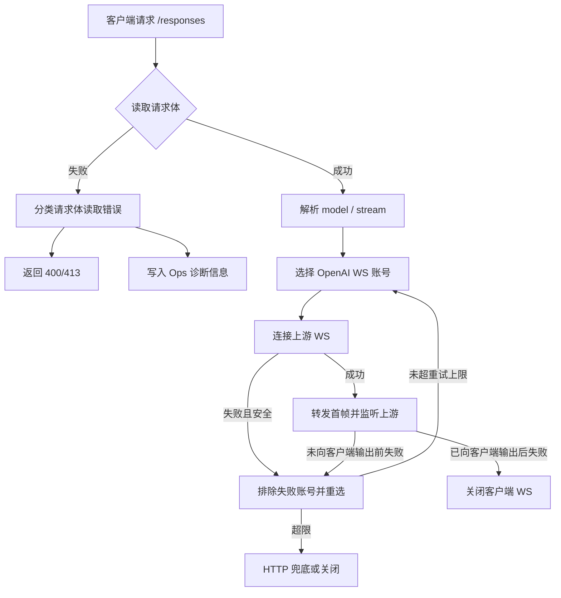

# Sub2API WS 静默恢复与请求体错误可观测性 PRD

## 1. 文档信息

| 项目 | 内容 |
|---|---|
| 文档名称 | WS 静默恢复与请求体错误可观测性 PRD |
| 所属系统 | Sub2API |
| 创建日期 | 2026-06-01 |
| 需求来源 | Codex Desktop 新开对话 reconnect、请求体读取失败排查困难 |
| 目标版本 | 后续最近一次后端发布版本 |

## 2. 文档目标

本需求解决两个线上问题：

1. `/responses` 请求体读取失败时，后台只能看到 `Failed to read request body`，无法判断是客户端断开、上传不完整、超时、编码解码失败还是请求过大。
2. OpenAI Responses WebSocket 上游连接异常时，服务端过早关闭客户端 WS，导致 Codex Desktop 显示 reconnect；在安全阶段应由服务端先静默恢复，不直接把可恢复错误暴露给客户端。

## 3. 背景与目标

### 3.1 背景

线上最近出现以下现象：

- 用户 `3238607507@qq.com` 的 `/responses` 请求出现 `Failed to read request body`，账号为空、模型为空。
- GPT-VIP 组内 OpenAI API Key 账号的 WS 上游出现 `account is busy`、EOF、ping 超时、握手失败等错误。
- Codex Desktop 新开对话或继续对话时出现多次 reconnect。

### 3.2 目标

| 目标 | 说明 |
|---|---|
| 请求体错误可定位 | 后台能区分客户端断开、请求体不完整、读取超时、解码失败、请求过大 |
| WS 安全静默恢复 | 上游 WS 未向客户端输出内容前，服务端先自动重试或切换账号 |
| 不破坏对话状态 | 已经向客户端输出内容后，不做跨账号重放 |
| 不重复计费 | 只有拿到有效终止事件并完成既有计费链路时才记录用量 |
| 可验收 | 测试覆盖请求体错误分类、WS 未输出前重试、已输出后不重试 |

## 4. 需求范围

### 4.1 本期包含

1. 请求体读取失败分类。
2. 请求体读取失败的后台诊断信息记录。
3. OpenAI Responses WS 入站代理的安全静默恢复。
4. 单元测试与关键回归测试。

### 4.2 本期不包含

1. 前端运维页面新增独立字段列。
2. 数据库表结构调整。
3. 自动永久禁用不稳定账号。
4. 客户端 Codex Desktop 修改。

## 5. 角色定义

| 角色 | 诉求 |
|---|---|
| API 使用者 | 不因为短暂上游 WS 波动频繁看到 reconnect |
| 运维管理员 | 能从后台错误详情判断请求体失败原因 |
| 开发/排障人员 | 能通过日志和 ops_error_logs 复盘失败发生在客户端、网关还是上游 |

## 6. 核心业务规则

| 规则 | 说明 |
|---|---|
| 请求体未读完整不进入上游选择 | 该类错误账号为空是正常现象 |
| 请求体过大仍返回 413 | 保持现有行为 |
| 请求体读取失败返回 400 | 保持 HTTP 语义，但错误信息更清晰 |
| WS 未输出内容前可静默恢复 | 允许同请求内重试、换账号或 HTTP 兜底 |
| WS 已输出内容后不跨账号重放 | 避免内容重复、工具调用错乱、上下文断链 |
| 带 previous_response_id 的首轮请求不跨账号切换 | 避免新账号不认识旧 response_id |
| 静默恢复有次数上限 | 防止无限等待和资源占用 |

## 7. 系统主数据与取值来源

| 数据 | 来源 | 说明 |
|---|---|---|
| 用户 | `users` 表 / API Key 认证上下文 | 用于定位请求发起人 |
| API Key | `api_keys` 表 / 认证缓存 | 用于定位调用入口 |
| 分组 | `groups` 表 / API Key 认证上下文 | 用于分组能力和限流判断 |
| 上游账号 | `accounts` 表 / OpenAI 调度器 | 用于 WS 调度和错误归因 |
| 请求体诊断 | HTTP 请求对象与读取过程 | 包含 Content-Length、已读字节数、耗时、错误分类 |
| WS 恢复诊断 | OpenAI WS 代理过程 | 包含失败账号、阶段、是否已输出内容、是否重试 |

## 8. 功能总览

| 功能模块 | 功能目标 |
|---|---|
| 请求体错误分类 | 把笼统读取失败拆成可理解原因 |
| Ops 诊断增强 | 把分类、耗时、已读字节、Content-Length 写入后台错误详情 |
| WS 静默恢复 | 在安全阶段自动换账号或兜底，减少客户端 reconnect |
| 安全边界控制 | 对已输出内容、previous_response_id、工具调用链等风险场景 fail-close |

## 9. 总体流程图

## 10. 详细功能需求

### 10.1 请求体错误分类

| 字段 | 控件类型 | 必填 | 数据来源 | 默认值 | 校验规则 | 说明 |
|---|---|---|---|---|---|---|
| 错误分类 | 文本 | 是 | 请求体读取错误 | `read_failed` | 系统枚举 | 如 client_disconnected、incomplete_body、read_timeout、unsupported_encoding、decode_failed、too_large |
| Content-Length | 数值 | 否 | HTTP Header | 空 | 原始请求值 | 用于判断客户端声明大小 |
| 已读字节数 | 数值 | 是 | 读取过程 | 0 | 大于等于 0 | 用于判断是否传输中断 |
| 读取耗时 | 数值 | 是 | 读取过程 | 0 | 毫秒 | 用于判断是否超时或快速断开 |
| 底层错误 | 文本 | 否 | Go error | 空 | 脱敏存储 | 仅用于后台诊断 |

#### 操作逻辑

1. 请求进入 `/responses`、`/v1/responses` 等入口。
2. 服务端读取请求体。
3. 读取失败时，系统根据底层错误进行分类。
4. 客户端收到 400 或 413。
5. 后台错误详情记录分类和诊断信息。

#### 异常处理

| 场景 | 返回状态 | 后台分类 |
|---|---|---|
| 客户端中途断开 | 400 | client_disconnected |
| 请求体不完整 | 400 | incomplete_body |
| 读取超时 | 400 | read_timeout |
| 请求超过限制 | 413 | too_large |
| 不支持的 Content-Encoding | 400 | unsupported_encoding |
| Content-Encoding 解码失败 | 400 | decode_failed |
| 未知读取错误 | 400 | read_failed |

### 10.2 WS 静默恢复

#### 功能目标

当上游 WS 在未向客户端输出内容前失败时，服务端自动恢复，减少 Codex Desktop reconnect。

#### 操作逻辑

1. 服务端选择 OpenAI WS 账号并连接上游。
2. 若握手失败、连接忙、EOF、上游读失败，且尚未向客户端输出内容：
   - 当前请求没有 `previous_response_id` 时，排除当前账号并重新选择账号。
   - 有其它可用账号时，使用新账号重试。
   - 没有其它可用账号时，按现有 HTTP 兜底或关闭客户端。
3. 若已经向客户端输出任何有效事件：
   - 不跨账号重放。
   - 按现有错误路径关闭客户端。

#### 状态矩阵

| 阶段 | 是否已输出客户端 | 是否带 previous_response_id | 动作 |
|---|---|---|---|
| 上游握手失败 | 否 | 否 | 可切账号重试 |
| 上游握手失败 | 否 | 是 | 不跨账号切换，按现有逻辑处理 |
| 上游返回 busy | 否 | 否 | 可切账号重试 |
| 上游 EOF | 否 | 否 | 可切账号重试 |
| 已输出 token 后断流 | 是 | 任意 | 不切账号，关闭客户端 |
| 工具调用结果续链异常 | 任意 | 是 | 不跨账号重放 |

### 10.3 后台错误详情增强

#### 字段说明

| 字段 | 控件类型 | 必填 | 数据来源 | 默认值 | 校验规则 | 说明 |
|---|---|---|---|---|---|---|
| error_message | 文本 | 是 | 错误分类 | 原错误 | 不为空 | 展示给运维的主要错误原因 |
| error_body.diagnostics.kind | 文本 | 否 | 读取分类 | 空 | 枚举 | 请求体读取失败原因 |
| error_body.diagnostics.bytes_read | 数值 | 否 | 读取过程 | 0 | 大于等于 0 | 已成功读取字节数 |
| error_body.diagnostics.content_length | 数值 | 否 | HTTP 请求 | -1 | 原始值 | 客户端声明长度 |
| error_body.diagnostics.read_duration_ms | 数值 | 否 | 读取过程 | 0 | 大于等于 0 | 读取耗时 |
| error_body.diagnostics.cause | 文本 | 否 | 底层错误 | 空 | 脱敏 | 仅后台存储 |

## 11. 指标口径

| 指标 | 公式 | 数据来源 | 用途 |
|---|---|---|---|
| 请求体读取失败数 | error_message / diagnostics.kind 聚合 | ops_error_logs | 判断客户端上传问题趋势 |
| WS 静默恢复次数 | 日志事件计数 | system logs | 判断上游 WS 波动频率 |
| 静默恢复成功率 | 恢复成功次数 / 恢复尝试次数 | system logs + usage_logs | 评估 reconnect 改善效果 |
| 客户端 reconnect 残留数 | WS proxy failed 且关闭客户端次数 | system logs | 验收 WS 体验 |

## 12. 验收标准

1. 请求体读取失败不再只记录 `Failed to read request body`，后台能看到具体分类。
2. 请求体过大仍返回 413，不回退成 400。
3. 上游 WS 未输出内容前失败时，服务端能排除失败账号并重试其它账号。
4. 已经向客户端输出内容后，不发生跨账号自动重放。
5. 带 `previous_response_id` 的首轮 WS 请求不跨账号切换。
6. 所有新增测试通过。
