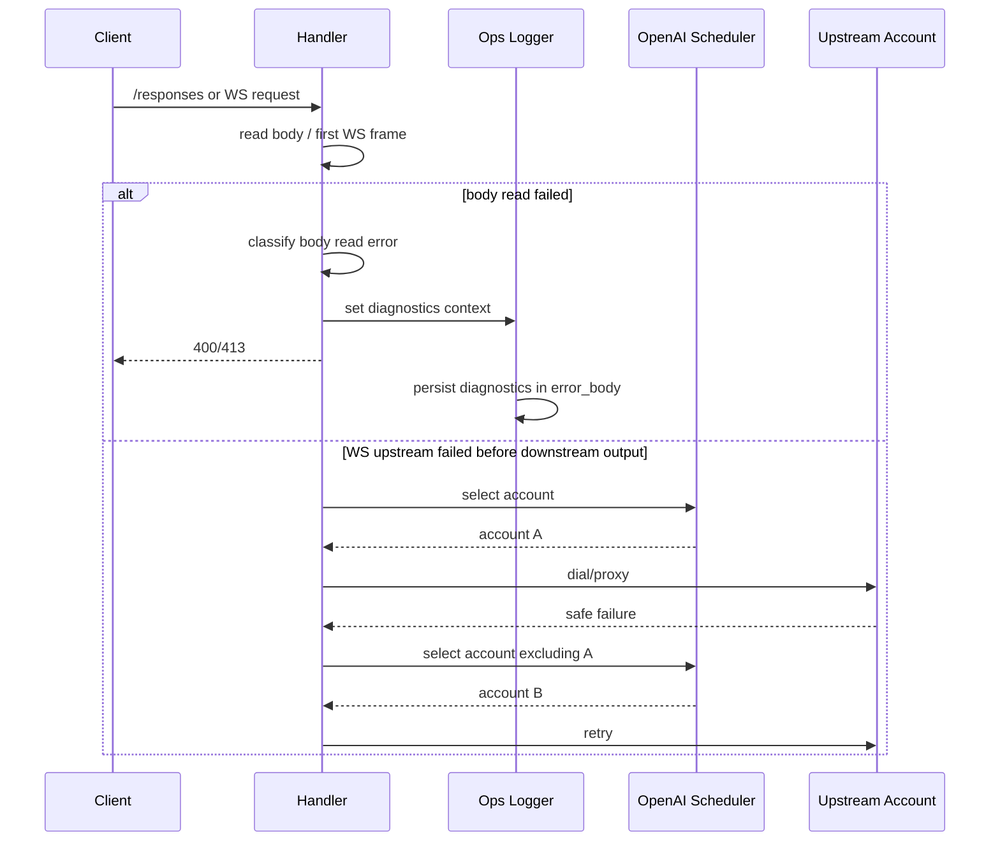

# Sub2API WS 静默恢复与请求体错误可观测性技术方案

## 1. 现状摘要

### 1.1 请求体读取

当前各网关入口调用 `pkghttputil.ReadRequestBodyWithPrealloc` 读取请求体。读取失败后统一返回 `Failed to read request body`，没有分类、已读字节数和读取耗时，Ops 只能记录同一条模糊错误。

### 1.2 WS 入站代理

OpenAI Responses WS 入站入口在 `OpenAIGatewayHandler.ResponsesWebSocket` 中完成：

1. 读取客户端首帧。
2. 选择上游账号。
3. 建立上游 WS。
4. 调用 `ProxyResponsesWebSocketFromClient` 或 passthrough adapter。
5. 失败后关闭客户端 WS 或尝试 HTTP 兜底。

现有服务层已经具备部分同账号重连能力，但 handler 层没有在“未向客户端输出内容”的安全阶段自动排除失败账号并重新选择账号。

## 2. 设计目标

| 目标 | 设计约束 |
|---|---|
| 请求体错误可定位 | 不新增数据库字段，复用现有 error_body 存储诊断 JSON |
| WS 静默恢复 | 仅在未向客户端输出内容、且首帧不带 previous_response_id 时跨账号重试 |
| 兼容现有 API | 客户端错误响应保持 OpenAI/Claude 风格结构 |
| 风险可控 | 重试次数固定上限，失败账号加入 excludedIDs |
| 可测试 | 单元测试覆盖分类和重试决策函数 |

## 3. 方案对比

| 方案 | 优点 | 缺点 | 结论 |
|---|---|---|---|
| 只优化错误文案 | 改动小 | reconnect 仍然明显 | 不足 |
| 全量 WS 自动重放 | reconnect 最少 | 会导致内容重复、工具调用错乱、重复计费 | 不采用 |
| 安全阶段静默恢复 | 兼顾体验与一致性 | 覆盖范围有限 | 采用 |

## 4. 推荐方案

### 4.1 请求体读取分类

在 `backend/internal/pkg/httputil/body.go` 中新增结构化错误：

- `Kind`
- `BytesRead`
- `ContentLength`
- `Encoding`
- 原始错误

`ReadRequestBodyWithPrealloc` 在 `io.Copy` 和解码失败时返回该结构化错误。

本期请求体错误分类枚举：

| 分类 | 含义 |
|---|---|
| `client_disconnected` | 客户端上传过程中断开 |
| `incomplete_body` | 请求体未完整传输 |
| `read_timeout` | 请求体读取超时 |
| `unsupported_encoding` | `Content-Encoding` 不受支持 |
| `decode_failed` | 压缩请求体解码失败 |
| `too_large` | 请求体超过限制 |
| `read_failed` | 其他读取失败 |

### 4.2 Handler 诊断记录

在 handler 层新增请求体读取辅助函数：

- 调用 `ReadRequestBodyWithPrealloc`
- 计算读取耗时
- 生成客户端错误文案
- 写入 Ops 诊断上下文

Ops 中间件在构造 `OpsInsertErrorLogInput` 时，如果存在诊断上下文，则将原始错误响应和诊断信息组合写入 `error_body`。

### 4.3 WS 静默恢复

在 `OpenAIGatewayHandler.ResponsesWebSocket` 中把“账号选择 → 槽位获取 → proxy”包成有限循环：

1. `excludedIDs` 初始为空。
2. 每次失败后判断 `service.IsOpenAIWSSilentRetrySafe(err)`。
3. 同时满足以下条件才跨账号重试：
   - 当前错误未向客户端输出内容。
   - 首帧没有 `previous_response_id`。
   - 未超过最大重试次数。
4. 将失败账号加入 `excludedIDs`，释放当前账号槽位，重新选择账号。
5. 若不满足条件，走现有 HTTP fallback 或关闭客户端。

## 5. 关键修改文件与职责

| 文件 | 职责 |
|---|---|
| `backend/internal/pkg/httputil/body.go` | 请求体读取错误结构化分类 |
| `backend/internal/pkg/httputil/body_test.go` | 请求体错误分类测试 |
| `backend/internal/handler/request_body_read.go` | Handler 统一请求体读取与 Ops 诊断辅助 |
| `backend/internal/handler/ops_error_logger.go` | 将请求体诊断写入 ops error_body |
| `backend/internal/handler/openai_gateway_handler.go` | WS 安全静默恢复、跨账号重试 |
| `backend/internal/service/openai_ws_forwarder.go` | 导出安全重试判定函数 |
| `backend/internal/service/openai_ws_forwarder_test.go` 或现有 WS 测试文件 | 重试安全判定测试 |
| `docs/*.md` | PRD 与技术方案 |

## 6. 数据流

## 7. 风险 / 兼容性 / 回滚点

| 风险 | 控制方式 | 回滚点 |
|---|---|---|
| 跨账号重放导致上下文错乱 | 有 previous_response_id 时不跨账号重试 | 移除 handler 循环 |
| 已输出内容后重复推送 | 只在 `wroteDownstream=false` 时重试 | 关闭 silent retry 判定 |
| 错误响应兼容性 | 保持 `error.type/message` 结构 | 回退错误文案 |
| error_body 结构变化 | 仅在 Ops 内部存储组合 JSON | 移除诊断包装 |

## 8. 实施顺序

1. 增加请求体读取错误分类和测试。
2. 增加 handler 诊断上下文和 Ops 写入逻辑。
3. 替换关键 `/responses` 入口的请求体读取错误处理。
4. 增加 WS 安全重试判定函数。
5. 改造 `ResponsesWebSocket` 为有限重试循环。
6. 运行后端单元测试。
7. 执行复核和验收。

## 9. 验证方案

| 验证项 | 方法 |
|---|---|
| 请求体 EOF 分类 | 单元测试模拟 reader 返回 `io.ErrUnexpectedEOF` |
| 请求体取消分类 | 单元测试模拟 `context.Canceled` |
| 请求体过大仍 413 | 现有 `MaxBytesError` 测试 |
| Ops 诊断写入 | handler/ops logger 单元测试检查 error_body 包含 diagnostics |
| WS 安全错误可重试 | service 单元测试覆盖 fallback / no downstream turn error；handler 测试覆盖失败账号排除后切换到下一账号 |
| WS 已输出后不重试 | service 单元测试覆盖 `wroteDownstream=true`；handler 测试覆盖已输出事件后不跨账号 |
| previous_response_id 不跨账号 | handler 测试覆盖首帧带 previous_response_id 时不切换账号 |
