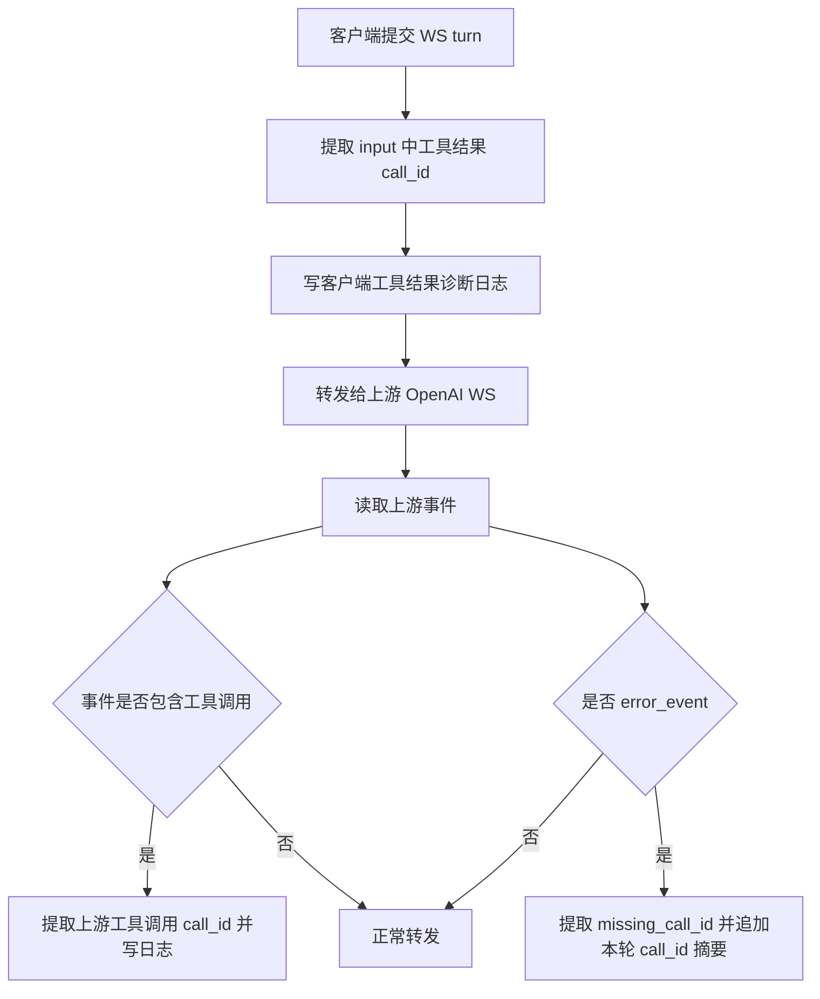
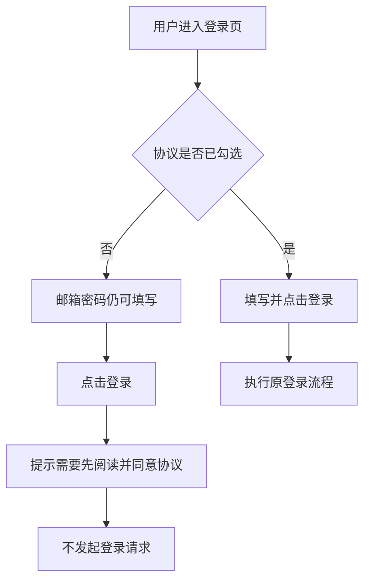

# Sub2API WS 工具调用诊断日志与登录协议交互 PRD

## 1. 文档信息

| 项目 | 内容 |
|---|---|
| 文档名称 | WS 工具调用诊断日志与登录协议交互 PRD |
| 所属系统 | Sub2API |
| 创建日期 | 2026-06-04 |
| 目标版本 | v0.2.6 |
| 需求来源 | Codex Desktop 工具调用续链报错排查；登录页协议勾选体验优化 |

## 2. 文档目标

本需求交付两个结果：

1. 当 OpenAI Responses WS 出现 `No tool call found for function call output with call_id ...` 时，日志能直接显示客户端提交的工具结果 call_id、上游下发的工具调用 call_id、当前 turn、连接和上游账号，支撑后续判断是客户端提交错轮次、网关续链状态异常，还是上游会话状态异常。
2. 登录页在用户未勾选协议时，邮箱和密码输入框仍可填写；用户点击登录时再提示必须勾选协议，降低新手用户填写被阻断的困惑。

## 3. 背景与目标

### 3.1 背景

线上 Codex Desktop 出现对话自动结束，错误内容为：

`No tool call found for function call output with call_id ...`

当前已有日志能证明同一轮链路中的上游账号、连接和 `previous_response_id`，但缺少 call_id 级别证据，无法最终判断该 call_id 是否由上一轮上游发出、是否被客户端跨轮提交、是否被网关改写或丢失。

登录页当前交互为：未同意协议时禁用账号密码输入和快捷登录。用户实际体验中，填写入口被禁用会让新手误以为页面不可用。

### 3.2 目标

| 目标 | 说明 |
|---|---|
| call_id 可追踪 | 日志记录客户端工具结果 call_id、客户端携带的工具上下文 call_id、item_reference id、上游工具调用 call_id |
| 续链归因更清晰 | 日志包含 account_id、conn_id、turn、previous_response_id、response_id、store 状态、prompt_cache_key 状态 |
| 不泄露敏感内容 | 不记录工具参数、工具输出正文、完整请求体、API Key |
| 登录填写不中断 | 未勾协议时，邮箱和密码输入框保持可填写 |
| 登录动作强校验 | 点击登录时发现未勾协议，提示用户先阅读并同意协议，不发起登录请求 |

## 4. 需求范围

### 4.1 本期包含

1. OpenAI Responses WS 入站代理新增工具调用诊断日志。
2. 上游错误日志新增缺失 call_id 字段。
3. 登录页协议未勾选时允许填写邮箱和密码。
4. 登录提交时校验协议勾选状态并提示。
5. 单元测试、前端组件测试、构建验收。

### 4.2 本期不包含

1. 不关闭或降级 WebSocket。
2. 不修改上游账号调度策略。
3. 不修改 Codex Desktop 客户端。
4. 不记录完整请求体、工具输出正文或敏感凭证。
5. 不新增数据库字段和后台页面字段。

## 5. 角色定义

| 角色 | 诉求 |
|---|---|
| API 使用者 | Codex Desktop 对话失败时能被快速定位原因 |
| 运维管理员 | 能从线上日志判断错误发生在哪个账号、哪条连接、哪一轮 turn |
| 开发排障人员 | 能比对客户端提交的工具结果 call_id 与上游下发的工具调用 call_id |
| 登录用户 | 未勾协议时仍能先填写邮箱密码，提交时获得明确提示 |

## 6. 核心业务规则

| 规则 | 说明 |
|---|---|
| 工具结果日志只记录标识 | 只记录 call_id、计数和上下文 id，不记录 output 内容 |
| 上游工具调用日志只记录标识 | 只记录 function/tool call id 和事件类型，不记录 arguments |
| 错误日志保留原语义 | 仍按上游 error_event 处理，只追加诊断字段 |
| 工具名称修正不改变 call_id | 日志标记是否发生工具名称修正，便于排除 call_id 被修正器改写 |
| 协议未勾不阻止输入 | 邮箱、密码、显示密码按钮不再因协议未勾而禁用 |
| 协议未勾阻止登录 | 点击登录时提示“请先阅读并同意最新条款后再登录。”，不调用登录接口 |
| 快捷登录仍受协议限制 | OAuth/快捷登录按钮继续在协议未勾时禁用 |

## 7. 页面与字段

### 7.1 登录页字段

| 字段 | 控件类型 | 必填 | 数据来源 | 默认值 | 校验规则 | 说明 |
|---|---|---|---|---|---|---|
| 邮箱 | 输入框 | 是 | 用户输入 | 空 | 邮箱格式 | 未勾协议时仍可填写 |
| 密码 | 密码框 | 是 | 用户输入 | 空 | 长度不少于 6 | 未勾协议时仍可填写 |
| 协议勾选 | 复选框/弹窗确认 | 是 | 公共设置 | 未勾选 | 登录前必须同意 | 未同意时点击登录给出提示 |
| 登录按钮 | 按钮 | 是 | 页面状态 | 可点击 | 加载中、设置未加载、验证码未完成时禁用 | 协议未勾时按钮可点击并触发提示 |
| 快捷登录按钮 | 按钮组 | 否 | 公共设置 | 按配置显示 | 协议未勾时禁用 | 保持现有合规约束 |

## 8. 功能总览

| 功能模块 | 功能目标 |
|---|---|
| WS 客户端工具结果诊断 | 记录客户端提交的 function_call_output 等工具结果 call_id |
| WS 上游工具调用诊断 | 记录上游下发的 function_call/tool_call call_id |
| WS 错误增强 | 在上游 error_event 中追加 missing_call_id 和本轮 call_id 摘要 |
| 登录协议交互优化 | 输入不被协议状态阻断，登录动作执行协议校验 |

## 9. 总体流程图

## 10. 详细功能需求

### 10.1 WS 工具调用诊断日志

#### 字段说明

| 字段 | 来源 | 说明 |
|---|---|---|
| account_id | 上游账号 | 当前 WS 使用的上游账号 |
| turn | WS 入站代理 | 当前对话轮次 |
| conn_id | WS 连接池 | 当前上游连接标识 |
| previous_response_id | 请求体 | 当前续链依赖的上一轮响应 |
| response_id | 上游事件 | 当前上游响应 id |
| function_call_output_call_ids | 请求 input | 客户端提交的工具结果 call_id 摘要 |
| tool_call_context_call_ids | 请求 input | 客户端携带的工具调用上下文 call_id 摘要 |
| item_reference_ids | 请求 input | 客户端携带的引用 id 摘要 |
| upstream_function_call_ids | 上游事件 | 上游下发的工具调用 call_id 摘要 |
| missing_call_id | 上游 error message | 上游提示找不到的 call_id |
| corrected | 工具修正器 | 本事件是否发生工具名称修正 |
| store_disabled | 请求设置 | 是否关闭上游存储 |
| has_prompt_cache_key | 请求设置 | 是否带 prompt_cache_key |

#### 操作逻辑

1. 每个 WS turn 写入上游前，提取 input 中的工具结果和工具上下文标识。
2. 如果存在工具续链信号，写入 `ingress_ws_client_tool_call_trace` 日志。
3. 收到上游包含工具调用的事件时，提取上游工具调用标识。
4. 如存在上游工具调用标识或工具名称修正，写入 `ingress_ws_upstream_tool_call_trace` 日志。
5. 收到上游 error_event 时，提取 `missing_call_id`，并把本轮客户端工具结果摘要追加到错误日志。

### 10.2 登录协议交互优化

#### 操作逻辑

1. 页面加载公共设置和协议配置。
2. 协议未同意时，邮箱、密码输入框保持可填写。
3. 用户点击登录后，系统先检查协议状态。
4. 未同意时提示“请先阅读并同意最新条款后再登录。”。
5. 系统不调用登录接口，不触发账号密码校验、不触发 2FA。
6. 用户勾选协议后，登录流程按原逻辑执行。

#### 异常处理

| 场景 | 系统行为 |
|---|---|
| 公共设置未加载完成 | 输入和登录按钮仍禁用，等待设置加载 |
| 协议配置加载失败 | 保持原降级逻辑，不阻断登录 |
| 协议弹窗模式未同意 | 点击登录时弹出协议并提示 |
| 复选框模式未同意 | 点击登录时只提示，不提交登录 |

## 11. 验收标准

1. WS 客户端提交工具结果时，日志出现 `ingress_ws_client_tool_call_trace`，且包含 function_call_output_call_ids。
2. WS 上游返回工具调用事件时，日志出现 `ingress_ws_upstream_tool_call_trace`，且包含 upstream_function_call_ids。
3. 上游返回 `No tool call found...` 时，`ingress_ws_error_event` 包含 missing_call_id 和本轮客户端 call_id 摘要。
4. 日志不包含工具输出正文、完整 arguments、API Key。
5. 登录页协议未勾选时，邮箱和密码输入框可输入。
6. 协议未勾选时点击登录，显示协议提示，不发起登录请求。
7. 协议勾选后，登录继续走原有校验和提交流程。
