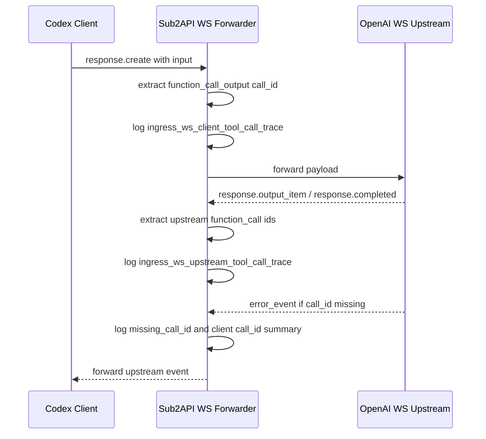

# Sub2API WS 工具调用诊断日志与登录协议交互技术方案

## 1. 现状摘要

### 1.1 WS 工具调用续链

OpenAI Responses WS 入站代理集中在 `backend/internal/service/openai_ws_forwarder.go`。现有日志能记录 `account_id`、`turn`、`conn_id`、`previous_response_id`、`response_id`、`store_disabled` 等链路字段，但没有记录工具调用 call_id 的进入与流出。

当前已知线上错误为上游返回：

`No tool call found for function call output with call_id ...`

已有证据能排除“同一段对话中切换不同上游账号”的情况，但缺少 call_id 级别日志，无法最终区分客户端提交错误、网关续链状态异常、上游会话状态异常。

### 1.2 登录协议交互

登录页位于 `frontend/src/views/auth/LoginView.vue`。当前 `authActionDisabled` 同时控制输入框、登录按钮、快捷登录按钮。该状态包含 `agreementGateActive`，导致协议未勾选时邮箱和密码输入框不能填写。

## 2. 设计目标

| 目标 | 约束 |
|---|---|
| 增加 call_id 诊断证据 | 不记录工具正文和敏感凭证 |
| 保持现有 WS 行为 | 不改变连接池、账号选择、重试策略 |
| 可低成本检索 | 日志名固定，字段结构稳定 |
| 登录页更符合新手预期 | 输入框不因协议未勾而禁用 |
| 保持协议强约束 | 登录提交前仍必须同意协议 |

## 3. 方案对比

| 方案 | 优点 | 缺点 | 结论 |
|---|---|---|---|
| 关闭 WS 规避错误 | 立刻减少 WS 错误 | 治标不治本，无法解释 call_id 为什么找不到 | 不采用 |
| 记录完整请求体和事件体 | 证据最完整 | 有敏感信息和日志膨胀风险 | 不采用 |
| 只记录 call_id 摘要和链路字段 | 可归因、风险低 | 不包含工具正文 | 采用 |

## 4. 推荐方案

### 4.1 后端 WS 诊断日志

在 `openai_ws_forwarder.go` 增加轻量提取函数：

| 函数 | 职责 |
|---|---|
| `openAIWSToolCallTraceFromRawPayload` | 从客户端 payload.input 提取工具结果 call_id、工具上下文 call_id、item_reference id |
| `openAIWSUpstreamToolCallIDsFromRawMessage` | 从上游事件中递归提取 function_call/tool_call id |
| `summarizeOpenAIWSTraceIDs` | 输出 count 和前 N 个 id，限制日志长度 |
| `extractOpenAIWSMissingToolCallID` | 从上游错误文案中提取 missing call_id |

日志落点：

1. `sendAndRelay` 写上游后，读取本轮 payload 的工具续链标识，存在时记录 `ingress_ws_client_tool_call_trace`。
2. 上游事件进入工具修正器前，提取上游工具调用 id；存在 id 或发生工具修正时记录 `ingress_ws_upstream_tool_call_trace`。
3. 上游 `error` 事件日志追加 `missing_call_id`、`function_call_output_call_ids`、`tool_call_context_call_ids`、`item_reference_ids`。

### 4.2 前端登录交互

在 `LoginView.vue` 拆分两个禁用状态：

| 状态 | 用途 | 包含协议未同意 |
|---|---|---|
| `authActionDisabled` | 快捷登录等需要协议前置的动作 | 是 |
| `loginFormDisabled` | 邮箱、密码、显示密码按钮、登录按钮的加载/设置状态 | 否 |

登录按钮禁用条件调整为：

`loginFormDisabled || (turnstileEnabled && !turnstileToken)`

协议校验继续保留在 `validateForm()` 最前面。未同意时提示并返回，不调用 `authStore.login()`。

## 5. 关键修改文件与职责

| 文件 | 职责 |
|---|---|
| `backend/internal/service/openai_ws_forwarder.go` | 新增 call_id 诊断提取函数和 WS turn 日志 |
| `backend/internal/service/openai_ws_forwarder_hotpath_optimization_test.go` | 覆盖 call_id 提取和 missing_call_id 提取 |
| `frontend/src/views/auth/LoginView.vue` | 拆分登录表单禁用状态，更新协议拒绝提示文案 |
| `frontend/src/views/auth/__tests__/LoginView.spec.ts` | 覆盖未勾协议仍可填写、点击登录才提示 |
| `docs/sub2api-ws-tool-call-diagnostics-and-login-agreement-prd-20260604.md` | PRD |
| `docs/sub2api-ws-tool-call-diagnostics-and-login-agreement-tech-plan-20260604.md` | 技术方案 |

## 6. 数据流

## 7. 风险 / 兼容性 / 回滚点

| 风险 | 控制方式 | 回滚点 |
|---|---|---|
| 日志过大 | 只输出 count 和前 8 个 id，单字段截断 | 移除新增日志调用 |
| 敏感数据泄露 | 不记录 output、arguments、完整 payload、token | 保留仅 id 提取函数 |
| 递归提取误报 id | 仅在包含工具调用关键词的事件中执行 | 缩小事件类型判断 |
| 登录按钮可点导致用户以为已提交 | 点击后立即 toast 提示，不调用登录接口 | 恢复按钮协议禁用条件 |
| 快捷登录合规变化 | 快捷登录继续使用 `authActionDisabled` | 无需回滚 |

## 8. 实施顺序

1. 增加 WS call_id 提取函数和单元测试。
2. 在 WS turn 写上游后记录客户端工具结果 trace。
3. 在上游工具事件转发前记录上游工具调用 trace。
4. 在上游错误日志追加 missing_call_id 和本轮 call_id 摘要。
5. 拆分登录页禁用状态。
6. 增加登录页交互测试。
7. 运行后端、前端测试和构建。
8. 复核、提交、打 tag、发布并升级线上。

## 9. 验证方案

| 验证项 | 方法 |
|---|---|
| 客户端工具结果 call_id 提取 | Go 单元测试 `TestOpenAIWSToolCallTraceFromRawPayload` |
| 上游工具调用 call_id 提取 | Go 单元测试 `TestOpenAIWSUpstreamToolCallIDsFromRawMessage` |
| missing_call_id 提取 | Go 单元测试 `TestExtractOpenAIWSMissingToolCallID` |
| 登录未勾协议可填写 | Vitest 挂载 `LoginView` 后断言输入框未禁用且可 setValue |
| 登录未勾协议不提交 | Vitest 提交表单后断言 toast 出现且 login mock 未调用 |
| 前端类型与打包 | `pnpm --dir frontend build` |
| 线上服务健康 | 发布后验证 `systemctl is-active sub2api`、`sub2api --version`、`/health` |
